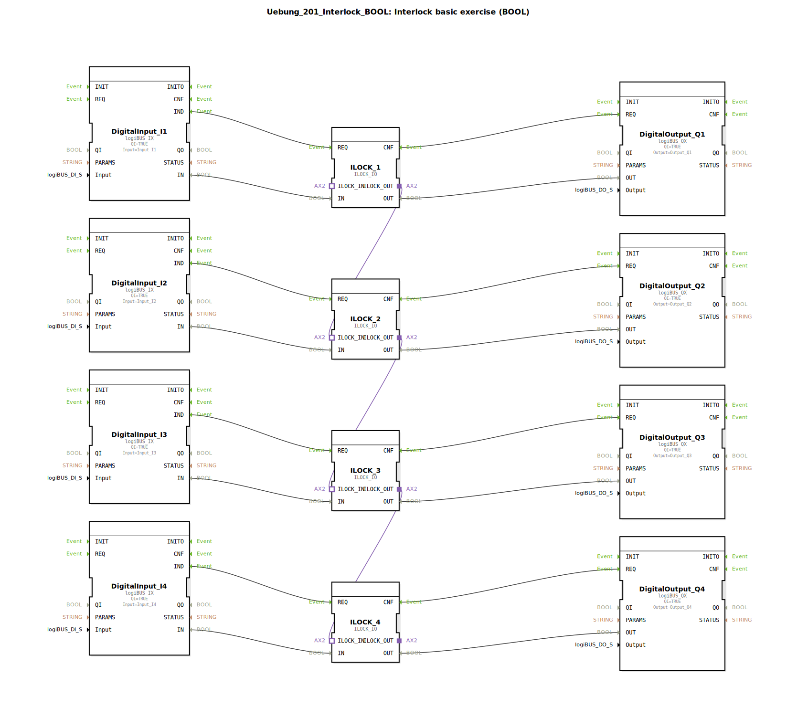

# Uebung_201_Interlock_BOOL: Interlock basic exercise (BOOL)

* * * * * * * * * *

## Einleitung

Diese Übung vermittelt die grundlegende Funktionsweise einer **Interlock‑Schaltung** (Verriegelung) mit booleschen Signalen. Vier digitale Eingänge (`I1` bis `I4`) steuern über spezielle Interlock‑Bausteine vier digitale Ausgänge (`Q1` bis `Q4`). Die Interlock‑Blöcke sind in einer Kette angeordnet, sodass die Freigabe eines nachfolgenden Ausgangs erst dann erfolgen kann, wenn der vorherige Interlock‑Block aktiv geschaltet wurde. So lässt sich eine sichere, sequenzielle Ablaufsteuerung realisieren.

## Verwendete Funktionsbausteine (FBs)

- **DigitalInput_I1 … DigitalInput_I4**  
  Typ: `logiBUS::io::DI::logiBUS_IX`  
  – Ein digitaler Eingang des logiBUS‑Systems.

- **DigitalOutput_Q1 … DigitalOutput_Q4**  
  Typ: `logiBUS::io::DQ::logiBUS_QX`  
  – Ein digitaler Ausgang des logiBUS‑Systems.

- **ILOCK_1 … ILOCK_4**  
  Typ: `logiBUS::signalprocessing::interlock::ILOCK_IO`  
  – Spezieller Interlock‑Funktionsbaustein, der den Zustand eines Eingangssignals nur dann an den Ausgang weitergibt, wenn die interne Verriegelungsbedingung erfüllt ist.

Es sind keine verschachtelten Sub‑Bausteine (Unterapplikationen) vorhanden.

## Programmablauf und Verbindungen

### Ereignis‑ und Datenfluss

1. **Eingangsereignisse**  
   Jeder Digitaleingang (z. B. `DigitalInput_I1`) erzeugt ein Ereignis (`IND`), sobald sich der Eingangswert ändert. Dieses Ereignis wird direkt an den zugehörigen Interlock‑Block (z. B. `ILOCK_1.REQ`) gesendet.

2. **Datenweitergabe**  
   Der Wert des Digitaleingangs (`IN`‑Datenport) wird parallel zum Ereignis an den entsprechenden Interlock‑Block (`ILOCK_x.IN`) übergeben.

3. **Verriegelungskette**  
   Über Adapterverbindungen sind die Interlock‑Blöcke kaskadiert:
   - `ILOCK_1.ILOCK_OUT` → `ILOCK_2.ILOCK_IN`
   - `ILOCK_2.ILOCK_OUT` → `ILOCK_3.ILOCK_IN`
   - `ILOCK_3.ILOCK_OUT` → `ILOCK_4.ILOCK_IN`

   Diese Verkettung bewirkt, dass ein Interlock‑Baustein nur dann einen gültigen Ausgang liefert, wenn der vorherige Baustein ebenfalls aktiviert wurde.

4. **Ausgangssteuerung**  
   Nach der internen Verarbeitung gibt jeder Interlock‑Block ein Bestätigungsereignis (`CNF`) aus, das den zugehörigen Digitalausgang (z. B. `DigitalOutput_Q1.REQ`) ansteuert. Gleichzeitig wird der Datenwert (`OUT`) an den Ausgang übertragen.

### Lernziele und Hinweise

- **Lernziel:** Verständnis der Interlock‑Logik und der kaskadierten Freigabebedingungen.  
- **Schwierigkeitsgrad:** Grundlegend.  
- **Voraussetzungen:** Grundkenntnisse in der 4diac‑IDE und im Umgang mit logiBUS‑Bausteinen.  
- **Start der Übung:** Legen Sie die Digitaleingänge (z. B. über Simulations‑Testwerte) auf `TRUE` und beobachten Sie, wie die Ausgänge nacheinander aktiv werden.

## Zusammenfassung

Die Übung *Uebung_201_Interlock_BOOL* demonstriert den Aufbau einer einfachen Verriegelungskette mit vier Stufen. Jeder Eingang schaltet einen eigenen Interlock‑Baustein, der seinen Ausgang nur dann freigibt, wenn die gesamte Kette bis zu ihm durchgängig aktiv ist. Die Realisierung erfolgt mit den logiBUS‑Standardbausteinen für digitale Ein‑/Ausgabe und dem speziellen Interlock‑Funktionsbaustein `ILOCK_IO`. Dieses Grundprinzip lässt sich direkt auf sicherheitsrelevante Steuerungen (z. B. Shut‑down‑Systeme) übertragen.