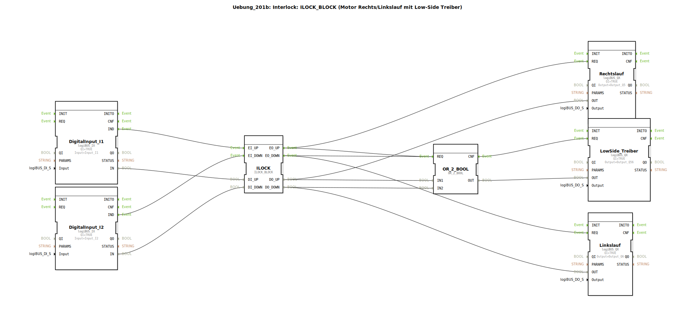

# Uebung_201b: Interlock: ILOCK_BLOCK (Motor Rechts/Linkslauf mit Low-Side Treiber)

* * * * * * * * * *
## Einleitung

Diese Übung realisiert eine **Interlock-Schaltung** für einen Motor mit Rechts- und Linkslauf. Zusätzlich wird ein **Low-Side Treiber** angesteuert. Die Verriegelung (Interlock) verhindert, dass beide Richtungen gleichzeitig aktiv werden. Die Logik basiert auf dem speziellen Funktionsbaustein `ILOCK_BLOCK`.

## Verwendete Funktionsbausteine (FBs)

Die SubApp verwendet folgende Funktionsbausteine:

| Baustein-Name        | Typ                                      | Beschreibung                                                                 |
|----------------------|------------------------------------------|------------------------------------------------------------------------------|
| DigitalInput_I1      | `logiBUS::io::DI::logiBUS_IX`            | Digitaler Eingang für Sensor I1 (z. B. Taster „Auf“).                        |
| DigitalInput_I2      | `logiBUS::io::DI::logiBUS_IX`            | Digitaler Eingang für Sensor I2 (z. B. Taster „Ab“).                        |
| ILOCK                | `logiBUS::signalprocessing::interlock::ILOCK_BLOCK` | Interlock-Baustein: verriegelt die beiden Richtungen gegeneinander.   |
| Rechtslauf           | `logiBUS::io::DQ::logiBUS_QX`            | Digitaler Ausgang für den Rechtslauf (Q5).                                   |
| Linkslauf            | `logiBUS::io::DQ::logiBUS_QX`            | Digitaler Ausgang für den Linkslauf (Q6).                                    |
| LowSide_Treiber      | `logiBUS::io::DQ::logiBUS_QX`            | Digitaler Ausgang für den Low-Side Treiber (Q56).                            |
| OR_2_BOOL            | `iec61131::bitwiseOperators::OR_2_BOOL`  | Logisches ODER: aktiviert den Low-Side Treiber bei Rechts- oder Linkslauf.   |

### Parameter der Instanzen

- **DigitalInput_I1**: `QI = TRUE`, `Input = Input_I1`
- **DigitalInput_I2**: `QI = TRUE`, `Input = Input_I2`
- **ILOCK**: keine Parameter gesetzt (Standardwerte)
- **Rechtslauf**: `QI = TRUE`, `Output = Output_Q5`
- **Linkslauf**: `QI = TRUE`, `Output = Output_Q6`
- **LowSide_Treiber**: `QI = TRUE`, `Output = Output_Q56`
- **OR_2_BOOL**: keine Parameter gesetzt

## Programmablauf und Verbindungen

1. **Eingangssignale**  
   Die digitalen Eingänge `DigitalInput_I1` und `DigitalInput_I2` lesen die physikalischen Signale der Taster oder Sensoren.  
   Die Ereignisausgänge `.IND` lösen die entsprechenden Ereignisseingänge des Interlock-Bausteins aus:
   - `I1.IND` → `ILOCK.EI_UP`
   - `I2.IND` → `ILOCK.EI_DOWN`

2. **Interlock-Logik**  
   Der Baustein `ILOCK` wertet die Daten-Eingänge `DI_UP` und `DI_DOWN` aus. Er stellt sicher, dass nie beide Ausgänge `DO_UP` und `DO_DOWN` gleichzeitig **TRUE** werden.  
   Die Ereignisse `EO_UP` und `EO_DOWN` signalisieren, wenn eine Richtung aktiviert wird.

3. **Ausgangsansteuerung**  
   - `ILOCK.EO_UP` und das Daten-Signal `DO_UP` steuern den Ausgang **Rechtslauf** (Q5).  
   - `ILOCK.EO_DOWN` und `DO_DOWN` steuern den Ausgang **Linkslauf** (Q6).  
   - Beide Ereignisse `EO_UP` und `EO_DOWN` sind mit dem ODER-Baustein `OR_2_BOOL` verbunden. Sobald eine Richtung aktiv ist, triggert der ODER-Baustein den **LowSide_Treiber** (Q56).  
   - Gleichzeitig werden die Daten-Signale `DO_UP` und `DO_DOWN` auf die Eingänge `IN1` und `IN2` des ODER-Bausteins geführt. Der Ausgang `OR_2_BOOL.OUT` speist den Daten-Eingang des LowSide_Treibers.

4. **Zusammenhang**  
   Der Low-Side Treiber wird nur dann eingeschaltet, wenn entweder Rechts- oder Linkslauf aktiv ist. Dadurch wird die Stromversorgung des Motors nur in diesen Zuständen freigegeben.

**Lernziele:**
- Verständnis einer Interlock-Schaltung für Motoren mit zwei Drehrichtungen.
- Ansteuerung eines Low-Side Treibers in Abhängigkeit einer ODER-Verknüpfung.
- Umgang mit den speziellen logiBUS-Funktionsbausteinen.

**Benötigte Vorkenntnisse:**
- Grundlagen der 4diac-IDE und des IEC 61499-Modells.
- Kenntnis über digitale Ein-/Ausgänge und boolesche Verknüpfungen.

## Zusammenfassung

Die Übung demonstriert eine sichere Ansteuerung eines Motors mit Rechts-/Linkslauf durch einen Interlock-Baustein. Ein Low-Side Treiber wird automatisch aktiviert, sobald eine der beiden Richtungen gewählt wird. Die gesamte Schaltung ist als SubApp realisiert und kann in übergeordneten Projekten wiederverwendet werden.