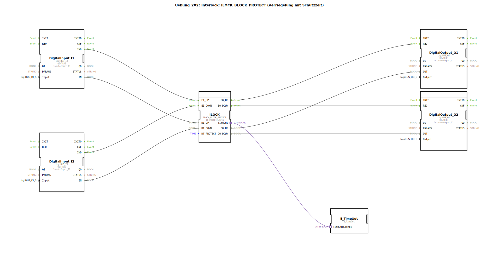

# Uebung_202: Interlock: ILOCK_BLOCK_PROTECT (Verriegelung mit Schutzzeit)

* * * * * * * * * *

## Einleitung  
Diese Übung demonstriert die Anwendung eines **Interlock-Bausteins mit Schutzzeit (ILOCK_BLOCK_PROTECT)**.  
Der Funktionsbaustein realisiert eine Verriegelung zwischen zwei gegenläufigen Bewegungen (z. B. Auf/Ab eines Antriebs) und verhindert durch eine einstellbare Schutzzeit ein sofortiges Umschalten der Richtung.  
Die logischen Eingangssignale werden über digitale Eingänge eingelesen und die Ausgangssignale über digitale Ausgänge ausgegeben. Ein Zeitgeberbaustein ist als Adapter an den Interlock angebunden, um das Zeitverhalten zu steuern.

## Verwendete Funktionsbausteine (FBs)

| Bausteinname | Typ | Beschreibung |
|--------------|-----|--------------|
| DigitalInput\_I1 | `logiBUS::io::DI::logiBUS_IX` | Digitaler Eingang – liest das Signal von **Input_I1** (z. B. Taster „Auf“) |
| DigitalInput\_I2 | `logiBUS::io::DI::logiBUS_IX` | Digitaler Eingang – liest das Signal von **Input_I2** (z. B. Taster „Ab“) |
| ILOCK | `logiBUS::signalprocessing::interlock::ILOCK_BLOCK_PROTECT` | Interlock-Baustein mit Schutzzeit – verriegelt die Ausgänge und erzwingt eine minimale Umschaltverzögerung (Parameter `DT_PROTECT = T#1s`) |
| DigitalOutput\_Q1 | `logiBUS::io::DQ::logiBUS_QX` | Digitaler Ausgang – steuert **Output_Q1** (z. B. Relais „Auf“) |
| DigitalOutput\_Q2 | `logiBUS::io::DQ::logiBUS_QX` | Digitaler Ausgang – steuert **Output_Q2** (z. B. Relais „Ab“) |
| E\_TimeOut | `iec61499::events::E_TimeOut` | Ereignisgesteuerter Zeitgeber – liefert die Zeitbasis für die Schutzzeit (als Adapter verbunden) |

### Parameter der FBs

- **DigitalInput\_I1**: `QI = TRUE`, `Input = Input_I1`  
- **DigitalInput\_I2**: `QI = TRUE`, `Input = Input_I2`  
- **ILOCK**: `DT_PROTECT = T#1s` (Schutzzeit 1 Sekunde)  
- **DigitalOutput\_Q1**: `QI = TRUE`, `Output = Output_Q1`  
- **DigitalOutput\_Q2**: `QI = TRUE`, `Output = Output_Q2`  

## Programmablauf und Verbindungen

### Ereignisverbindungen

1. **DigitalInput_I1.IND** → **ILOCK.EI_UP**  
   - Eine steigende Flanke am Eingang I1 löst das Ereignis „Auf“ beim Interlock aus.

2. **DigitalInput_I2.IND** → **ILOCK.EI_DOWN**  
   - Eine steigende Flanke am Eingang I2 löst das Ereignis „Ab“ aus.

3. **ILOCK.EO_UP** → **DigitalOutput_Q1.REQ**  
   - Wenn der Interlock den Zustand „Auf“ freigibt, wird der digitale Ausgang Q1 gesetzt.

4. **ILOCK.EO_DOWN** → **DigitalOutput_Q2.REQ**  
   - Wenn der Interlock den Zustand „Ab“ freigibt, wird der digitale Ausgang Q2 gesetzt.

### Datenverbindungen

- **DigitalInput_I1.IN** → **ILOCK.DI_UP**  
- **DigitalInput_I2.IN** → **ILOCK.DI_DOWN**  
- **ILOCK.DO_UP** → **DigitalOutput_Q1.OUT**  
- **ILOCK.DO_DOWN** → **DigitalOutput_Q2.OUT**  

### Adapterverbindung

- **ILOCK.timeOut** ↔ **E_TimeOut.TimeOutSocket**  
  - Der Zeitgeber wird als Adapter an den Interlock angeschlossen und stellt die benötigte Zeitbasis für die Schutzzeit zur Verfügung.

### Funktionsweise

- Wird der Eingang **I1** aktiv, sendet der Interlock nach Ablauf der Schutzzeit das Ereignis **EO_UP** und setzt **DO_UP**.  
- Wird direkt danach **I2** aktiv, wird der Umschaltvorgang blockiert, bis die Schutzzeit abgelaufen ist.  
- Der Parameter `DT_PROTECT` definiert die Mindestzeit zwischen zwei Richtungswechseln – hier 1 Sekunde.  
- Die digitalen Eingänge werden mit ihren logischen Zuständen (IN) verarbeitet, während die Ereignisse (IND) die Zustandsänderung des Interlocks triggern.

### Lernziele dieser Übung

- Verständnis der Funktionsweise eines Interlock-Bausteins mit Schutzzeit  
- Anwendung des Bausteins `ILOCK_BLOCK_PROTECT`  
- Einbindung eines Zeitgebers als Adapter  
- Zusammenhang zwischen Ereignis- und Datenflüssen in 4diac-IDE  

## Zusammenfassung  
Die Übung **Uebung_202** veranschaulicht eine einfache Verriegelung mit Schutzzeit. Zwei Taster (Auf/Ab) steuern über einen Interlock-Baustein zwei Ausgänge. Der integrierte Zeitschutz verhindert ein sofortiges Umschalten und schützt damit mechanische Komponenten. Die Implementierung nutzt digitale Ein-/Ausgänge und einen externen Zeitgeber, der als Adapter an den Interlock angebunden wird. Dieses Grundprinzip ist in der Automatisierungstechnik (z. B. bei Hubwerken oder Schiebetoren) weit verbreitet.