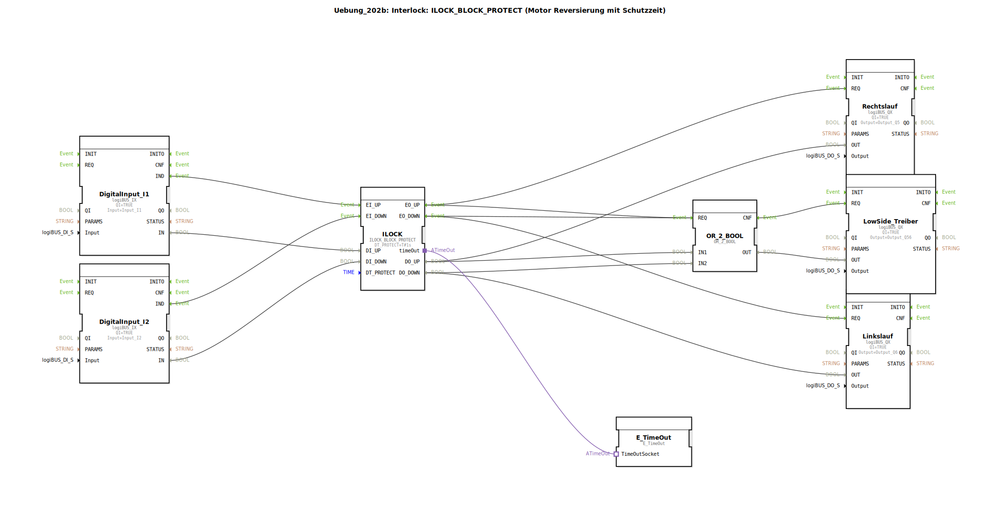

# Uebung_202b: Interlock: ILOCK_BLOCK_PROTECT (Motor Reversierung mit Schutzzeit)

* * * * * * * * * *

## Einleitung

Diese Übung implementiert eine Motorreversierung mit Interlock und Schutzzeit (ILOCK_BLOCK_PROTECT). Über zwei digitale Eingänge wird die Drehrichtung (Rechts- oder Linkslauf) angesteuert, wobei der Interlock-Block verhindert, dass beide Ausgänge gleichzeitig aktiv werden. Ein Low-Side-Treiber wird über eine ODER-Verknüpfung in beiden Fällen mitgeschaltet. Zusätzlich ist eine Schutzzeit (DT_PROTECT = 1 s) integriert, die einen Richtungswechsel erst nach Ablauf dieser Zeit erlaubt.

## Verwendete Funktionsbausteine (FBs)

Die Übung besteht aus folgenden Funktionsbausteinen (FB-Instanzen), die alle in der SubApp ``Uebung_202b`` enthalten sind.

- **DigitalInput_I1**: Typ ``logiBUS::io::DI::logiBUS_IX``  
  Lest den digitalen Eingang ``Input_I1`` ein.  
  - Parameter: QI = TRUE, Input = ``Input_I1``  
  - Ereignisausgang: IND (Indication)  
  - Datenausgang: IN (Wert des Eingangs)

- **DigitalInput_I2**: Typ ``logiBUS::io::DI::logiBUS_IX``  
  Lest den digitalen Eingang ``Input_I2`` ein.  
  - Parameter: QI = TRUE, Input = ``Input_I2``  
  - Ereignisausgang: IND  
  - Datenausgang: IN

- **ILOCK**: Typ ``logiBUS::signalprocessing::interlock::ILOCK_BLOCK_PROTECT``  
  Kernbaustein der Interlock-Funktion mit Schutzzeit.  
  - Parameter: DT_PROTECT = T#1s (Schutzzeit 1 Sekunde)  
  - Ereigniseingänge: EI_UP, EI_DOWN  
  - Ereignisausgänge: EO_UP, EO_DOWN  
  - Dateneingänge: DI_UP, DI_DOWN  
  - Datenausgänge: DO_UP, DO_DOWN  
  - Adapterschnittstelle: timeOut (verbunden mit E_TimeOut)

- **Rechtslauf**: Typ ``logiBUS::io::DQ::logiBUS_QX``  
  Steuert den digitalen Ausgang ``Output_Q5`` (Rechtslauf).  
  - Parameter: QI = TRUE, Output = ``Output_Q5``  
  - Ereigniseingang: REQ  
  - Dateneingang: OUT

- **Linkslauf**: Typ ``logiBUS::io::DQ::logiBUS_QX``  
  Steuert den digitalen Ausgang ``Output_Q6`` (Linkslauf).  
  - Parameter: QI = TRUE, Output = ``Output_Q6``  
  - Ereigniseingang: REQ  
  - Dateneingang: OUT

- **LowSide_Treiber**: Typ ``logiBUS::io::DQ::logiBUS_QX``  
  Steuert den gemeinsamen Low-Side-Ausgang ``Output_Q56``.  
  - Parameter: QI = TRUE, Output = ``Output_Q56``  
  - Ereigniseingang: REQ  
  - Dateneingang: OUT

- **OR_2_BOOL**: Typ ``iec61131::bitwiseOperators::OR_2_BOOL``  
  Logische ODER-Verknüpfung zweier Boolescher Werte.  
  - Ereigniseingang: REQ  
  - Ereignisausgang: CNF  
  - Dateneingänge: IN1, IN2  
  - Datenausgang: OUT

- **E_TimeOut**: Typ ``iec61499::events::E_TimeOut``  
  Zeitgeber, der die Schutzzeit des ILOCK überwacht.  
  - Adapterschnittstelle: TimeOutSocket (verbunden mit ILOCK.timeOut)

## Programmablauf und Verbindungen

Die Komponenten sind wie folgt verschaltet:

1. **Eingangssignale**:  
   - ``DigitalInput_I1`` (Taster/Sensor für Rechtslauf) sendet über seinen Ereignisausgang IND ein Ereignis an den Ereigniseingang ``EI_UP`` des ILOCK. Gleichzeitig wird der Datenwert ``IN`` an den Dateneingang ``DI_UP`` übergeben.  
   - ``DigitalInput_I2`` (Taster/Sensor für Linkslauf) sendet analog an ``EI_DOWN`` und ``DI_DOWN``.

2. **Interlock mit Schutzzeit (ILOCK)**:  
   Der ILOCK-Block wertet die Eingangssignale aus. Bei einem gültigen Befehl (z. B. DI_UP = TRUE und Ereignis an EI_UP) wird der entsprechende Ausgang (DO_UP) aktiviert und ein Ereignis an ``EO_UP`` ausgegeben. Gleichzeitig wird der andere Ausgang (DO_DOWN) deaktiviert. Die Schutzzeit ``DT_PROTECT = 1s`` verhindert einen sofortigen Richtungswechsel; erst nach Ablauf der Zeit darf die Gegenrichtung angenommen werden. Der Adapter ``timeOut`` ist mit dem ``E_TimeOut``-Baustein verbunden, der die Zeitüberwachung realisiert.

3. **Ausgangsansteuerung**:  
   - Das Ereignis ``EO_UP`` des ILOCK triggert den ``Rechtslauf``-Baustein (Eingang REQ) und übergibt den Datenwert ``DO_UP`` an den Dateneingang OUT. Somit wird der Ausgang ``Output_Q5`` gesetzt.  
   - Analog wird bei ``EO_DOWN`` der ``Linkslauf``-Baustein aktiviert und ``Output_Q6`` gesetzt.  
   - Beide Ereignisse (EO_UP und EO_DOWN) werden auch an den Ereigniseingang REQ des ``OR_2_BOOL``-Bausteins weitergeleitet. Der Datenwertausgang ``DO_UP`` geht auf IN1, ``DO_DOWN`` auf IN2 des ODER-Bausteins. Der Ausgang OUT des ODER-Bausteins wird an den ``LowSide_Treiber`` übergeben, sodass der gemeinsame Ausgang ``Output_Q56`` immer dann aktiv ist, wenn entweder Rechts- oder Linkslauf aktiv ist.

4. **Zeitüberwachung**:  
   Der ``E_TimeOut``-Baustein ist über eine Adapterverbindung mit dem ILOCK verbunden und stellt die notwendige Timing-Funktionalität für die Schutzzeit bereit.

Zusammenfassend ergibt sich folgender Ablauf:  
- Betätigung von Eingang I1 → Rechtslauf wird eingeschaltet, Linkslauf ist gesperrt, Low-Side-Treiber wird aktiv.  
- Bei Wechsel auf I2: die Schutzzeit von 1s muss abgelaufen sein, bevor der Linkslauf aktiv wird. Während der Schutzzeit bleibt der letzte Zustand erhalten.  
- Der Low-Side-Treiber folgt dem aktuell aktiven Laufbefehl.

## Zusammenfassung

Die Übung ``Uebung_202b`` vermittelt den Einsatz des Interlock-Bausteins ``ILOCK_BLOCK_PROTECT`` zur sicheren Motorreversierung. Durch die Integration einer Schutzzeit wird ein zu schneller Richtungswechsel verhindert, was Bauteilschäden vorbeugt. Die Verknüpfung mit einem ODER-Gatter zur gemeinsamen Low-Side-Ansteuerung sowie die klare Trennung von Ereignis- und Datenflüssen verdeutlichen die typische Struktur einer 4diac-IDE-Steuerung für logiBUS-Hardware.