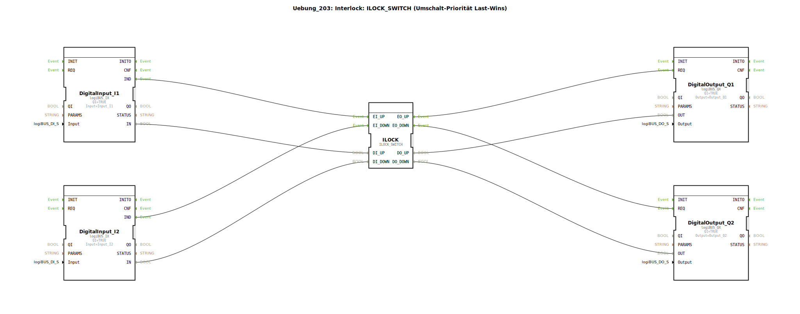

# Uebung_203: Interlock: ILOCK_SWITCH (Umschalt-Priorität Last-Wins)

> **Interlock: ILOCK_SWITCH (Umschalt-Priorität Last-Wins)**

* * * * * * * * * *

## Einleitung

Diese Übung demonstriert den Einsatz eines Interlock-Bausteins vom Typ `ILOCK_SWITCH` zur Priorisierung zweier konkurrierender Anforderungen. Die Schaltung realisiert eine **Umschalt-Priorität nach dem Last-Wins-Prinzip**: Der zuletzt aktivierte Eingang erhält die Freigabe (Priorität). Sobald beide Eingänge wieder inaktiv sind, wird der Ausgang zurückgesetzt.

Zwei digitale Eingangssignale (I1, I2) steuern über den Interlock-Baustein zwei separate digitale Ausgänge (Q1, Q2). Die Logik verhindert, dass beide Ausgänge gleichzeitig aktiv sind, und stellt sicher, dass nur der zuletzt betätigte Kanal durchgeschaltet wird.

## Verwendete Funktionsbausteine (FBs)

Die SubApp enthält folgende Funktionsbausteine:

- **DigitalInput_I1** (Typ: `logiBUS::io::DI::logiBUS_IX`)  
  *Parameter*: `QI = TRUE`, `Input = Input_I1`  
  *Ereignisausgang*: `IND` (aktiviert bei steigender Flanke des Eingangs)  
  *Datenausgang*: `IN` (aktueller Eingangswert)

- **DigitalInput_I2** (Typ: `logiBUS::io::DI::logiBUS_IX`)  
  *Parameter*: `QI = TRUE`, `Input = Input_I2`

- **ILOCK** (Typ: `logiBUS::signalprocessing::interlock::ILOCK_SWITCH`)  
  Keine Parameter.  
  *Ereigniseingänge*: `EI_UP`, `EI_DOWN`  
  *Dateneingänge*: `DI_UP`, `DI_DOWN`  
  *Ereignisausgänge*: `EO_UP`, `EO_DOWN`  
  *Datenausgänge*: `DO_UP`, `DO_DOWN`

- **DigitalOutput_Q1** (Typ: `logiBUS::io::DQ::logiBUS_QX`)  
  *Parameter*: `QI = TRUE`, `Output = Output_Q1`  
  *Ereigniseingang*: `REQ` (aktiviert die Ausgabe)  
  *Dateneingang*: `OUT` (zu setzender Wert)

- **DigitalOutput_Q2** (Typ: `logiBUS::io::DQ::logiBUS_QX`)  
  *Parameter*: `QI = TRUE`, `Output = Output_Q2`

## Programmablauf und Verbindungen

Die Schaltung arbeitet **ereignisgesteuert** und nutzt sowohl Ereignis- als auch Datenverbindungen.

1. **Ereignissteuerung**:  
   - Eine steigende Flanke am Eingang `I1` erzeugt am `DigitalInput_I1` ein Ereignis an `IND`, das mit dem Ereigniseingang `EI_UP` des Interlock-Bausteins verbunden ist.  
   - Analog wird bei einer Flanke an `I2` das Ereignis an `EI_DOWN` gesendet.  
   - Der Interlock-Baustein entscheidet anhand der Priorität (Last-Wins), welcher Kanal freigegeben wird, und löst entweder `EO_UP` oder `EO_DOWN` aus.  
   - Das Ereignis `EO_UP` triggert den Digitalausgang `Q1` über `REQ`, während `EO_DOWN` den Ausgang `Q2` triggert.

2. **Datenfluss**:  
   - Der aktuelle Wert von `I1` (über `IN` von `DigitalInput_I1`) wird an den Dateneingang `DI_UP` des Interlocks übergeben.  
   - Der Wert von `I2` wird an `DI_DOWN` übergeben.  
   - Der Interlock-Baustein gibt den freigegebenen Kanal über die entsprechenden Datenausgänge weiter (`DO_UP` → `OUT` von `DigitalOutput_Q1`, `DO_DOWN` → `OUT` von `DigitalOutput_Q2`).

3. **Funktionsweise des `ILOCK_SWITCH`**:  
   - Bei gleichzeitiger oder kollidierender Anforderung gewinnt der zuletzt eingetroffene Impuls (Last-Wins).  
   - Nur einer der beiden Ausgänge kann aktiv sein.  
   - Sobald beide Eingänge auf `FALSE` zurückgehen, werden auch die Ausgänge zurückgesetzt (sofern der Baustein entsprechend konfiguriert ist).

**Lernziele dieser Übung**:
- Verständnis des Interlock-Prinzips und der Last-Wins-Priorität.
- Umgang mit ereignisgesteuerten Funktionsbausteinen in 4diac IDE.
- Verknüpfung von digitalen Ein-/Ausgängen mit einem Interlock-Baustein.
- Fehlersuche und Verhaltenstests durch Simulation.

## Zusammenfassung

Die Übung `Uebung_203` setzt einen `ILOCK_SWITCH`-Baustein ein, um zwei konkurrierende digitale Eingänge zu priorisieren. Die Last-Wins-Logik stellt sicher, dass stets nur der zuletzt aktivierte Kanal durchgeschaltet wird. Die Implementierung erfolgt vollständig ereignisgesteuert mit entsprechenden Datenverbindungen, was eine saubere und deterministische Steuerung ermöglicht. Diese Grundschaltung ist ein typischer Baustein für Sicherheits- und Verriegelungslogiken in der Automatisierungstechnik.