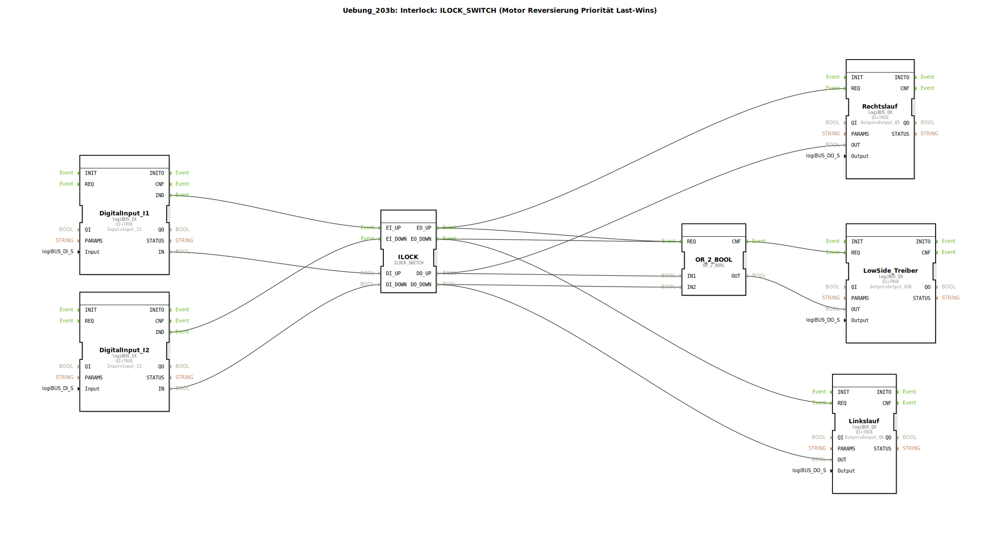

# Uebung_203b: Interlock: ILOCK_SWITCH (Motor Reversierung Priorität Last-Wins)

* * * * * * * * * *

## Einleitung

Diese Übung demonstriert den Einsatz eines **ILOCK_SWITCH**-Funktionsbausteins zur sicheren Ansteuerung eines Motors mit Reversierfunktion.  
Das Prinzip der **Last-Wins-Priorität** sorgt dafür, dass bei gleichzeitig anliegenden Steuersignalen das zuletzt aktive Signal Vorrang hat – ein Kurzschluss durch gleichzeitige Aktivierung beider Drehrichtungen wird verhindert.  
Ein zusätzlicher **Low-Side-Treiber** wird bei jeder aktiven Drehrichtung eingeschaltet, um die Last (z. B. Motor) mit Spannung zu versorgen.

## Verwendete Funktionsbausteine (FBs)

### Digitaleingänge
- **DigitalInput_I1** (Typ: `logiBUS::io::DI::logiBUS_IX`)
  - Parameter: `QI = TRUE`, `Input = Input_I1`
  - Ereignisausgang: `IND`
  - Datenausgang: `IN`

- **DigitalInput_I2** (Typ: `logiBUS::io::DI::logiBUS_IX`)
  - Parameter: `QI = TRUE`, `Input = Input_I2`
  - Ereignisausgang: `IND`
  - Datenausgang: `IN`

### Interlock-Baustein
- **ILOCK** (Typ: `logiBUS::signalprocessing::interlock::ILOCK_SWITCH`)
  - Ereigniseingänge: `EI_UP`, `EI_DOWN`
  - Dateneingänge: `DI_UP`, `DI_DOWN`
  - Ereignisausgänge: `EO_UP`, `EO_DOWN`
  - Datenausgänge: `DO_UP`, `DO_DOWN`

### Digitalausgänge
- **Rechtslauf** (Typ: `logiBUS::io::DQ::logiBUS_QX`)
  - Parameter: `QI = TRUE`, `Output = Output_Q5`
  - Eingang: `REQ`, Daten: `OUT`

- **Linkslauf** (Typ: `logiBUS::io::DQ::logiBUS_QX`)
  - Parameter: `QI = TRUE`, `Output = Output_Q6`
  - Eingang: `REQ`, Daten: `OUT`

- **LowSide_Treiber** (Typ: `logiBUS::io::DQ::logiBUS_QX`)
  - Parameter: `QI = TRUE`, `Output = Output_Q56`
  - Eingang: `REQ`, Daten: `OUT`

### Logikgatter
- **OR_2_BOOL** (Typ: `iec61131::bitwiseOperators::OR_2_BOOL`)
  - Ereigniseingang: `REQ`
  - Dateneingänge: `IN1`, `IN2`
  - Ereignisausgang: `CNF`
  - Datenausgang: `OUT`

## Programmablauf und Verbindungen

1. Die beiden digitalen Eingänge **Input_I1** und **Input_I2** liefern über die Bausteine `DigitalInput_I1` bzw. `DigitalInput_I2` die Steuersignale für die Drehrichtung (z. B. Taster für Rechts- und Linkslauf).
2. Die Ereignisse `IND` sowie die Datenwerte `IN` werden an den Interlock-Baustein **ILOCK** weitergeleitet:
   - `DigitalInput_I1.IND` → `ILOCK.EI_UP` | `DigitalInput_I1.IN` → `ILOCK.DI_UP`
   - `DigitalInput_I2.IND` → `ILOCK.EI_DOWN` | `DigitalInput_I2.IN` → `ILOCK.DI_DOWN`
3. Der `ILOCK_SWITCH` entscheidet nach der **Last-Wins**-Logik, welcher Ausgang aktiviert wird:
   - Bei einem Ereignis an `EI_UP` wird `DO_UP = DI_UP` gesetzt und `DO_DOWN` zurückgesetzt (sofern beide Eingänge aktiv).
   - Bei einem Ereignis an `EI_DOWN` wird `DO_DOWN = DI_DOWN` gesetzt und `DO_UP` zurückgesetzt.
   - Die entsprechenden Ereignisausgänge (`EO_UP`, `EO_DOWN`) triggern die nachfolgenden Bausteine.
4. Der Ausgang `DO_UP` wird auf den Datenausgang **Rechtslauf** (`OUT`) gegeben und dessen `REQ`-Ereignis über `EO_UP` aktiviert. Gleiches gilt für `DO_DOWN` und **Linkslauf**.
5. Die Signale `DO_UP` und `DO_DOWN` werden gleichzeitig dem ODER-Gatter **OR_2_BOOL** zugeführt:
   - `ILOCK.DO_UP` → `OR_2_BOOL.IN1`
   - `ILOCK.DO_DOWN` → `OR_2_BOOL.IN2`
   - Die Ereignisse `EO_UP` und `EO_DOWN` werden auf `OR_2_BOOL.REQ` zusammengeführt.
6. Sobald mindestens einer der beiden Datenwerte `TRUE` ist, liefert `OR_2_BOOL.OUT = TRUE`. Das Bestätigungsereignis `CNF` aktiviert dann den **LowSide_Treiber** (`REQ`), der die gemeinsame Versorgung der Last (z. B. Motorspannung) über `Output_Q56` einschaltet.

Durch diese Verschaltung wird sichergestellt:
- Nie beide Drehrichtungen gleichzeitig aktiv.
- Die Last wird nur bestromt, wenn eine Drehrichtung angefordert wird.
- Die **Last-Wins-Priorität** verhindert Blockaden bei gleichzeitigen Tasterbetätigungen.

## Zusammenfassung

Die Übung vermittelt die sichere Ansteuerung eines Reversiermotors mittels Interlock-Baustein und Last-Wins-Logik.  
**Lernziele:**
- Verständnis von Interlock-Mechanismen zur Vermeidung von Kurzschlüssen.
- Umgang mit dem ILOCK_SWITCH-Funktionsbaustein (Ereignis-/Datenschnittstelle).
- Kombination von Ereignis- und Datenflüssen in 4diac-IDE.
- Realisierung einer Hilfsspannung (Low-Side-Treiber) in Abhängigkeit der Motoranforderung.

**Schwierigkeitsgrad:** Mittel  
**Vorkenntnisse:** Grundlagen der 4diac-IDE, Ereignis- und Datenverbindungen, einfache Logikgatter.  
**Start der Übung:** Öffnen Sie die Subapplikation `Uebung_203b` und simulieren Sie die digitalen Eingänge `Input_I1` / `Input_I2`. Beobachten Sie die Ausgänge `Output_Q5` (Rechts), `Output_Q6` (Links) und `Output_Q56` (Low-Side).