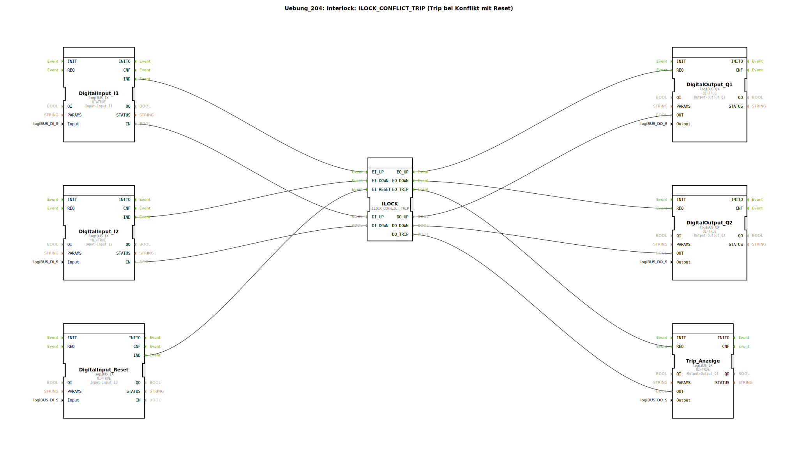

# Uebung_204: Interlock: ILOCK_CONFLICT_TRIP (Trip bei Konflikt mit Reset)

* * * * * * * * * *
## Einleitung
Diese Übung realisiert eine Interlock-Funktion mit Konflikterkennung und Trip-Auslösung, die durch einen Reset zurückgesetzt werden kann. Sie zeigt den typischen Einsatz eines Interlock-Bausteins zur Vermeidung gleichzeitiger, widersprüchlicher Ansteuerungen (z. B. Auf/Ab-Bewegung). Der ILOCK_CONFLICT_TRIP erzeugt bei einem Konflikt einen Trip (Störausgang) und sperrt die Ausgänge, bis ein explizites Rücksetzsignal anliegt.

## Verwendete Funktionsbausteine (FBs)
Die Übung besteht aus folgenden Funktionsbausteinen, die über Ereignis- und Datenleitungen verbunden sind:

- **DigitalInput_I1** – Typ: `logiBUS::io::DI::logiBUS_IX`  
  Parameter: `QI = TRUE`, `Input = Input_I1`  
  Digitaleingang für das Auf-Signal (UP).

- **DigitalInput_I2** – Typ: `logiBUS::io::DI::logiBUS_IX`  
  Parameter: `QI = TRUE`, `Input = Input_I2`  
  Digitaleingang für das Ab-Signal (DOWN).

- **DigitalInput_Reset** – Typ: `logiBUS::io::DI::logiBUS_IX`  
  Parameter: `QI = TRUE`, `Input = Input_I3`  
  Digitaleingang für das Rücksetzsignal.

- **ILOCK** – Typ: `logiBUS::signalprocessing::interlock::ILOCK_CONFLICT_TRIP`  
  Der zentrale Interlock-Baustein. Er wertet die Eingangssignale aus und steuert die Ausgänge. Bei gleichzeitig anliegendem UP und DOWN (Konflikt) wird der Trip-Ausgang gesetzt.

- **DigitalOutput_Q1** – Typ: `logiBUS::io::DQ::logiBUS_QX`  
  Parameter: `QI = TRUE`, `Output = Output_Q1`  
  Digitalausgang für das Auf-Signal.

- **DigitalOutput_Q2** – Typ: `logiBUS::io::DQ::logiBUS_QX`  
  Parameter: `QI = TRUE`, `Output = Output_Q2`  
  Digitalausgang für das Ab-Signal.

- **Trip_Anzeige** – Typ: `logiBUS::io::DQ::logiBUS_QX`  
  Parameter: `QI = TRUE`, `Output = Output_Q4`  
  Digitalausgang zur Anzeige des Trip-Zustands.

## Programmablauf und Verbindungen
Die Übung ist als SubAppType angelegt, in der die gesamte Logik abläuft. Die Verbindungen sind wie folgt:

| Ereignisverbindung | Quelle | Ziel | Datenverbindung | Quelle | Ziel |
|-------------------|--------|------|-----------------|--------|------|
| IND → EI_UP | DigitalInput_I1 | ILOCK | IN → DI_UP | DigitalInput_I1 | ILOCK |
| IND → EI_DOWN | DigitalInput_I2 | ILOCK | IN → DI_DOWN | DigitalInput_I2 | ILOCK |
| IND → EI_RESET | DigitalInput_Reset | ILOCK | – | – | – |
| EO_UP → REQ | ILOCK | DigitalOutput_Q1 | DO_UP → OUT | ILOCK | DigitalOutput_Q1 |
| EO_DOWN → REQ | ILOCK | DigitalOutput_Q2 | DO_DOWN → OUT | ILOCK | DigitalOutput_Q2 |
| EO_TRIP → REQ | ILOCK | Trip_Anzeige | DO_TRIP → OUT | ILOCK | Trip_Anzeige |

**Ablauf:**  
1. Ein steigende Flanke auf einem der Eingänge (I1 für AUF, I2 für AB) erzeugt ein Ereignis, das den ILOCK-Baustein an seinem entsprechenden Ereigniseingang aktiviert.  
2. Der ILOCK prüft, ob ein Konflikt vorliegt (beide Eingänge gleichzeitig aktiv).  
   - **Kein Konflikt:** Der gewünschte Ausgang (DO_UP oder DO_DOWN) wird gesetzt und der zugehörige Ausgangstreiber (Q1 oder Q2) geschaltet.  
   - **Konflikt:** Es wird kein Ausgang gesetzt, stattdessen wird der Trip-Ausgang (DO_TRIP) aktiviert und über `Trip_Anzeige` ausgegeben. Die Ausgänge Q1 und Q2 bleiben aus.  
3. Ein anliegendes Rücksetzsignal (I3) kann den Trip zurücksetzen und die normale Funktion wiederherstellen. Solange der Konflikt andauert, führt ein erneuter Reset nicht zu einer Freigabe.

## Zusammenfassung
Die Übung **Uebung_204** demonstriert die Verwendung des Interlock-Bausteins `ILOCK_CONFLICT_TRIP`. Sie zeigt, wie durch zwei gegensätzliche Stellsignale (z. B. Auf/Ab) ein Konflikt erkannt und durch einen Trip abgesichert wird. Der Baustein erfordert eine explizite Rücksetzung nach einem Konflikt. Dieses Verhalten ist typisch für Sicherheitsanwendungen in der Automatisierungstechnik. Die Übung eignet sich für Einsteiger, die grundlegende Verriegelungsmechanismen mit 4diac und logiBUS-Funktionsbausteinen erlernen möchten.