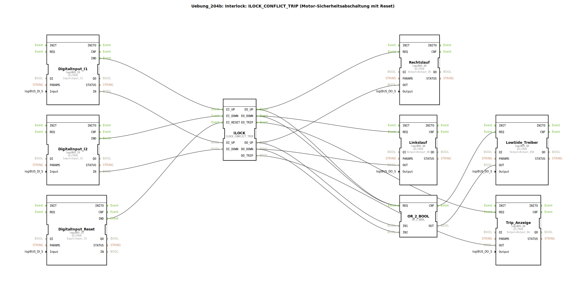

# Uebung_204b: Interlock: ILOCK_CONFLICT_TRIP (Motor-Sicherheitsabschaltung mit Reset)

* * * * * * * * * *

## Einleitung

In dieser Übung wird eine **Motor-Sicherheitsabschaltung mit Reset** realisiert. Sie basiert auf dem Funktionsbaustein `ILOCK_CONFLICT_TRIP`, der eine Verriegelung (Interlock) für zwei gegenläufige Motorrichtungen (Rechts- und Linkslauf) implementiert. Tritt ein Konflikt auf (beide Richtungen gleichzeitig aktiv), wird der Motor gestoppt und ein Alarm (Trip) ausgelöst. Ein separater Reset-Eingang erlaubt das Zurücksetzen des Trip-Zustands.

Die Steuerung erfolgt über drei digitale Eingänge:
- I1 – Anforderung Rechtslauf
- I2 – Anforderung Linkslauf
- I3 – Reset

Als Ausgänge stehen zur Verfügung:
- Q5 – Rechtslauf
- Q6 – Linkslauf
- Q4 – Trip-Anzeige
- Q56 – Low-Side-Treiber (gemeinsame Freigabe für beide Motorrichtungen)

## Verwendete Funktionsbausteine (FBs)

Die Übung verwendet folgende Funktionsbausteine:

- **`DigitalInput_I1`** (Typ: `logiBUS::io::DI::logiBUS_IX`)  
  - Parameter: `QI` = TRUE, `Input` = `Input_I1`  
  - Wandelt das digitale Eingangssignal I1 in ein internes Signal um.

- **`DigitalInput_I2`** (Typ: `logiBUS::io::DI::logiBUS_IX`)  
  - Parameter: `QI` = TRUE, `Input` = `Input_I2`  
  - Wandelt das digitale Eingangssignal I2 in ein internes Signal um.

- **`DigitalInput_Reset`** (Typ: `logiBUS::io::DI::logiBUS_IX`)  
  - Parameter: `QI` = TRUE, `Input` = `Input_I3`  
  - Wandelt das digitale Eingangssignal I3 (Reset) in ein internes Signal um.

- **`ILOCK`** (Typ: `logiBUS::signalprocessing::interlock::ILOCK_CONFLICT_TRIP`)  
  - Keine Parameter  
  - Kernbaustein dieser Übung. Er realisiert die Verriegelungslogik mit Konflikterkennung und Trip-Funktion.

- **`Rechtslauf`** (Typ: `logiBUS::io::DQ::logiBUS_QX`)  
  - Parameter: `QI` = TRUE, `Output` = `Output_Q5`  
  - Steuert den Ausgang Q5 für Rechtslauf des Motors.

- **`Linkslauf`** (Typ: `logiBUS::io::DQ::logiBUS_QX`)  
  - Parameter: `QI` = TRUE, `Output` = `Output_Q6`  
  - Steuert den Ausgang Q6 für Linkslauf des Motors.

- **`Trip_Anzeige`** (Typ: `logiBUS::io::DQ::logiBUS_QX`)  
  - Parameter: `QI` = TRUE, `Output` = `Output_Q4`  
  - Steuert den Ausgang Q4 als Anzeige für den Trip-Zustand.

- **`LowSide_Treiber`** (Typ: `logiBUS::io::DQ::logiBUS_QX`)  
  - Parameter: `QI` = TRUE, `Output` = `Output_Q56`  
  - Steuert den Ausgang Q56 als gemeinsame Freigabe (Low-Side-Treiber) für beide Motorrichtungen.

- **`OR_2_BOOL`** (Typ: `iec61131::bitwiseOperators::OR_2_BOOL`)  
  - Keine Parameter  
  - Logisches ODER-Gatter; verknüpft die Signale für Rechts- und Linkslauf, um den Low-Side-Treiber anzusteuern.

## Programmablauf und Verbindungen

Der Ablauf gliedert sich in folgende Schritte:

1. **Eingangserfassung**:  
   Die drei digitalen Eingänge (I1, I2, I3) werden über die entsprechenden `logiBUS_IX`-Bausteine eingelesen.  
   - `DigitalInput_I1` liefert den Rechtslauf-Wunsch (BOOL) und ein Ereignis `IND`.  
   - `DigitalInput_I2` liefert den Linkslauf-Wunsch und ein Ereignis `IND`.  
   - `DigitalInput_Reset` liefert das Reset-Signal und ein Ereignis `IND`.

2. **Verarbeitung im ILOCK-Baustein**:  
   - Der Baustein `ILOCK` empfängt die Ereignisse von den Eingängen:  
     - `EI_UP` wird durch `DigitalInput_I1.IND` getriggert.  
     - `EI_DOWN` wird durch `DigitalInput_I2.IND` getriggert.  
     - `EI_RESET` wird durch `DigitalInput_Reset.IND` getriggert.  
   - Die Datenwerte (BOOL) werden über die entsprechenden Datenports übertragen:  
     - `DI_UP` von `DigitalInput_I1.IN`  
     - `DI_DOWN` von `DigitalInput_I2.IN`  
   - Der Baustein entscheidet basierend auf seiner internen Zustandslogik, ob die Anforderung gültig ist, ein Konflikt vorliegt oder ein Reset durchgeführt wird.

3. **Ausgabe der Motorrichtungen**:  
   - Bei gültiger Rechtslauf-Anforderung erzeugt `ILOCK` ein Ereignis `EO_UP` und setzt den Datenausgang `DO_UP` auf TRUE.  
   - Bei gültiger Linkslauf-Anforderung erzeugt `ILOCK` ein Ereignis `EO_DOWN` und setzt `DO_DOWN` auf TRUE.  
   - Im Fehlerfall (Konflikt) erzeugt `ILOCK` ein Ereignis `EO_TRIP` und setzt `DO_TRIP` auf TRUE.  
   - Die Ereignisse werden an die entsprechenden Ausgangsbausteine weitergeleitet:  
     - `EO_UP` → `Rechtslauf.REQ`  
     - `EO_DOWN` → `Linkslauf.REQ`  
     - `EO_TRIP` → `Trip_Anzeige.REQ`  
   - Die Datenwerte werden über die Datenverbindungen auf die Ausgangsbausteine übertragen:  
     - `DO_UP` → `Rechtslauf.OUT`  
     - `DO_DOWN` → `Linkslauf.OUT`  
     - `DO_TRIP` → `Trip_Anzeige.OUT`

4. **Low-Side-Treiber**:  
   - Der Low-Side-Treiber (Ausgang Q56) wird aktiviert, sobald entweder Rechts- oder Linkslauf aktiv ist.  
   - Dazu werden die Ereignisse `EO_UP` und `EO_DOWN` (beide) an den Baustein `OR_2_BOOL.REQ` geleitet.  
   - Die Datenwerte `DO_UP` und `DO_DOWN` werden an die Eingänge `IN1` bzw. `IN2` des ODER-Gatters geführt.  
   - Der Ausgang `OR_2_BOOL.OUT` ist TRUE, wenn mindestens eine der beiden Anforderungen aktiv ist.  
   - Das Ereignis `OR_2_BOOL.CNF` triggert den Baustein `LowSide_Treiber.REQ`, und der Datenwert `OR_2_BOOL.OUT` wird an `LowSide_Treiber.OUT` übergeben.

### Lernziele

- Verständnis des Interlock-Konzepts für Motorsteuerungen
- Umgang mit dem Baustein `ILOCK_CONFLICT_TRIP` (Konflikt-/Trip-Logik)
- Verknüpfung von Ereignis- und Datenflüssen in der 4diac-IDE
- Anwendung eines ODER-Gatters zur gemeinsamen Freigabe
- Fehlerbehandlung durch Reset-Mechanismus

### Schwierigkeitsgrad
Fortgeschritten – Grundkenntnisse in der 4diac-IDE und im Umgang mit Funktionsbausteinen werden vorausgesetzt.

### Vorkenntnisse
- Grundlagen der IEC 61499
- Ablaufsteuerungen und Verriegelungen
- Ein-/Ausgabe-Konfiguration mit logiBUS-Bausteinen

### Start der Übung
1. Öffnen Sie die 4diac-IDE und laden Sie die Übung `Uebung_204b`.
2. Stellen Sie sicher, dass die benötigten logiBUS-Bibliotheken importiert sind (siehe CompilerInfo).
3. Überprüfen Sie die Verbindungen zwischen den Bausteinen.
4. Simulieren Sie das Verhalten durch Anlegen der Eingangssignale I1, I2 und I3.

## Zusammenfassung

Die Übung `Uebung_204b` demonstriert den Einsatz des Funktionsbausteins `ILOCK_CONFLICT_TRIP` für eine Motor-Sicherheitsabschaltung. Durch die Kombination von drei digitalen Eingängen (zwei Richtungswünsche und ein Reset) wird eine Verriegelung realisiert, die Konflikte erkennt und im Fehlerfall einen Trip auslöst. Die Ansteuerung der Ausgänge erfolgt über getrennte Kanäle für Rechtslauf, Linkslauf sowie eine gemeinsame Low-Side-Freigabe. Die Lösung zeigt exemplarisch, wie sicherheitsgerichtete Steuerungen mit der 4diac-IDE umgesetzt werden können.