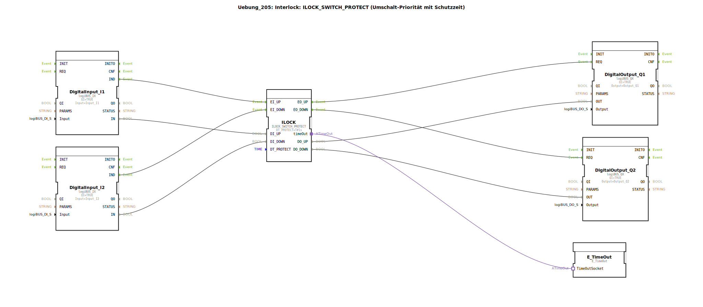

# Uebung_205: Interlock: ILOCK_SWITCH_PROTECT (Umschalt-Priorität mit Schutzzeit)

* * * * * * * * * *

## Einleitung

Diese Übung demonstriert den Einsatz des Funktionsbausteins `ILOCK_SWITCH_PROTECT` zur Realisierung einer Umschalt-Priorität mit Schutzzeit (Interlock). Zwei digitale Eingänge (I1, I2) steuern zwei digitale Ausgänge (Q1, Q2) über eine verriegelte Logik. Der `ILOCK_SWITCH_PROTECT` stellt sicher, dass nach einer Umschaltung eine konfigurierbare Schutzzeit (`DT_PROTECT`) eingehalten wird, bevor erneut umgeschaltet werden kann. Dies verhindert ein schnelles, unerwünschtes Hin- und Herschalten (Pendeln). Die Ausgänge werden über ereignisgesteuerte Ausgangsbausteine angesteuert. Ein `E_TimeOut`-Baustein ist über einen Adapter an den `ILOCK` angeschlossen und ermöglicht eine Zeitüberwachung der Schutzzeit.

## Verwendete Funktionsbausteine (FBs)

### Bausteine der SubApplikation `Uebung_205`

| Bausteinname | Typ | Parameter | Beschreibung |
|--------------|-----|-----------|--------------|
| `DigitalInput_I1` | `logiBUS::io::DI::logiBUS_IX` | `QI = TRUE`, `Input = Input_I1` | Liest den ersten digitalen Eingang (Hardwareadresse `Input_I1`). Das Ereignis `IND` signalisiert eine Wertänderung. |
| `DigitalInput_I2` | `logiBUS::io::DI::logiBUS_IX` | `QI = TRUE`, `Input = Input_I2` | Liest den zweiten digitalen Eingang. Das Ereignis `IND` signalisiert eine Wertänderung. |
| `ILOCK` | `logiBUS::signalprocessing::interlock::ILOCK_SWITCH_PROTECT` | `DT_PROTECT = T#1s` | Kernbaustein: Realisiert die Umschalt-Priorität mit Schutzzeit von 1 Sekunde. |
| `DigitalOutput_Q1` | `logiBUS::io::DQ::logiBUS_QX` | `QI = TRUE`, `Output = Output_Q1` | Setzt den ersten digitalen Ausgang (Hardwareadresse `Output_Q1`) auf den Wert des Dateneingangs `OUT`, wenn das Ereignis `REQ` eintrifft. |
| `DigitalOutput_Q2` | `logiBUS::io::DQ::logiBUS_QX` | `QI = TRUE`, `Output = Output_Q2` | Setzt den zweiten digitalen Ausgang (Hardwareadresse `Output_Q2`) auf den Wert des Dateneingangs `OUT`, wenn das Ereignis `REQ` eintrifft. |
| `E_TimeOut` | `iec61499::events::E_TimeOut` | – | Zeitgeber-Baustein, der über den Adapter `timeOut` mit dem `ILOCK` verbunden ist. Er überwacht die Einhaltung der Schutzzeit. |

## Programmablauf und Verbindungen

1. **Ereignissteuerung:**
   - Eine steigende/fallende Flanke an `DigitalInput_I1` löst das Ereignis `DigitalInput_I1.IND` aus → verbunden mit `ILOCK.EI_UP`.
   - Eine Flanke an `DigitalInput_I2` löst `DigitalInput_I2.IND` aus → verbunden mit `ILOCK.EI_DOWN`.
   - Der `ILOCK` generiert bei erfolgreicher Umschaltung das Ereignis `EO_UP` (für den oberen Ausgang) bzw. `EO_DOWN` (für den unteren Ausgang).
   - `ILOCK.EO_UP` ist mit `DigitalOutput_Q1.REQ` verbunden (Ausgang Q1 schaltet).
   - `ILOCK.EO_DOWN` ist mit `DigitalOutput_Q2.REQ` verbunden (Ausgang Q2 schaltet).

2. **Datenpfad:**
   - Der Wert des Eingangs `DigitalInput_I1.IN` wird auf `ILOCK.DI_UP` übertragen.
   - Der Wert von `DigitalInput_I2.IN` wird auf `ILOCK.DI_DOWN` übertragen.
   - Der ILOCK gibt über `DO_UP` den Zustand für den oberen Ausgang (1 = aktiv) an `DigitalOutput_Q1.OUT` weiter.
   - Entsprechend gibt `DO_DOWN` den Zustand an `DigitalOutput_Q2.OUT` weiter.

3. **Schutzzeit-Überwachung:**
   - Der `ILOCK_SWITCH_PROTECT` verfügt über einen Adapteranschluss `timeOut`, der mit dem `E_TimeOut.TimeOutSocket` verbunden ist. Dieser Adapter erlaubt es dem `E_TimeOut`, die Schutzzeit (hier 1 Sekunde) zu überwachen und bei Ablauf ein Ereignis zu erzeugen, falls nötig.

4. **Funktionsweise des Interlocks:**
   - Der `ILOCK_SWITCH_PROTECT` arbeitet mit Priorität: Welcher Eingang zuerst aktiv wird, setzt den entsprechenden Ausgang. Solange die Schutzzeit (`DT_PROTECT = 1s`) läuft, wird der andere Eingang ignoriert. Erst nach Ablauf der Schutzzeit kann wieder umgeschaltet werden.
   - Dies verhindert ein schnelles Hin- und Herschalten zwischen den beiden Ausgängen (z.B. bei mechanischen Prellern oder schnellen Tastern).

**Lernziele:**
- Verwendung des Interlock-Bausteins `ILOCK_SWITCH_PROTECT` mit Schutzzeit.
- Verständnis für ereignisgesteuerte Kommunikation (IND → EI, EO → REQ).
- Einbindung eines Zeitgeber-Adapters zur Überwachung der Schutzzeit.
- Konfiguration von Hardware-Ein-/Ausgängen (`logiBUS_IX`, `logiBUS_QX`).

**Schwierigkeitsgrad:** Mittel  
**Vorkenntnisse:** Grundlagen der Ereignissteuerung in 4diac, Umgang mit Ein-/Ausgangsbausteinen.

## Zusammenfassung

Die Übung **Uebung_205** zeigt die praktische Anwendung eines Interlocks mit Schutzzeit mithilfe des `ILOCK_SWITCH_PROTECT`-Bausteins. Zwei digitale Eingänge steuern zwei Ausgänge, wobei eine Umschaltung nur nach Ablauf einer konfigurierbaren Schutzzeit möglich ist. Der Aufbau verdeutlicht die Trennung von Ereignis- und Datenpfaden sowie die Integration von Zeitüberwachung über Adapter. Diese Schaltung eignet sich typischerweise für Anwendungen, bei denen zwei Aktoren nicht gleichzeitig aktiv sein dürfen und ein schnelles Umschalten vermieden werden muss (z.B. Motor-Richtungsumkehr, Ventilsteuerung).