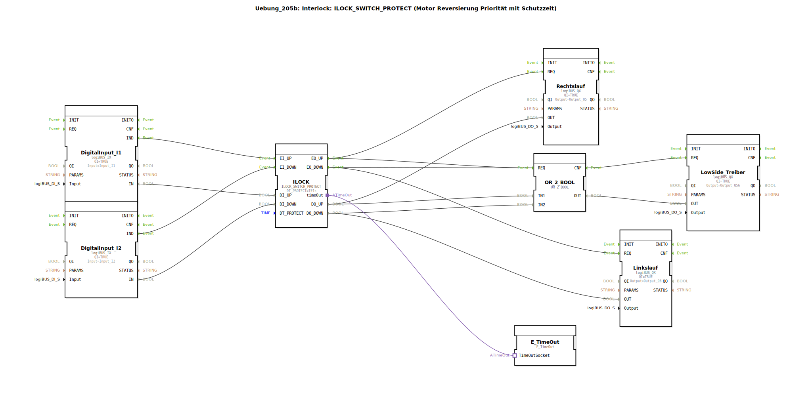

# Uebung_205b: Interlock: ILOCK_SWITCH_PROTECT (Motor Reversierung Priorität mit Schutzzeit)

* * * * * * * * * *

## Einleitung

Diese Übung zeigt die Realisierung einer **Motor-Umkehrverriegelung** mit Prioritätsschutz und einer Schutzzeit. Mit Hilfe des Funktionsbausteins `ILOCK_SWITCH_PROTECT` wird sichergestellt, dass ein Motor nicht gleichzeitig in beide Drehrichtungen (Rechts‑ und Linkslauf) geschaltet werden kann. Ein zusätzlicher Low‑Side‑Treiber schaltet die gemeinsame Versorgung. Die Schutzzeit `DT_PROTECT` von 1 s verhindert ein zu schnelles Umschalten und schützt die Leistungselektronik.

## Verwendete Funktionsbausteine (FBs)

### Eingangsbausteine – Digitale Eingänge

- **DigitalInput_I1** (Typ `logiBUS::io::DI::logiBUS_IX`)  
  - Parameter: `QI = TRUE`, `Input = Input_I1`  
  - Funktion: Erfasst das Signal des ersten Tasters/Sensors (z. B. „Rechts starten“) und gibt es als Ereignis `IND` und Datenwert `IN` weiter.

- **DigitalInput_I2** (Typ `logiBUS::io::DI::logiBUS_IX`)  
  - Parameter: `QI = TRUE`, `Input = Input_I2`  
  - Funktion: Erfasst das Signal des zweiten Tasters/Sensors (z. B. „Links starten“) und gibt es als Ereignis `IND` und Datenwert `IN` weiter.

### Verriegelungsbaustein

- **ILOCK** (Typ `logiBUS::signalprocessing::interlock::ILOCK_SWITCH_PROTECT`)  
  - Parameter: `DT_PROTECT = T#1s`  
  - Funktion: Realisiert die Verriegelung zwischen zwei Richtungen.  
    - Ereigniseingänge: `EI_UP` (Rechts anfordern), `EI_DOWN` (Links anfordern)  
    - Datenausgänge: `DO_UP`, `DO_DOWN` (Freigabe der Richtungen)  
    - Ereignisausgänge: `EO_UP`, `EO_DOWN` (Bestätigung der Freigabe)  
    - Intern wird bei einer Richtungsänderung die Schutzzeit `DT_PROTECT` gestartet, bevor die andere Richtung freigegeben werden kann.  
    - Adapter `timeOut` gibt den Timerstatus an den `E_TimeOut`‑Baustein weiter.

### Ausgangsbausteine

- **Rechtslauf** (Typ `logiBUS::io::DQ::logiBUS_QX`)  
  - Parameter: `QI = TRUE`, `Output = Output_Q5`  
  - Funktion: Schaltet den Ausgang für die Rechtslaufspule (Q5), wenn über `REQ` und `IN` die Freigabe vom ILOCK kommt.

- **Linkslauf** (Typ `logiBUS::io::DQ::logiBUS_QX`)  
  - Parameter: `QI = TRUE`, `Output = Output_Q6`  
  - Funktion: Schaltet den Ausgang für die Linkslaufspule (Q6), wenn über `REQ` und `IN` die Freigabe vom ILOCK kommt.

- **LowSide_Treiber** (Typ `logiBUS::io::DQ::logiBUS_QX`)  
  - Parameter: `QI = TRUE`, `Output = Output_Q56`  
  - Funktion: Schaltet die gemeinsame Versorgung (Q56) für beide Richtungen. Wird aktiviert, sobald eine der beiden Freigaben (`DO_UP` oder `DO_DOWN`) anliegt.

### Logikbaustein

- **OR_2_BOOL** (Typ `iec61131::bitwiseOperators::OR_2_BOOL`)  
  - Funktion: Logische ODER-Verknüpfung der beiden Freigabesignale (`DO_UP` und `DO_DOWN`).  
    - Eingänge: `IN1`, `IN2`  
    - Ausgang: `OUT` – ergibt `TRUE`, wenn mindestens eine Richtung freigegeben ist.

### Timerbaustein

- **E_TimeOut** (Typ `iec61499::events::E_TimeOut`)  
  - Funktion: Dient der Visualisierung/Überwachung der Schutzzeit. Er ist über den Adapter `timeOut` mit dem ILOCK verbunden und zeigt den Status des laufenden Timers an (z. B. für Diagnosezwecke).

## Programmablauf und Verbindungen

1. **Eingangsverarbeitung**  
   - Die digitalen Eingänge `Input_I1` (Rechts) und `Input_I2` (Links) werden über die Bausteine `DigitalInput_I1` und `DigitalInput_I2` erfasst.  
   - Bei einer Flanke wird ein Ereignis (`IND`) an den ILOCK gesendet.

2. **Verriegelung durch ILOCK**  
   - Der ILOCK prüft, ob eine Richtungsänderung zulässig ist.  
   - Bei einem Umschaltwunsch wird die Schutzzeit von 1 s gestartet.  
   - Erst nach Ablauf der Schutzzeit wird die neue Richtung freigegeben und das entsprechende Ereignis (`EO_UP`/`EO_DOWN`) sowie der Datenwert (`DO_UP`/`DO_DOWN`) ausgegeben.  
   - Der Adapter `timeOut` liefert den Timerstatus an den `E_TimeOut`, der z. B. in einer HMI‑Anzeige verwendet werden kann.

3. **Ansteuerung der Ausgänge**  
   - `EO_UP` triggert den Baustein `Rechtslauf`, der den Ausgang `Output_Q5` setzt.  
   - `EO_DOWN` triggert den Baustein `Linkslauf`, der den Ausgang `Output_Q6` setzt.  
   - Parallel werden die Datenausgänge `DO_UP` und `DO_DOWN` an die ODER‑Verknüpfung (`OR_2_BOOL`) weitergeleitet.  
   - Das ODER‑Signal aktiviert den `LowSide_Treiber`, der die gemeinsame Versorgung `Output_Q56` einschaltet. Dadurch fließt nur dann Strom, wenn mindestens eine Richtung aktiv ist.

4. **Schutzmechanismus**  
   - Die Schutzzeit verhindert, dass bei schnellem Wechsel der Anforderung (Prellen, Fehlbedienung) die Ausgänge zu schnell umschalten, und schützt so die Motorbrücke.

## Zusammenfassung

Die Übung 205b demonstriert eine industriegerechte Motor‑Umkehrschaltung mit **Prioritätsverriegelung** (`ILOCK_SWITCH_PROTECT`). Durch die integrierte **Schutzzeit** wird ein zu schnelles Umschalten zwischen Rechts‑ und Linkslauf unterbunden. Ein Low‑Side‑Treiber sorgt für die saubere Trennung der Versorgung. Der Einsatz von logiBUS‑ und IEC‑61131‑Bausteinen macht die Lösung hardwarenah und in SPS‑Projekten wiederverwendbar.

**Lernziele:**  
- Verriegelungskonzepte für Motorsteuerungen verstehen  
- Umgang mit dem Funktionsbaustein `ILOCK_SWITCH_PROTECT`  
- Anwendung von ODER‑Verknüpfungen zur Freigabe von Gemeinschaftsausgängen  
- Interpretation von Schutzzeiten in der Steuerungstechnik  

**Schwierigkeitsgrad:** Fortgeschrittene Einsteiger (Grundlagen der IEC 61499 und logiBUS‑Hardware werden vorausgesetzt).