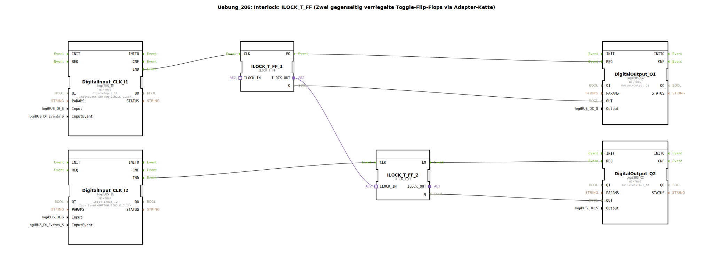

# Uebung_206: Interlock: ILOCK_T_FF (Zwei gegenseitig verriegelte Toggle-Flip-Flops via Adapter-Kette)

* * * * * * * * * *

## Einleitung

Diese Übung demonstriert die gegenseitige Verriegelung (Interlock) zweier Toggle-Flip-Flops. Jeder Taster (I1 und I2) steuert einen separaten Ausgang (Q1 bzw. Q2). Die Besonderheit besteht darin, dass die beiden Flip-Flops über eine Adapterverbindung („ILOCK“) miteinander verbunden sind, sodass immer nur einer der beiden Ausgänge aktiv sein kann. Wird der andere Taster betätigt, wird der zuvor aktive Ausgang zurückgesetzt und der neue Ausgang gesetzt. Es entsteht eine einfache Wechselblinkschaltung mit gegenseitiger Verriegelung.

## Verwendete Funktionsbausteine (FBs)

- **DigitalInput_CLK_I1** und **DigitalInput_CLK_I2**: `logiBUS::io::DI::logiBUS_IE`
    - Parameter: `QI = TRUE`, `Input = Input_I1` bzw. `Input_I2`, `InputEvent = BUTTON_SINGLE_CLICK`
    - Diese Bausteine wandeln das vom Hardware-Eingang (z. B. Taster) kommende Signal in ein Ereignis (`IND`) um, das als Takt für die Flip-Flops dient.
- **ILOCK_T_FF_1** und **ILOCK_T_FF_2**: `logiBUS::signalprocessing::interlock::ILOCK_T_FF`
    - Diese Bausteine sind spezielle Toggle-Flip-Flops mit einer Interlock-Schnittstelle (Adapter). Bei jedem Takt (Ereignis an `CLK`) toggelt der Ausgang `Q`. Zusätzlich kann der Ausgangszustand über den Adapter (`ILOCK_IN`) von außen zurückgesetzt werden.
- **DigitalOutput_Q1** und **DigitalOutput_Q2**: `logiBUS::io::DQ::logiBUS_QX`
    - Parameter: `QI = TRUE`, `Output = Output_Q1` bzw. `Output_Q2`
    - Diese Bausteine geben den Datenwert an den Hardware-Ausgang weiter, sobald ein Ereignis an `REQ` anliegt.

## Programmablauf und Verbindungen

1. **Eingangsverarbeitung**  
   Jeder Taster (I1, I2) wird über einen `logiBUS_IE`-Baustein eingelesen. Bei jedem Single-Click erzeugt der Baustein ein Ereignis am Ausgang `IND`.

2. **Toggle-Flip-Flops**  
   Das Ereignis von `DigitalInput_CLK_I1` wird mit dem Eingang `CLK` von `ILOCK_T_FF_1` verbunden. Analog wird `DigitalInput_CLK_I2` mit `ILOCK_T_FF_2` verbunden. Bei jedem Ereignis wechselt der Ausgang `Q` des entsprechenden Flip-Flops seinen Zustand (Toggle).

3. **Gegenseitige Verriegelung (Interlock)**  
   Der Adapterausgang `ILOCK_OUT` von `ILOCK_T_FF_1` ist mit dem Adaptereingang `ILOCK_IN` von `ILOCK_T_FF_2` verbunden (bidirektionale Kette). Dadurch wird aktiviert, sobald `ILOCK_T_FF_1` gesetzt ist, der andere Baustein zurückgesetzt. Gleichzeitig wird über die Verbindung auch der umgekehrte Fall realisiert: Setzt `ILOCK_T_FF_2`, wird `ILOCK_T_FF_1` zurückgesetzt. Somit kann immer nur einer der beiden Ausgänge den Wert `TRUE` (also „aktiv“) haben.

4. **Ausgangsansteuerung**  
   Die Ausgangsereignisse `EO` der Flip-Flops triggern die `REQ`-Eingänge der Ausgangsbausteine. Gleichzeitig werden die Datenwerte `Q` an die `OUT`-Eingänge der Ausgangsbausteine weitergeleitet. Damit werden die Hardware-Ausgänge Q1 und Q2 entsprechend dem Zustand der Flip-Flops gesetzt.

**Lernziele dieser Übung:**
- Verständnis der Funktionsweise eines Toggle-Flip-Flops (Toggle bei jedem Takt).
- Anwendung einer Adapterverbindung zur Realisierung einer gegenseitigen Verriegelung (Interlock).
- Einlesen von Tastern mit Single-Click-Ereignissen und Ausgabe an digitale Ausgänge.
- Aufbau einer einfachen Zustandssteuerung mit zwei sich ausschließenden Zuständen.

**Schwierigkeitsgrad:** Mittel  
**Vorkenntnisse:** Grundlagen der IEC 61499, Ereignis- und Datenverbindungen, Umgang mit Adaptern.

## Zusammenfassung

Die Übung 206 zeigt eine elegante Lösung für eine gegenseitig verriegelte Schaltung mit zwei Toggle-Flip-Flops. Durch die Verwendung des vorgefertigten Interlock-Bausteins `ILOCK_T_FF` und der Adapterverbindung zwischen beiden Instanzen wird sichergestellt, dass stets nur ein Ausgang aktiv ist. Dieses Prinzip findet sich häufig in Steuerungen, bei denen mehrere Aktoren nicht gleichzeitig aktiv sein dürfen (z. B. Richtungswechsel eines Motors, Schrankensteuerung).