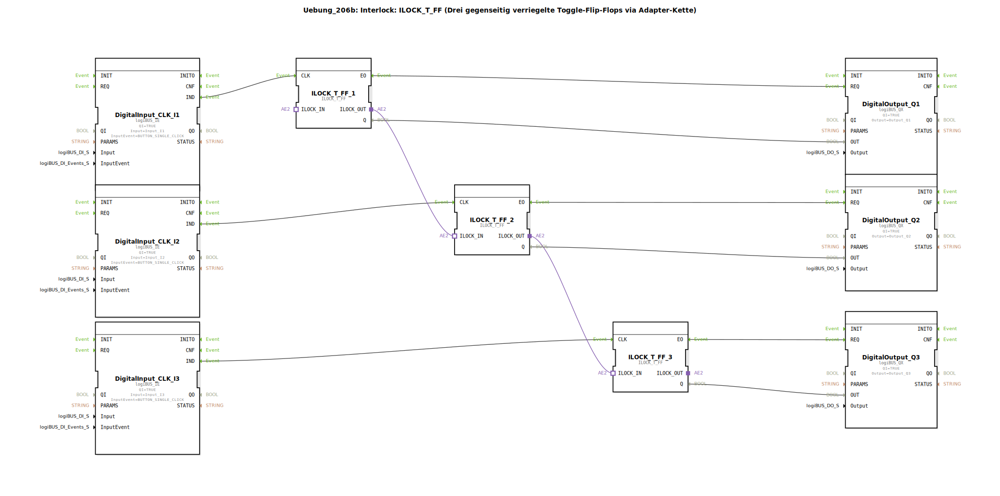

# Uebung_206b: Interlock: ILOCK_T_FF (Drei gegenseitig verriegelte Toggle-Flip-Flops via Adapter-Kette)

* * * * * * * * * *
## Einleitung
In dieser Übung wird eine Anwendung mit drei gegenseitig verriegelten Toggle-Flip-Flops realisiert. Drei Taster (Digitaleingänge) steuern jeweils ein ILOCK_T_FF, welches seinen Ausgang bei jedem Tastendruck umschaltet. Die drei Flip-Flops sind über eine Adapter-Kette bidirektional miteinander verbunden, sodass immer nur ein Ausgang aktiv sein kann (Interlock). Die Ausgänge werden auf drei digitale Ausgänge (z. B. LEDs) geführt.

## Verwendete Funktionsbausteine (FBs)
### Digitaleingang: logiBUS_IE
- **Typ**: logiBUS::io::DI::logiBUS_IE  
- **Verwendete Instanzen**: DigitalInput_CLK_I1, DigitalInput_CLK_I2, DigitalInput_CLK_I3  
- **Parameter**:  
  - QI = TRUE  
  - Input = Input_I1 / Input_I2 / Input_I3  
  - InputEvent = BUTTON_SINGLE_CLICK  
- **Funktionsweise**:  
  Jeder Baustein erfasst einen Taster (Button) und erzeugt bei einem einzelnen Klick ein Ereignis (IND) an seinem Ereignisausgang.

### Interlock-Toggle-Flip-Flop: ILOCK_T_FF
- **Typ**: logiBUS::signalprocessing::interlock::ILOCK_T_FF  
- **Verwendete Instanzen**: ILOCK_T_FF_1, ILOCK_T_FF_2, ILOCK_T_FF_3  
- **Parameter**: keine spezifischen Parameter im XML  
- **Funktionsweise**:  
  Ein Toggle-Flip-Flop, das bei jedem Ereignis am Eingang **CLK** seinen Ausgang **Q** umschaltet. Es besitzt zwei Adapter-Schnittstellen: **ILOCK_IN** und **ILOCK_OUT**. Über diese Adapter können mehrere ILOCK_T_FF zu einer Kette verbunden werden, wodurch sichergestellt wird, dass immer nur ein Flip-Flop in der Kette seinen Ausgang auf TRUE setzen kann (gegenseitige Verriegelung). Bei Aktivierung eines anderen Flip-Flops wird das zuvor aktive automatisch zurückgesetzt.

### Digitalausgang: logiBUS_QX
- **Typ**: logiBUS::io::DQ::logiBUS_QX  
- **Verwendete Instanzen**: DigitalOutput_Q1, DigitalOutput_Q2, DigitalOutput_Q3  
- **Parameter**:  
  - QI = TRUE  
  - Output = Output_Q1 / Output_Q2 / Output_Q3  
- **Funktionsweise**:  
  Der Baustein setzt einen digitalen Ausgang (z. B. eine LED) auf den Wert, der am Dateneingang **OUT** anliegt. Die Ausgabe erfolgt bei einem Ereignis am **REQ**-Eingang.

## Programmablauf und Verbindungen

1. **Eingangssignale**:  
   Drei Taster sind an die logiBUS-Eingänge *Input_I1*, *Input_I2* und *Input_I3* angeschlossen. Jeder Tastendruck (Single Click) erzeugt ein Ereignis am zugehörigen logiBUS_IE, das über den Ereignisausgang **IND** an den **CLK**-Eingang des entsprechenden ILOCK_T_FF weitergeleitet wird.

2. **Verriegelung (Interlock)**:  
   Die drei ILOCK_T_FF sind über ihre Adapter-Schnittstellen verbunden:  
   - ILOCK_T_FF_1.ILOCK_OUT → ILOCK_T_FF_2.ILOCK_IN  
   - ILOCK_T_FF_2.ILOCK_OUT → ILOCK_T_FF_3.ILOCK_IN  
   Diese Kette bewirkt, dass nur eines der drei Flip-Flops seinen Ausgang **Q** auf TRUE setzen kann. Sobald ein anderes Flip-Flop seinen Zustand ändert, wird das vorher aktive zurückgesetzt.

3. **Ausgangssignale**:  
   Die Ausgänge **Q** der Flip-Flops sind mit den Dateneingängen **OUT** der Digitalausgangsbausteine verbunden. Das Ereignis **EO** jedes ILOCK_T_FF (wird bei Zustandsänderung ausgelöst) triggert den **REQ**-Eingang des zugehörigen logiBUS_QX, sodass die Ausgabe aktualisiert wird.

**Verbindungen im Überblick (Ereignisse & Daten):**

| Quelle | Ziel | Art |
|--------|------|------|
| DigitalInput_CLK_I1.IND | ILOCK_T_FF_1.CLK | Ereignis |
| DigitalInput_CLK_I2.IND | ILOCK_T_FF_2.CLK | Ereignis |
| DigitalInput_CLK_I3.IND | ILOCK_T_FF_3.CLK | Ereignis |
| ILOCK_T_FF_1.EO | DigitalOutput_Q1.REQ | Ereignis |
| ILOCK_T_FF_2.EO | DigitalOutput_Q2.REQ | Ereignis |
| ILOCK_T_FF_3.EO | DigitalOutput_Q3.REQ | Ereignis |
| ILOCK_T_FF_1.Q | DigitalOutput_Q1.OUT | Daten |
| ILOCK_T_FF_2.Q | DigitalOutput_Q2.OUT | Daten |
| ILOCK_T_FF_3.Q | DigitalOutput_Q3.OUT | Daten |

**Adapterverbindungen (bidirektional):**

| Quelle | Ziel |
|--------|------|
| ILOCK_T_FF_1.ILOCK_OUT | ILOCK_T_FF_2.ILOCK_IN |
| ILOCK_T_FF_2.ILOCK_OUT | ILOCK_T_FF_3.ILOCK_IN |

## Zusammenfassung
Diese Übung demonstriert die Verwendung des ILOCK_T_FF-Bausteins zur Realisierung einer gegenseitigen Verriegelung (Interlock) von drei Toggle-Flip-Flops. Durch die Adapter-Kette wird sichergestellt, dass stets nur ein Ausgang aktiv ist, was typischerweise für Anwendungen mit wechselnden Betriebsmodi oder exklusiven Zuständen benötigt wird. Die Ein-/Ausgabe erfolgt über die logiBUS-Hardware. **Lernziele**: Verständnis von Interlock-Mechanismen, Umgang mit Adapter-Schnittstellen und Ereignisgesteuerter Logik in 4diac. **Voraussetzungen**: Grundkenntnisse der 4diac-IDE und der logiBUS-Bibliothek.