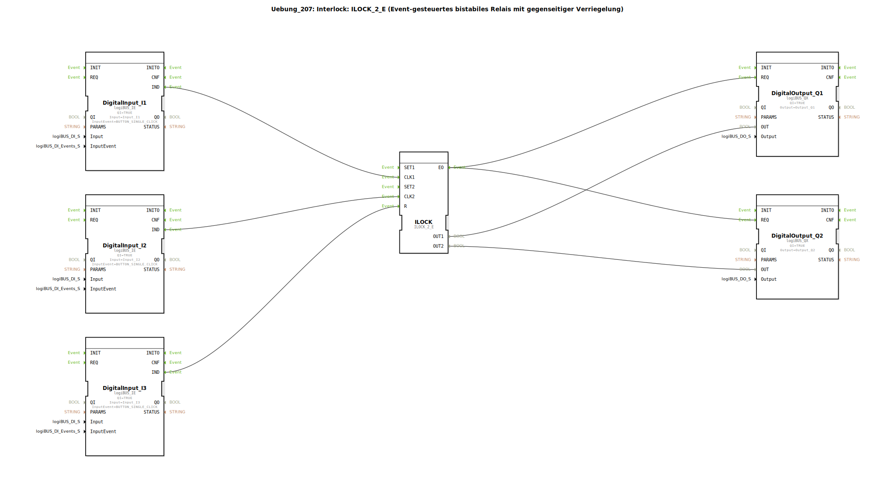

# Uebung_207: Interlock: ILOCK_2_E (Event-gesteuertes bistabiles Relais mit gegenseitiger Verriegelung)




* * * * * * * * * *

## Einleitung

Die Übung 207 realisiert ein **event-gesteuertes bistabiles Relais mit gegenseitiger Verriegelung** (Interlock). Über zwei Taster (Eingänge I1 und I2) können zwei Ausgänge (Q1 und Q2) wechselseitig gesetzt werden, wobei sich die Ausgänge gegenseitig ausschließen. Ein dritter Taster (Eingang I3) dient als Reset, um beide Ausgänge zurückzusetzen.

Diese Schaltung ist typisch für Sicherheitsanwendungen, bei denen nie beide Ausgänge gleichzeitig aktiv sein dürfen (z. B. Verriegelung von Antrieben oder Weichen).

## Verwendete Funktionsbausteine (FBs)

| Baustein | Typ | Kurzbeschreibung |
|----------|-----|------------------|
| `DigitalInput_I1`, `DigitalInput_I2`, `DigitalInput_I3` | `logiBUS_IE` (logiBUS Digital Input Event) | Wandelt einen Tastendruck (Single Click) in ein Ereignis `IND` um. Der Parameter `Input` legt den physikalischen Eingang fest (z. B. `Input_I1`). |
| `ILOCK` | `ILOCK_2_E` (logiBUS Interlock, eventgesteuert) | Bistabiles Relais mit zwei Ausgängen `OUT1`/`OUT2`. Die Ereignisse `CLK1` und `CLK2` setzen den jeweiligen Ausgang (mit gegenseitiger Verriegelung), `R` setzt beide zurück. |
| `DigitalOutput_Q1`, `DigitalOutput_Q2` | `logiBUS_QX` (logiBUS Digital Output) | Nimmt über das Ereignis `REQ` einen Datenwert (`OUT`) entgegen und gibt ihn am physikalischen Ausgang aus. |

## Programmablauf und Verbindungen

Die Verschaltung erfolgt innerhalb einer Subapplikation (`SubAppType`). Die nachfolgende Grafik zeigt die logische Verbindung der Funktionsbausteine:

```
[I1] → DigitalInput_I1.IND → ILOCK.CLK1
[I2] → DigitalInput_I2.IND → ILOCK.CLK2
[I3] → DigitalInput_I3.IND → ILOCK.R

ILOCK.EO → DigitalOutput_Q1.REQ
          → DigitalOutput_Q2.REQ

ILOCK.OUT1 → DigitalOutput_Q1.OUT
ILOCK.OUT2 → DigitalOutput_Q2.OUT
```

**Ablauf:**

1. **Setzen von Q1**: Ein Tastendruck an Eingang I1 erzeugt ein Ereignis am Ausgang `IND` des Bausteins `DigitalInput_I1`. Dieses Ereignis wird an den Ereigniseingang `CLK1` des Interlock-Bausteins `ILOCK` weitergeleitet. Daraufhin setzt `ILOCK` den Datenausgang `OUT1` auf `TRUE` und `OUT2` auf `FALSE` (gegenseitige Verriegelung). Anschließend wird über den Ereignisausgang `EO` der Ausgangsbaustein `DigitalOutput_Q1` getriggert, der den Wert von `OUT1` an den physikalischen Ausgang Q1 weitergibt. Auch `DigitalOutput_Q2` erhält dasselbe Ereignis und übernimmt den Wert von `OUT2` (der nun `FALSE` ist).

2. **Setzen von Q2**: Analog führt ein Tastendruck an Eingang I2 über `DigitalInput_I2` und den Ereigniseingang `CLK2` zum Setzen von `OUT2` (und Rücksetzen von `OUT1`).

3. **Reset**: Ein Tastendruck an Eingang I3 wird an den Ereigniseingang `R` des Interlock-Bausteins geführt. Dies setzt beide Ausgänge `OUT1` und `OUT2` zurück auf `FALSE`. Über `EO` werden wieder beide Ausgangsbausteine aktualisiert.

**Besonderheit:** Die Ausgangsbausteine werden bei jedem Ereignis (egal ob Setzen oder Reset) gemeinsam getriggert, sodass beide Ausgänge stets synchron den Zustand des Interlocks abbilden.

## Zusammenfassung

Die Übung demonstriert den Einsatz des standardisierten Interlock-Funktionsbausteins `ILOCK_2_E` aus der logiBUS-Bibliothek. Durch die Verwendung von Ereignis-gesteuerten Digital-Eingängen und -Ausgängen wird ein einfaches, aber sicheres Verriegelungssystem aufgebaut. Die gegenseitige Verriegelung stellt sicher, dass nie beide Ausgänge gleichzeitig aktiv werden – eine typische Anforderung in der Automatisierungstechnik.