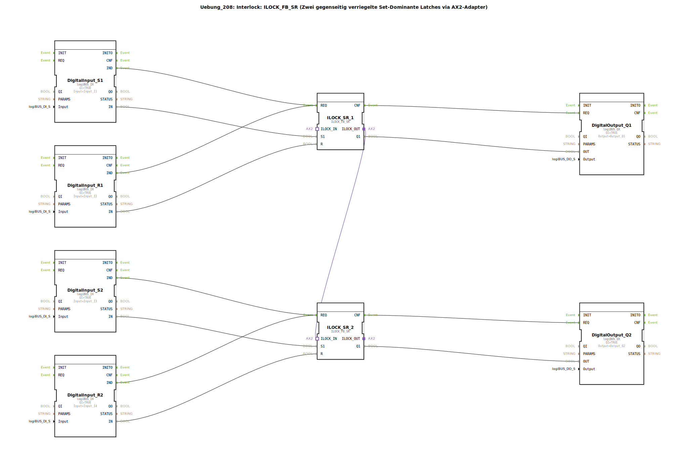

# Uebung_208: Interlock: ILOCK_FB_SR (Zwei gegenseitig verriegelte Set-Dominante Latches via AX2-Adapter)

* * * * * * * * * *

## Einleitung

Diese Übung demonstriert die Realisierung einer gegenseitigen Verriegelung (Interlock) zwischen zwei Ausgängen mithilfe des Funktionsbausteins `ILOCK_FB_SR`. Jeweils ein Set-dominantes Latch steuert einen Ausgang, wobei über eine Adapterverbindung sichergestellt wird, dass immer nur einer der beiden Ausgänge aktiv sein kann. Die Eingänge (Set und Reset) werden über digitale Eingabebaugruppen (logiBUS_IX) eingelesen, die Ausgänge über digitale Ausgabebaugruppen (logiBUS_QX) ausgegeben. Die Verriegelung verhindert, dass beide Ausgänge gleichzeitig gesetzt werden – selbst wenn beide Set-Signale gleichzeitig anliegen.

## Verwendete Funktionsbausteine (FBs)

- **DigitalInput_S1, DigitalInput_R1, DigitalInput_S2, DigitalInput_R2**  
  - **Typ**: `logiBUS::io::DI::logiBUS_IX`  
  - **Parameter**:  
    - `QI` = `TRUE` (Intern aktiviert)  
    - `Input` = `Input_I1` (bzw. `I2`, `I3`, `I4`) – Zuordnung zum realen Eingangskanal  
  - **Funktion**: Wandelt das binäre Signal des angeschlossenen Sensors in ein digitales Datensignal (`IN`) und erzeugt bei einer Flanke ein Ereignis (`IND`).

- **ILOCK_SR_1, ILOCK_SR_2**  
  - **Typ**: `logiBUS::signalprocessing::interlock::ILOCK_FB_SR`  
  - **Parameter**: Keine benutzerdefinierten Parameter (werden über Verbindungen konfiguriert).  
  - **Funktion**: Set-dominantes Latch mit Verriegelungslogik. Über den Adapter (`ILOCK_IN`/`ILOCK_OUT`) wird die gegenseitige Blockade realisiert. Die Bausteine arbeiten intern wie folgt:  
    - `S1` (Set) hat Priorität vor `R` (Reset) – bei aktivem Set wird der Ausgang `Q1` gesetzt, solange der verriegelnde Eingang (`ILOCK_IN`) nicht aktiv ist.  
    - `R` (Reset) setzt `Q1` zurück, wenn `S1` inaktiv ist.  
    - `Q1` wird nur dann aktiv, wenn der verriegelnde Partnerausgang (`ILOCK_IN` von der anderen Instanz) nicht gesetzt ist.  
  - **Adapteranschluss**:  
    - `ILOCK_OUT` (von `ILOCK_SR_1`) → `ILOCK_IN` (von `ILOCK_SR_2`)  
    - Dadurch wird verhindert, dass beide Bausteine gleichzeitig `Q1` = TRUE setzen.

- **DigitalOutput_Q1, DigitalOutput_Q2**  
  - **Typ**: `logiBUS::io::DQ::logiBUS_QX`  
  - **Parameter**:  
    - `QI` = `TRUE` (Intern aktiviert)  
    - `Output` = `Output_Q1` (bzw. `Q2`) – Zuordnung zum realen Ausgangskanal  
  - **Funktion**: Setzt den physikalischen Ausgang auf den über `OUT` anliegenden Wert, sobald ein Ereignis (`REQ`) eintrifft.

## Programmablauf und Verbindungen

1. **Eingangsverarbeitung**  
   Jeder DigitalInput-FB (logiBUS_IX) wartet auf eine Signaländerung an seinem zugehörigen Hardware-Eingang (`Input_I1` … `Input_I4`). Bei einer Flanke erzeugt er das Ereignis `IND` und stellt den aktuellen Zustand am Datenausgang `IN` bereit.

2. **Verriegelungslogik**  
   - Das Ereignis `IND` des jeweiligen Eingangs wird direkt an den `REQ`-Eingang des zugehörigen `ILOCK_FB_SR` weitergeleitet.  
   - Gleichzeitig wird der Datenwert `IN` an den entsprechenden Set- oder Reset-Eingang des ILOCKs angelegt:  
     * `DigitalInput_S1.IN` → `ILOCK_SR_1.S1`  
     * `DigitalInput_R1.IN` → `ILOCK_SR_1.R`  
     * `DigitalInput_S2.IN` → `ILOCK_SR_2.S1`  
     * `DigitalInput_R2.IN` → `ILOCK_SR_2.R`  
   - Die beiden ILOCK-Bausteine sind über ihre Adapteranschlüsse verriegelt:  
     `ILOCK_SR_1.ILOCK_OUT` → `ILOCK_SR_2.ILOCK_IN`.  
     Dadurch kann `ILOCK_SR_2` seinen Ausgang `Q1` nur dann auf TRUE setzen, wenn `ILOCK_SR_1.Q1` = FALSE ist (und umgekehrt).  

3. **Ausgabe**  
   - Nach der Verarbeitung erzeugt der ILOCK-Baustein das Ereignis `CNF`. Dieses triggert den zugehörigen DigitalOutput-FB (logiBUS_QX) über dessen `REQ`-Eingang.  
   - Gleichzeitig wird das Ergebnis `Q1` des ILOCKs an den Datenausgang `OUT` des DigitalOutputs übergeben:  
     * `ILOCK_SR_1.Q1` → `DigitalOutput_Q1.OUT`  
     * `ILOCK_SR_2.Q1` → `DigitalOutput_Q2.OUT`  

**Lernziele:**  
- Verständnis der Arbeitsweise eines Set-dominanten Latches mit Interlock-Funktion.  
- Umsetzung einer gegenseitigen Verriegelung (z. B. für Schutzfunktionen oder Richtungssteuerungen) mittels Adapterverbindung.  
- Einbindung von digitalen Ein-/Ausgabebausteinen in ein logisches Steuerungsnetzwerk.  

**Schwierigkeitsgrad:** Mittel – erfordert Grundkenntnisse in der Signalverarbeitung und der Arbeit mit Funktionsbausteinen in 4diac.  

**Vorgehen zur Inbetriebnahme:**  
- Laden Sie die Übung in die 4diac-IDE.  
- Stellen Sie sicher, dass die Hardware-Anschlüsse `Input_I1`…`Input_I4` den Tastern/Sensoren für S1, R1, S2, R2 entsprechen und `Output_Q1`/`Q2` die zu steuernden Aktoren ansteuern.  
- Starten Sie die Ausführung und testen Sie durch Betätigen der Taster das Setzen und Zurücksetzen der Ausgänge. Dabei sollte nie gleichzeitig `Q1` und `Q2` TRUE sein.

## Zusammenfassung

In dieser Übung wurde eine gegenseitige Verriegelung zweier Ausgänge mit dem Funktionsbaustein `ILOCK_FB_SR` realisiert. Die beiden ILOCK-Bausteine sind über einen Adapter so verbunden, dass nur einer der Ausgänge aktiv sein kann – ein typisches Anwendungsbeispiel für Verriegelungen in der Automatisierungstechnik. Die Übung vermittelt den Umgang mit digitalen Ein-/Ausgabemodulen und zeigt, wie sich komplexe Logiken wie Set-Dominanz und Interlocking in einem 4diac-Netzwerk abbilden lassen.