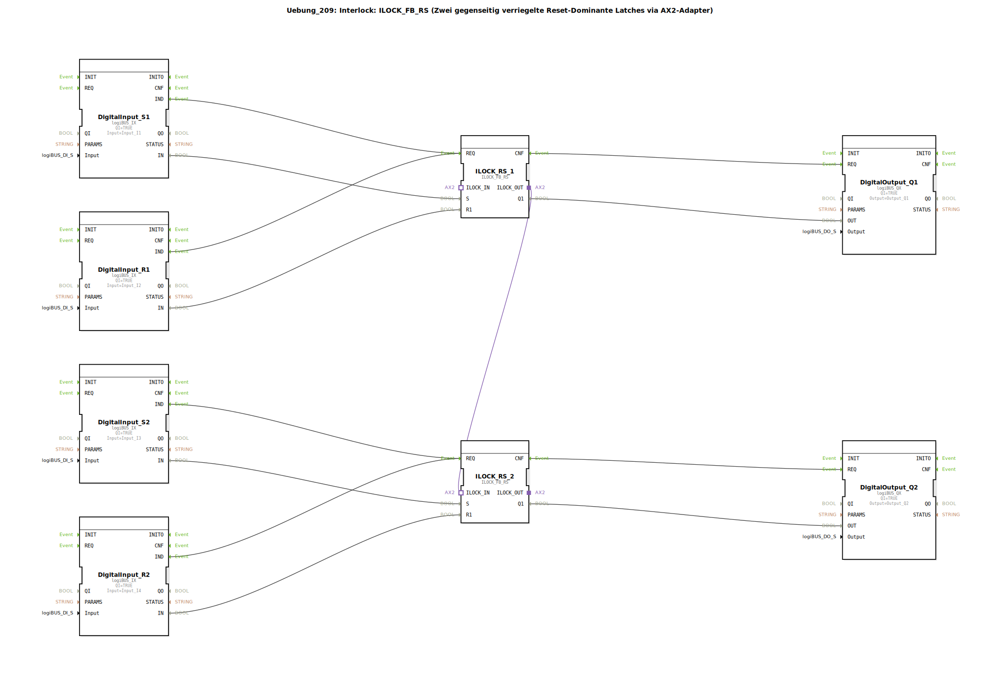

# Uebung_209: Interlock: ILOCK_FB_RS (Zwei gegenseitig verriegelte Reset-Dominante Latches via AX2-Adapter)

* * * * * * * * * *

## Einleitung

In dieser Übung wird eine **gegenseitige Verriegelung** (Interlock) zwischen zwei reset-dominanten RS-Latches realisiert. Die Funktionsbausteine `ILOCK_FB_RS` sind über einen AX2-Adapter miteinander verbunden, sodass immer nur einer der beiden Ausgänge aktiv sein kann. Sobald ein Latch gesetzt wird, wird der andere zwangsweise zurückgesetzt. Die Ein- und Ausgänge sind an digitale logiBUS-Hardware (Eingänge I1–I4, Ausgänge Q1 und Q2) angebunden.

Die Übung vermittelt den Umgang mit speziellen Interlock-Bausteinen, die in der Steuerungstechnik für wechselseitige Sicherungen (z. B. bei Motoren oder Ventilen) eingesetzt werden.

## Verwendete Funktionsbausteine (FBs)

| Bausteinname | Typ | Parameter / Anschlüsse |
|--------------|-----|------------------------|
| `DigitalInput_S1` | `logiBUS::io::DI::logiBUS_IX` | `QI` = TRUE, `Input` = `Input_I1` (Einschaltsignal 1) |
| `DigitalInput_R1` | `logiBUS::io::DI::logiBUS_IX` | `QI` = TRUE, `Input` = `Input_I2` (Rücksetzsignal 1) |
| `DigitalInput_S2` | `logiBUS::io::DI::logiBUS_IX` | `QI` = TRUE, `Input` = `Input_I3` (Einschaltsignal 2) |
| `DigitalInput_R2` | `logiBUS::io::DI::logiBUS_IX` | `QI` = TRUE, `Input` = `Input_I4` (Rücksetzsignal 2) |
| `ILOCK_RS_1` | `logiBUS::signalprocessing::interlock::ILOCK_FB_RS` | – |
| `ILOCK_RS_2` | `logiBUS::signalprocessing::interlock::ILOCK_FB_RS` | – |
| `DigitalOutput_Q1` | `logiBUS::io::DQ::logiBUS_QX` | `QI` = TRUE, `Output` = `Output_Q1` (Lampe/Signal 1) |
| `DigitalOutput_Q2` | `logiBUS::io::DQ::logiBUS_QX` | `QI` = TRUE, `Output` = `Output_Q2` (Lampe/Signal 2) |

**Erläuterung der Interlock-Bausteine**  
`ILOCK_FB_RS` ist ein reset-dominantes RS-Latch mit einer zusätzlichen Adapterschnittstelle (`ILOCK_IN`, `ILOCK_OUT`). Über diese Adapterverbindung können mehrere solche Bausteine gekoppelt werden: Wird ein Latch gesetzt, sendet es ein Signal auf dem `ILOCK_OUT`-Adapter, das den anderen Baustein über `ILOCK_IN` in den Reset-Zustand zwingt. Somit ist zu jedem Zeitpunkt maximal einer der beiden Ausgänge `Q1` aktiv.

## Programmablauf und Verbindungen

Das System ist **ereignisgesteuert** aufgebaut:

1. **Eingangssignal**  
   Ein Signal auf einem Digitaleingang (z. B. `Input_I1` für Setzen von Latch 1) erzeugt ein Ereignis `IND` am entsprechenden `DigitalInput`-FB.

2. **Ablauf im Latch**  
   Dieses Ereignis wird auf den `REQ`-Eingang des zugehörigen `ILOCK_RS`-Bausteins weitergeleitet. Gleichzeitig werden die Datenwerte (`S` und `R1`) aus dem Digitaleingang an den Latch übergeben.  
   Der Baustein verarbeitet die Signale (Reset dominant) und gibt bei Abschluss ein `CNF`-Ereignis aus.

3. **Ausgang**  
   Das `CNF`-Ereignis aktiviert den `DigitalOutput`-Baustein, der den aktuellen Zustand des Latches auf den physikalischen Ausgang (z. B. `Output_Q1`) legt.

4. **Verriegelung**  
   Der Adapterausgang `ILOCK_RS_1.ILOCK_OUT` ist mit dem Adaptereingang `ILOCK_RS_2.ILOCK_IN` verbunden. Wenn Latch 1 gesetzt wird, erhält Latch 2 über die Adapterleitung ein aktives Signal, das ihn zurücksetzt (und umgekehrt). Dadurch kann nie gleichzeitig `Q1` und `Q2` HIGH sein.

**Verbindungsübersicht:**

| Quelle | Ziel | Art |
|--------|------|-----|
| `DigitalInput_S1.IND` | `ILOCK_RS_1.REQ` | Ereignis |
| `DigitalInput_R1.IND` | `ILOCK_RS_1.REQ` | Ereignis |
| `DigitalInput_S2.IND` | `ILOCK_RS_2.REQ` | Ereignis |
| `DigitalInput_R2.IND` | `ILOCK_RS_2.REQ` | Ereignis |
| `ILOCK_RS_1.CNF` | `DigitalOutput_Q1.REQ` | Ereignis |
| `ILOCK_RS_2.CNF` | `DigitalOutput_Q2.REQ` | Ereignis |
| `DigitalInput_S1.IN` | `ILOCK_RS_1.S` | Daten |
| `DigitalInput_R1.IN` | `ILOCK_RS_1.R1` | Daten |
| `DigitalInput_S2.IN` | `ILOCK_RS_2.S` | Daten |
| `DigitalInput_R2.IN` | `ILOCK_RS_2.R1` | Daten |
| `ILOCK_RS_1.Q1` | `DigitalOutput_Q1.OUT` | Daten |
| `ILOCK_RS_2.Q1` | `DigitalOutput_Q2.OUT` | Daten |
| `ILOCK_RS_1.ILOCK_OUT` | `ILOCK_RS_2.ILOCK_IN` | **Adapter** (Interlock) |

## Zusammenfassung

Die Übung demonstriert eine **wechselseitige Verriegelung** zweier reset-dominanter RS-Latches mithilfe der speziellen `ILOCK_FB_RS`-Bausteine und deren Adapterkopplung. Wichtige Lerninhalte:

- Verständnis des Interlock-Prinzips (gegenseitige Ausschließlichkeit).
- Anwendung von Adapterverbindungen zur Querkommunikation zwischen Funktionsbausteinen.
- Einbindung digitaler Ein-/Ausgabehardware (logiBUS).
- Ereignisgesteuerter Ablauf in 4diac-FBS.

Nach erfolgreicher Durchführung kann der Anwender solche Verriegelungen in eigenen Steuerungsprojekten einsetzen, z. B. für die Absicherung konkurrierender Aktoren.