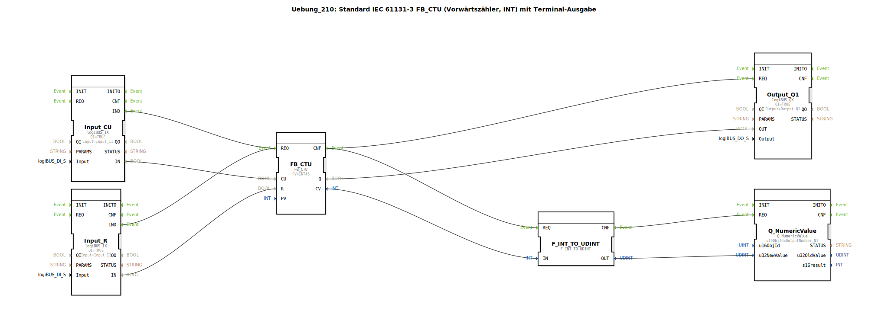

# Uebung_210: Standard IEC 61131-3 FB_CTU (Vorwärtszähler, INT) mit Terminal-Ausgabe

* * * * * * * * * *
## Einleitung

Diese Übung implementiert einen Vorwärtszähler (Count-Up) basierend auf dem Standardbaustein **FB_CTU** nach IEC 61131-3. Der Zähler arbeitet mit einem Datentyp `INT` (16‑Bit Ganzzahl) und verfügt über eine Terminal-Ausgabe, die den aktuellen Zählwert numerisch anzeigt. Als Hardware-Anbindung dienen digitale Eingänge und ein digitaler Ausgang des logiBUS-Systems.

## Verwendete Funktionsbausteine (FBs)

| Bausteinname | Typ | Parameter | Ereigniseingänge/-ausgänge | Dateneingänge/-ausgänge |
|---|---|---|---|---|
| **FB_CTU** | `iec61131::counters::FB_CTU` | PV = INT#5 | REQ (Eingang), CNF (Ausgang) | CU (Eingang), R (Eingang), Q (Ausgang), CV (Ausgang) |
| **Input_CU** | `logiBUS::io::DI::logiBUS_IX` | QI = TRUE, Input = Input_I1 | IND (Ausgang) | IN (Ausgang) |
| **Input_R** | `logiBUS::io::DI::logiBUS_IX` | QI = TRUE, Input = Input_I2 | IND (Ausgang) | IN (Ausgang) |
| **Output_Q1** | `logiBUS::io::DQ::logiBUS_QX` | QI = TRUE, Output = Output_Q1 | REQ (Eingang) | OUT (Eingang) |
| **F_INT_TO_UDINT** | `iec61131::conversion::F_INT_TO_UDINT` | – | REQ (Eingang), CNF (Ausgang) | IN (Eingang), OUT (Ausgang) |
| **Q_NumericValue** | `isobus::UT::Q::Q_NumericValue` | u16ObjId = OutputNumber_N1 | REQ (Eingang) | u32NewValue (Eingang) |

### Funktionsweise der einzelnen Bausteine

- **FB_CTU**: Der Vorwärtszähler erhöht bei jeder positiven Flanke am Eingang *CU* den internen Zählwert *CV* um 1. Erreicht *CV* den voreingestellten Wert *PV* (hier: 5), wird der Ausgang *Q* gesetzt. Ein Signal am Eingang *R* setzt *CV* zurück auf 0 und *Q* zurück auf FALSE. Der Baustein wird über den Ereigniseingang *REQ* aktiviert.
- **Input_CU** und **Input_R**: Lesen jeweils einen digitalen Hardware-Eingang (logiBUS-Klemme) und geben bei einer Signaländerung ein Ereignis (*IND*) sowie den aktuellen Zustand (*IN*) aus.
- **Output_Q1**: Empfängt ein Ereignis und setzt den angeschlossenen digitalen Ausgang auf den Wert des Dateneingangs *OUT*.
- **F_INT_TO_UDINT**: Wandelt den aktuellen Zählwert *CV* (Datentyp `INT`) in einen vorzeichenlosen 32‑Bit Wert (`UDINT`) um, da die nachfolgende Terminal-Ausgabe nur positive Werte verarbeiten kann.
- **Q_NumericValue**: Stellt einen numerischen Wert auf dem Terminal (HMI) dar. Der Wert wird über *u32NewValue* übergeben und das Display über die Objekt-ID *OutputNumber_N1* adressiert.

## Programmablauf und Verbindungen

Der Ablauf wird durch Ereignisverbindungen gesteuert:

1. **Zählimpulse**: Tritt eine Änderung am digitalen Eingang *Input_I1* auf, sendet `Input_CU.IND` ein Ereignis an `FB_CTU.REQ`. Gleichzeitig wird der Signalzustand über `Input_CU.IN` → `FB_CTU.CU` weitergeleitet.
2. **Rücksetzen**: Analog löst eine Änderung an *Input_I2* ein Ereignis von `Input_R.IND` aus, das ebenfalls an `FB_CTU.REQ` geht. Der Wert von `Input_R.IN` wird an den Rücksetzeingang `FB_CTU.R` geführt.
3. **Ausgang setzen**: Nach jedem Bearbeitungsschritt des Zählers (Ereignisausgang `FB_CTU.CNF`) werden zwei Aktionen parallel ausgelöst:
   - Der Ausgangswert *Q* wird über `FB_CTU.Q` → `Output_Q1.OUT` an den digitalen Ausgang *Output_Q1* übergeben und durch `Output_Q1.REQ` ausgegeben.
   - Der aktuelle Zählwert *CV* wird über `FB_CTU.CV` → `F_INT_TO_UDINT.IN` gewandelt. Der gewandelte `UDINT`-Wert (`F_INT_TO_UDINT.OUT`) wird an `Q_NumericValue.u32NewValue` übergeben. Ein weiteres Ereignis (`F_INT_TO_UDINT.CNF`) aktiviert `Q_NumericValue.REQ` zur Aktualisierung der Terminalanzeige.

**Hinweise aus dem Entwurf**:
- Die Umwandlung von `INT` nach `UDINT` ist nicht optimal, da negative Zählwerte nicht abgebildet werden können. Eine Alternative könnte die Verwendung eines vorzeichenbehafteten Datentyps oder eines anderen Ausgabebausteins sein.
- Da beide Eingänge (`Input_CU` und `Input_R`) dasselbe Ereignis an `FB_CTU.REQ` senden, kann es zu einer hohen Ereignisfrequenz kommen. In der Praxis sollte hier ein **E_D_FF** (Ereignis-D-Flipflop) oder ein ähnlicher Entprellmechanismus zwischengeschaltet werden, um unnötige Verarbeitungen zu vermeiden.

## Zusammenfassung

Diese Übung vermittelt den praktischen Umgang mit dem IEC‑61131-3 Zählerbaustein **FB_CTU** in der 4diac-IDE. Lernziele sind:
- Erstellung eines einfachen Vorwärtszählers mit einstellbarem Schwellwert.
- Anbindung digitaler Ein- und Ausgänge über den logiBUS.
- Datenkonvertierung und Darstellung numerischer Werte auf einem Terminal.
- Verständnis der ereignisgesteuerten Ausführung und der Notwendigkeit von Ereignisreduzierung (z. B. durch Flipflops).

**Schwierigkeitsgrad**: Mittel  
**Vorkenntnisse**: Grundlegende Bedienung der 4diac‑IDE, Verständnis von Ereignissen und Datenverbindungen, Basiswissen über IEC‑61131-3 Funktionsbausteine.  
**Start der Übung**: Importieren Sie die Datei `Uebung_210.fbt` (oder das entsprechende 4diac‑Projekt) und weisen Sie die logiBUS‑Hardware‑Kanäle entsprechend den Pool‑Bezeichnungen (`Input_I1`, `Input_I2`, `Output_Q1`, `OutputNumber_N1`) zu.