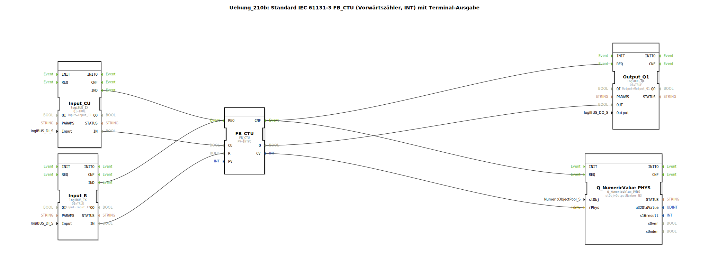

# Uebung_210b: Standard IEC 61131-3 FB_CTU (Vorwärtszähler, INT) mit Terminal-Ausgabe




* * * * * * * * * *

## Einleitung

Diese Übung implementiert einen **Vorwärtszähler (Counter Up)** nach IEC 61131‑3 (FB_CTU) mit dem Datentyp `INT`. Der Zähler wird über zwei digitale Eingänge gesteuert: ein Zählimpuls-Eingang (`CU`) und ein Rücksetz-Eingang (`R`). Der aktuelle Zählerstand wird sowohl auf einen digitalen Ausgang (Grenzwert erreicht) als auch über ein Terminal-Objekt zur numerischen Anzeige ausgegeben.

Die Übung demonstriert die grundlegende Funktionsweise eines industriellen Zählers, die Einbindung von Hardware-Ein‑/Ausgängen (logiBUS) sowie die Ausgabe von Werten auf eine numerische Anzeige (Terminal).

## Verwendete Funktionsbausteine (FBs)

In dieser Übung werden folgende Funktionsbausteine eingesetzt:

| FB-Name | Typ | Parameter | Kurzbeschreibung |
|---------|-----|-----------|------------------|
| `FB_CTU` | `iec61131::counters::FB_CTU` | `PV = INT#5` | IEC 61131‑3 Vorwärtszähler, Zählbereich INT, Preset-Wert 5. |
| `Input_CU` | `logiBUS::io::DI::logiBUS_IX` | `QI = TRUE`, `Input = Input_I1` | Digitaler Eingang, liefert den Zählimpuls (`CU`). |
| `Input_R` | `logiBUS::io::DI::logiBUS_IX` | `QI = TRUE`, `Input = Input_I2` | Digitaler Eingang, liefert das Rücksetzsignal (`R`). |
| `Output_Q1` | `logiBUS::io::DQ::logiBUS_QX` | `QI = TRUE`, `Output = Output_Q1` | Digitaler Ausgang, wird aktiviert wenn der Zähler seinen Endwert erreicht hat (`Q`). |
| `Q_NumericValue_PHYS` | `isobus::UT::Q::Q_NumericValue_PHYS` | `stObj = OutputNumber_N3` | Terminal-Ausgabe: Zeigt den aktuellen Zählerstand (CV) numerisch an. |

**Hinweise zu den Hardware‑FBs**:  
Die Eingänge `Input_I1` und `Input_I2` sowie der Ausgang `Output_Q1` sind physische logiBUS‑Kanäle. Das Terminal‑Objekt `OutputNumber_N3` ist ein vordefiniertes numerisches Anzeigeelement, das den Zählerwert darstellt.

## Programmablauf und Verbindungen

### Ereignis‑ und Datenverbindungen

Die nachfolgende Grafik zeigt die logischen Verbindungen zwischen den Bausteinen (basierend auf dem XML‑Netzwerk):

```
[Input_Cu]  ─── IND ──→ REQ [FB_CTU]
[Input_R ]  ─── IND ──→ REQ [FB_CTU]
[FB_CTU ]  ─── CNF ──→ REQ [Output_Q1]
[FB_CTU ]  ─── CNF ──→ REQ [Q_NumericValue_PHYS]

Daten:
[Input_Cu.IN]  ──→ FB_CTU.CU
[Input_R.IN]   ──→ FB_CTU.R
[FB_CTU.Q]     ──→ Output_Q1.OUT
[FB_CTU.CV]    ──→ Q_NumericValue_PHYS.rPhys
```

**Erklärung**:

- **Zählereingänge**:  
  Die beiden digitalen Eingänge `Input_CU` und `Input_R` werden über ihre `IND`‑Ereignisse mit dem `REQ`‑Eingang des Zählers `FB_CTU` verbunden. Dadurch wird der Zähler bei jeder positiven Flanke der Eingänge bearbeitet. Der Datenwert des jeweiligen Eingangs (`IN`) wird auf den entsprechenden Zähleingang (`CU` bzw. `R`) gelegt.

- **Zählerverhalten**:  
  Der `FB_CTU` zählt bei jeder steigenden Flanke an `CU` hoch. Der aktuelle Zählerstand ist auf dem Datenausgang `CV` verfügbar. Ist der Zählerstand größer oder gleich dem Preset-Wert `PV` (hier `INT#5`), wird der Ausgang `Q` auf `TRUE` gesetzt. Ein `TRUE`-Signal an `R` setzt den Zähler zurück (CV = 0, Q = FALSE).

- **Ausgabe**:  
  Nach jedem Zählvorgang wird das `CNF`-Ereignis des Zählers an den digitalen Ausgang `Output_Q1` und an die Terminal‑Ausgabe `Q_NumericValue_PHYS` weitergeleitet.  
  - Der `Q`-Wert wird auf den Ausgang `Output_Q1` geschrieben.  
  - Der `CV`-Wert wird als physikalische Größe (`rPhys`) an das Terminal übergeben und dort numerisch dargestellt.

### Anmerkungen aus dem Quellcode

- Der Kommentar „**INT kann ohne Konvertierung auf REAL geschlossen werden**“ bezieht sich darauf, dass der Zählerwert vom Typ `INT` direkt an den `rPhys`-Eingang (Typ `REAL`) angeschlossen werden kann – eine automatische Typkonvertierung findet statt.
- Der Hinweis „**hier gegebenenfalls einen E_D_FF einbauen, damit die Events reduziert werden**“ empfiehlt, bei schnellen Impulsen einen Flanken‑Detektor vorzuschalten, um Fehlauslösungen zu vermeiden.
- Der Kommentar „**F_INT_TO_REAL kann man weglassen**“ bestätigt die direkte Konvertierung ohne expliziten Baustein.

### Lernziele und Vorkenntnisse

- **Lernziele**:  
  - Einbindung eines IEC‑61131-3‑Zählers in eine 4diac‑Applikation.  
  - Verknüpfung digitaler Ein‑ und Ausgänge mit logiBUS‑Hardware.  
  - Ausgabe von numerischen Werten auf einem Terminal.
- **Schwierigkeitsgrad**: Einfach  
- **Vorkenntnisse**: Grundlegende Kenntnisse der 4diac‑IDE, Verständnis von Ereignis‑ und Datenverbindungen.
- **Start der Übung**: Die Übung kann direkt in einer laufenden 4diac‑Umgebung mit angeschlossener logiBUS‑Hardware ausgeführt werden. Die Eingänge `Input_I1` (Taster) und `Input_I2` (Taster) steuern den Zähler; `Output_Q1` kann z.B. eine Lampe ansteuern.

## Zusammenfassung

Die Übung **Uebung_210b** realisiert einen vollständigen IEC‑61131-3 Vorwärtszähler (`FB_CTU`) mit zwei digitalen Steuereingängen und einer Ausgabe des Zählerstands auf ein Terminal. Der Preset-Wert ist auf 5 gesetzt. Die Applikation verdeutlicht die Verbindung von Hardware‑E/A mit einem Standardfunktionsbaustein und die unkomplizierte Datenausgabe mittels Terminal‑Objekt. Sie eignet sich als Einstiegsübung in die industrielle Zählerprogrammierung mit 4diac.