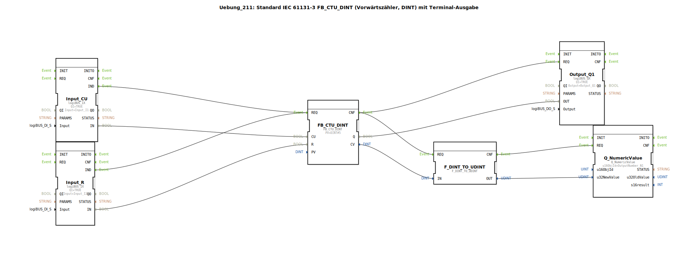

# Uebung_211: Standard IEC 61131-3 FB_CTU_DINT (Vorwärtszähler, DINT) mit Terminal-Ausgabe

* * * * * * * * * *

## Einleitung

Diese Übung implementiert einen Vorwärtszähler (Counter Up) nach IEC 61131-3 mit dem Funktionsbaustein `FB_CTU_DINT`. Der Zähler verwendet den Datentyp `DINT` (doppelt genaue Ganzzahl). Die Zählimpulse werden über einen digitalen Eingang (I1) bereitgestellt, ein zweiter digitaler Eingang (I2) dient zum Rücksetzen des Zählers. Der Ausgang des Zählers (Q) steuert einen digitalen Ausgang (Q1), gleichzeitig wird der aktuelle Zählerwert (CV) über eine Terminal-Ausgabe auf einem Display sichtbar gemacht.

Die Übung zeigt die grundlegende Verschaltung von industriellen Ein‑/Ausgangsbausteinen (logiBUS) mit einem Zählbaustein und einer numerischen Anzeige. Ein Kommentar in der Schaltung weist darauf hin, dass die verwendete Datentypkonvertierung `DINT_TO_UDINT` problematisch ist, da negative Zählerstände nicht korrekt dargestellt werden können.

## Verwendete Funktionsbausteine (FBs)

- **FB_CTU_DINT**  
  *Typ:* `iec61131::counters::FB_CTU_DINT`  
  *Parameter:* `PV` = `DINT#5` (Voreinstellungswert – der Zähler gibt Q aus, wenn CV >= PV)  
  *Ereignisseingang:* `REQ` – aktiviert die Zählerlogik  
  *Datenverbindungen:*  
  - `CU` (Count Up) vom Baustein `Input_CU.IN`  
  - `R` (Reset) vom Baustein `Input_R.IN`  
  - `Q` (Ausgang) geht an `Output_Q1.OUT`  
  - `CV` (aktueller Zählerwert) geht an `F_DINT_TO_UDINT.IN`  

- **Input_CU**  
  *Typ:* `logiBUS::io::DI::logiBUS_IX`  
  *Parameter:* `QI` = `TRUE`, `Input` = `Input_I1` (erster digitaler Eingang)  
  *Ereignisausgang:* `IND` – löst bei Flankenänderung aus  
  *Datenausgang:* `IN` – liefert den aktuellen Eingangszustand  

- **Input_R**  
  *Typ:* `logiBUS::io::DI::logiBUS_IX`  
  *Parameter:* `QI` = `TRUE`, `Input` = `Input_I2` (zweiter digitaler Eingang)  
  *Ereignisausgang:* `IND` – löst bei Flankenänderung aus  
  *Datenausgang:* `IN` – liefert den aktuellen Eingangszustand  

- **Output_Q1**  
  *Typ:* `logiBUS::io::DQ::logiBUS_QX`  
  *Parameter:* `QI` = `TRUE`, `Output` = `Output_Q1`  
  *Ereigniseingang:* `REQ` – aktiviert die Ausgabe  
  *Dateneingang:* `OUT` – erhält den Zustand vom Zählerausgang `Q`  

- **Q_NumericValue**  
  *Typ:* `isobus::UT::Q::Q_NumericValue`  
  *Parameter:* `u16ObjId` = `OutputNumber_N1` (Kennung des Terminal‑Ausgabefelds)  
  *Ereigniseingang:* `REQ` – aktualisiert die Anzeige  
  *Dateneingang:* `u32NewValue` – neuer Wert zur Anzeige (erwartet `UDINT`)  

- **F_DINT_TO_UDINT**  
  *Typ:* `iec61131::conversion::F_DINT_TO_UDINT`  
  *Ereigniseingang:* `REQ` – führt die Konvertierung aus  
  *Dateneingang:* `IN` (`DINT`)  
  *Datenausgang:* `OUT` (`UDINT`)  
  *Hinweis:* Die Konvertierung ist nicht geeignet für negative `DINT`-Werte, da `UDINT` nur positive Zahlen darstellen kann. Ein Kommentar im Netzwerk bezeichnet dies als „großen Quatsch“.  

## Programmablauf und Verbindungen

Das Zusammenspiel der Bausteine erfolgt wie folgt:

1. **Eingangserfassung:**  
   Die beiden digitalen Eingänge `Input_CU` und `Input_R` detektieren Flanken an den physikalischen Anschlüssen I1 und I2. Bei jeder Zustandsänderung senden sie ein Ereignis (`IND`) aus.

2. **Zählerlogik:**  
   Die Ereignisse von `Input_CU` und `Input_R` werden auf den **gleichen** Ereigniseingang `FB_CTU_DINT.REQ` geführt. Der Zähler unterscheidet intern anhand der Datenleitungen, ob ein Zählimpuls (`CU`) oder ein Rücksetzen (`R`) angefordert wird.  
   **Wichtig:** Da beide Ereignisquellen direkt auf `REQ` verdrahtet sind, kann es zu Konflikten kommen, wenn beide Eingänge gleichzeitig schalten. Ein Kommentar schlägt vor, einen „E_D_FF“ (Ereignis‑D‑Flipflop) einzubauen, um die Ereignisse zu reduzieren oder zu priorisieren.

3. **Ausgangssteuerung:**  
   Nach der Bearbeitung des Zählers wird das Ereignis `CNF` ausgelöst. Dieses triggert zwei Aktionen parallel:  
   - `Output_Q1.REQ` – der digitale Ausgang Q1 wird durch den Wert von `FB_CTU_DINT.Q` gesetzt.  
   - `F_DINT_TO_UDINT.REQ` – der aktuelle Zählerstand (CV) wird von `DINT` nach `UDINT` konvertiert.

4. **Terminalausgabe:**  
   Die konvertierte Zahl (`UDINT`) wird dem Baustein `Q_NumericValue` übergeben, der nach dem Ereignis `CNF` der Konvertierung getriggert wird. Dadurch wird der Wert auf dem Terminal (z. B. Bedienpanel) mit der Objektkennung `OutputNumber_N1` aktualisiert.

**Datentyp‑Problematik:**  
Der Zähler arbeitet mit `DINT` (vorzeichenbehaftet). Bei Überlauf oder Rücksetzen kann der aktuelle Wert negativ werden. Die Konvertierung `DINT_TO_UDINT` interpretiert negative Bitmuster jedoch als sehr große positive Zahlen (z. B. −1 wird zu 4294967295). Dies führt zu einer sinnlosen Anzeige. In der Praxis sollte entweder ein anderer Datentyp verwendet oder eine Begrenzung eingebaut werden.

## Zusammenfassung

In dieser Übung wird ein IEC‑61131‑3 Vorwärtszähler mit zwei digitalen Eingängen (Zählimpuls und Reset) und einem digitalen Ausgang aufgebaut. Der aktuelle Zählerstand wird zusätzlich auf einem Terminal ausgegeben. Der Schaltplan demonstriert die Verwendung von logiBUS‑Ein‑/Ausgangsbausteinen, einen Konvertierungsbaustein und eine numerische Anzeigekomponente. Gleichzeitig werden typische Fallstricke bei der Datentypkonvertierung aufgezeigt – ein wichtiger Aspekt für die industrielle Steuerungstechnik. Die Übung eignet sich für Einsteiger, die erste Erfahrungen mit Zählfunktionen und der Verschaltung von Ereignis‑ und Datenverbindungen sammeln möchten.