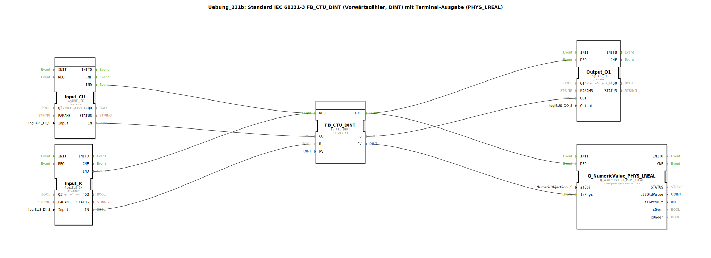

# Uebung_211b: Standard IEC 61131-3 FB_CTU_DINT (Vorwärtszähler, DINT) mit Terminal-Ausgabe (PHYS_LREAL)

* * * * * * * * * *
## Einleitung

In dieser Übung wird der IEC 61131-3 Standard-Funktionsbaustein **FB_CTU_DINT** (Vorwärtszähler mit `DINT`-Datentyp) verwendet. Der Zähler wird durch einen Taster an einem Digitaleingang erhöht und über einen zweiten Taster zurückgesetzt. Der aktuelle Zählerstand wird zusätzlich über einen Terminal-Ausgabebaustein als physikalischer `LREAL`-Wert ausgegeben.

Ziel ist es, das Zusammenspiel zwischen einem Zähler, digitalen Ein-/Ausgängen und einer numerischen Terminalausgabe in der 4diac-IDE zu verstehen.

## Verwendete Funktionsbausteine (FBs)

Im SubApp-Netzwerk werden fünf Instanzen von vordefinierten Bausteintypen verwendet. Es sind keine weiteren Sub-Bausteine definiert.

| Name | Typ | Beschreibung |
|------|-----|--------------|
| `Input_CU` | `logiBUS_IX` | Digitaler Eingang (logiBUS), der den Zählimpuls (CU) bereitstellt. |
| `Input_R` | `logiBUS_IX` | Digitaler Eingang, der das Rücksetzsignal (R) bereitstellt. |
| `FB_CTU_DINT` | `FB_CTU_DINT` | Vorwärtszähler (Counter Up) mit `DINT`-Datentyp. |
| `Output_Q1` | `logiBUS_QX` | Digitaler Ausgang (logiBUS), der den Zählerausgang Q anzeigt. |
| `Q_NumericValue_PHYS_LREAL` | `Q_NumericValue_PHYS_LREAL` | Terminal-Ausgabebaustein zur Darstellung eines physikalischen `LREAL`-Wertes. |

### Detaillierte Parameter und Verbindungen

- **Input_CU**
    - Parameter: `QI` = `TRUE`, `Input` = `Input_I1`
    - Ereignisausgang: `IND` (Signalisiert eine steigende Flanke am Eingang)
    - Datenausgang: `IN` (logischer Zustand des Eingangs)

- **Input_R**
    - Parameter: `QI` = `TRUE`, `Input` = `Input_I2`
    - Ereignisausgang: `IND`
    - Datenausgang: `IN`

- **FB_CTU_DINT**
    - Parameter: `PV` = `DINT#5` (Preset Value = 5)
    - Ereigniseingang: `REQ` (auslösendes Ereignis für Zählvorgang)
    - Dateneingänge: `CU` (Count Up), `R` (Reset)
    - Ereignisausgang: `CNF` (Bestätigung nach Ausführung)
    - Datenausgänge: `Q` (Ausgangssignal – wird TRUE wenn CV ≥ PV), `CV` (aktueller Zählerwert, Typ `DINT`)

- **Output_Q1**
    - Parameter: `QI` = `TRUE`, `Output` = `Output_Q1`
    - Ereigniseingang: `REQ`
    - Dateneingang: `OUT` (Wert, der auf den physikalischen Ausgang geschrieben wird)

- **Q_NumericValue_PHYS_LREAL**
    - Parameter: `stObj` = `OutputNumber_N3` (Referenz auf das Terminal-Ausgabeobjekt)
    - Ereigniseingang: `REQ`
    - Dateneingang: `lrPhys` (physikalischer `LREAL`-Wert zur Anzeige)

## Programmablauf und Verbindungen

### Ereignisverbindungen

1. **Eingangssignale**  
   - Wenn der Taster an `Input_I1` betätigt wird (steigende Flanke), sendet `Input_CU.IND` ein Ereignis an `FB_CTU_DINT.REQ`.  
   - Wenn der Taster an `Input_I2` betätigt wird, sendet `Input_R.IND` ebenfalls ein Ereignis an denselben `REQ`-Eingang des Zählers.

   *Hinweis: Beide Ereignisse werden auf den gleichen `REQ`-Eingang geführt, daher muss der Baustein intern unterscheiden, welcher Eingang (CU oder R) aktiv ist.*

2. **Zählerausführung**  
   Nachdem der Zähler das Ereignis verarbeitet hat (Ausführung der Funktion), sendet er über `CNF` zwei gleichzeitige Ereignisse:
   - an `Output_Q1.REQ` (Aktualisierung des digitalen Ausgangs)
   - an `Q_NumericValue_PHYS_LREAL.REQ` (Aktualisierung der Terminal-Anzeige)

### Datenverbindungen

- `Input_CU.IN` → `FB_CTU_DINT.CU` – Logischer Zustand des Tasters I1 als Zählimpuls.
- `Input_R.IN` → `FB_CTU_DINT.R` – Logischer Zustand des Tasters I2 als Rücksetzsignal.
- `FB_CTU_DINT.Q` → `Output_Q1.OUT` – Gibt den Status des Zählausgangs (TRUE, wenn Zählerstand ≥ PV) an den digitalen Ausgang Q1 weiter.
- `FB_CTU_DINT.CV` → `Q_NumericValue_PHYS_LREAL.lrPhys` – Der aktuelle Zählerstand (`DINT`) wird in einen physikalischen `LREAL`-Wert umgewandelt und auf dem Terminal angezeigt.

### Ablauf im Detail

- **Initialzustand:** Zählerstand = 0, Ausgang Q = FALSE, Terminal zeigt 0.0.
- **Zählvorgang:** Jede positive Flanke an `Input_I1` (bei steigender Flanke) erhöht den Zählerstand um 1.
- **Rücksetzen:** Eine positive Flanke an `Input_I2` setzt den Zählerstand auf 0 zurück.
- **Ausgang:** Sobald der Zählerstand den Wert 5 (PV) erreicht oder überschreitet, wird `Q` = TRUE und der digitale Ausgang Q1 schaltet ein.
- **Terminal:** Nach jeder Änderung des Zählerstands wird der neue Wert als `LREAL` auf dem konfigurierten Terminal-Objekt `OutputNumber_N3` angezeigt.

### Lernziele

- Verwendung eines IEC 61131-3 Standard-Zählers (FB_CTU_DINT).
- Umgang mit digitalen Ein- und Ausgängen (logiBUS).
- Ausgabe numerischer Werte über einen Terminal-Baustein.
- Verständnis der Ereignis- und Datenflussmodellierung in 4diac.

### Benötigte Vorkenntnisse

- Grundlagen der 4diac-IDE (Erstellung von SubApp-Typen, Verbindung von Bausteinen).
- Einfaches Verständnis von Zählern und Binärsignalen.

## Zusammenfassung

Die Übung 211b demonstriert den praktischen Einsatz eines Vorwärtszählers (CTU) nach IEC 61131-3 in der 4diac-Umgebung. Zwei Taster steuern den Zähler (Zählen und Rücksetzen), der sowohl einen digitalen Ausgang als auch eine numerische Terminalanzeige ansteuert. Der Aufbau zeigt typische Verbindungsmuster für ereignisgesteuerte Automatisierungssoftware und erlaubt ein vertieftes Verständnis der Bausteinparameter, Ereignisverkettungen und Datenkonvertierungen.