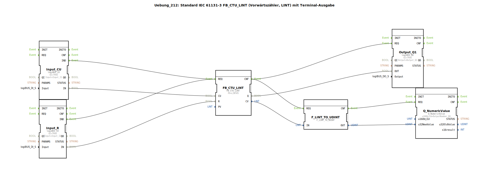

# Uebung_212: Standard IEC 61131-3 FB_CTU_LINT (Vorwärtszähler, LINT) mit Terminal-Ausgabe

* * * * * * * * * *
## Einleitung
Diese Übung demonstriert die Verwendung des IEC‑61131‑3‑Funktionsbausteins **FB_CTU_LINT** (Vorwärtszähler für große Integer‑Werte) in einer 4diac‑IDE Subapplikation. Der Zählerstand wird über eine Konvertierung auf einem Terminal ausgegeben. Zusätzlich wird ein digitaler Ausgang gesetzt, sobald der Zähler den vorgegebenen Maximalwert erreicht hat.

---

## Verwendete Funktionsbausteine

Es werden ausschließlich vordefinierte Bibliotheksbausteine eingesetzt; weitere Sub‑Bausteine sind nicht enthalten.

- **FB_CTU_LINT**  
  - **Typ**: `iec61131::counters::FB_CTU_LINT`  
  - **Parameter**: `PV = LINT#5` (Preset‑Wert = 5)  
  - **Aufgabe**: Vorwärtszähler mit LINT‑Datentyp; zählt bei jeder positiven Flanke am CU‑Eingang und setzt den Ausgang Q, wenn der Zählerstand den Presetwert erreicht oder überschreitet.

- **Input_CU**  
  - **Typ**: `logiBUS::io::DI::logiBUS_IX`  
  - **Parameter**: `QI = TRUE`, `Input = Input_I1`  
  - **Aufgabe**: Digitaler Eingang, der den Zählimpuls (Clock Up) für den Zähler bereitstellt.

- **Input_R**  
  - **Typ**: `logiBUS::io::DI::logiBUS_IX`  
  - **Parameter**: `QI = TRUE`, `Input = Input_I2`  
  - **Aufgabe**: Digitaler Eingang zum Rücksetzen (Reset) des Zählers.

- **Output_Q1**  
  - **Typ**: `logiBUS::io::DQ::logiBUS_QX`  
  - **Parameter**: `QI = TRUE`, `Output = Output_Q1`  
  - **Aufgabe**: Digitaler Ausgang, der aktiv wird, sobald der Zähler den Presetwert erreicht hat (Q‑Signal des Zählers).

- **F_LINT_TO_UDINT**  
  - **Typ**: `iec61131::conversion::F_LINT_TO_UDINT`  
  - **Parameter**: keiner (Standardkonvertierung)  
  - **Aufgabe**: Wandelt den aktuellen Zählerstand (LINT) in einen vorzeichenlosen Doppel‑Integer (UDINT) um, da der Terminalbaustein nur positive Werte darstellen kann.  
  - **Hinweis**: Ein Kommentar im Netzwerk weist darauf hin, dass diese Konvertierung problematisch ist, weil negative Zahlen nicht dargestellt werden können. Hier könnte man stattdessen einen E_D_FF einbauen, um unerwünschte Ereignisse zu reduzieren.

- **Q_NumericValue**  
  - **Typ**: `isobus::UT::Q::Q_NumericValue`  
  - **Parameter**: `u16ObjId = OutputNumber_N1`  
  - **Aufgabe**: Gibt den übergebenen Zahlenwert auf einem angeschlossenen Terminal (z. B. Isobus‑Display) aus. Der Wert wird über den Dateneingang `u32NewValue` aktualisiert.

---

## Programmablauf und Verbindungen

1. **Ereignissteuerung**  
   - Jede steigende Flanke an `Input_I1` (verbunden mit `Input_CU`) erzeugt ein Ereignis `IND`, das den Zählerbaustein über den Ereigniseingang `REQ` aktiviert.  
   - Jede steigende Flanke an `Input_I2` (verbunden mit `Input_R`) erzeugt ebenfalls ein Ereignis `IND` und aktiviert den Zählerbaustein über denselben `REQ`‑Eingang.  
   - Nach Abschluss der Zähleroperation signalisiert der Zähler dies über `CNF`. Dieses Ereignis wird an drei Bausteine weitergeleitet:  
     - **Output_Q1.REQ** (setzt den digitalen Ausgang entsprechend dem Zähler‑Q‑Signal)  
     - **F_LINT_TO_UDINT.REQ** (startet die Konvertierung des Zählerstands)  
     - **Q_NumericValue.REQ** (wird nach erfolgreicher Konvertierung über die Kette `F_LINT_TO_UDINT.CNF → Q_NumericValue.REQ` ausgelöst).

2. **Datenverbindungen**  
   - `Input_CU.IN` → `FB_CTU_LINT.CU` (Zählimpuls)  
   - `Input_R.IN` → `FB_CTU_LINT.R` (Rücksetzen)  
   - `FB_CTU_LINT.Q` → `Output_Q1.OUT` (Ausgangssignal bei Erreichen des Presetwerts)  
   - `FB_CTU_LINT.CV` (aktueller Zählerstand) → `F_LINT_TO_UDINT.IN`  
   - `F_LINT_TO_UDINT.OUT` (konvertierter Wert) → `Q_NumericValue.u32NewValue` (Anzeige auf dem Terminal)

3. **Funktionsweise des Zählers**  
   - Der Zähler inkrementiert bei jeder ansteigenden Flanke am CU‑Eingang, solange kein Reset erfolgt.  
   - Wird der Reset‑Eingang auf TRUE gesetzt, wird der Zählerstand auf Null zurückgesetzt.  
   - Sobald der Zählerstand den Wert **PV = 5** erreicht, wird der Ausgang `Q` auf TRUE gesetzt (aktives High).  
   - Der aktuelle Zählerstand wird kontinuierlich an das Terminal gesendet, sobald sich der Wert ändert.

4. **Lernziele / Schwierigkeit**  
   - Einführung in die IEC‑61131‑3‑Zählerfamilie  
   - Kombination von digitalen Ein‑/Ausgängen mit einem Zähler  
   - Datenkonvertierung und Terminalausgabe  
   - Schwierigkeitsgrad: **Mittel**  
   - Vorkenntnisse: Grundlegendes Verständnis von Ereignis‑ und Datenflüssen in 4diac sowie einfache IEC‑61131‑3‑Datentypen.

---

## Zusammenfassung

Die Übung **Uebung_212** implementiert einen Vorwärtszähler (`FB_CTU_LINT`) mit einem Presetwert von 5. Über zwei digitale Eingänge wird gezählt und zurückgesetzt. Der Zählerstand wird mittels einer Datentypkonvertierung (`F_LINT_TO_UDINT`) auf einem Terminal ausgegeben, während der Ausgang `Output_Q1` aktiv wird, sobald der Zähler den Grenzwert erreicht. Die gezeigte Schaltung demonstriert die Interaktion zwischen industriellen Zählbausteinen, Ein‑/Ausgabe und Benutzeranzeige – eine typische Aufgabenstellung für Automatisierungslösungen. Der beigefügte Kommentar zur Konvertierung gibt einen Hinweis auf mögliche Verbesserungen (Reduzierung der Ereignisse, Vermeidung negativer Zahlen).