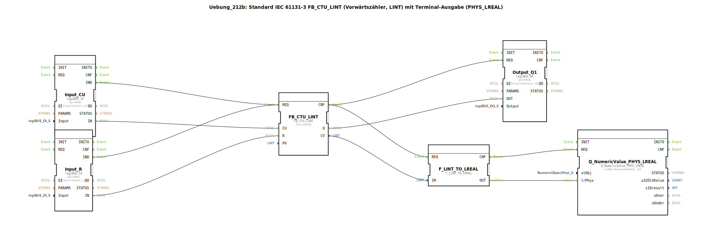

# Uebung_212b: Standard IEC 61131-3 FB_CTU_LINT (Vorwärtszähler, LINT) mit Terminal-Ausgabe (PHYS_LREAL)

*Kein Bild verfügbar.*

* * * * * * * * * *
## Einleitung

Diese Übung implementiert einen Vorwärtszähler nach IEC 61131-3 (FB_CTU_LINT) mit Terminalausgabe des aktuellen Zählerwerts. Der Zähler wird durch einen digitalen Eingang (CU) hochgezählt und über einen weiteren digitalen Eingang (R) zurückgesetzt. Der Zählerstand wird nach jedem Zählereignis über eine Typkonvertierung (LINT → LREAL) auf einem Terminalbaustein (LogiBUS Utility) ausgegeben. Gleichzeitig wird ein digitaler Ausgang gesetzt, sobald der Zähler den voreingestellten Wert (PV = 5) erreicht hat.

## Verwendete Funktionsbausteine (FBs)

- **FB_CTU_LINT**: Typ `iec61131::counters::FB_CTU_LINT`
  - Parameter: PV = LINT#5 (Voreinstellwert)
  - Ereigniseingang: REQ (Start der Zähleroperation)
  - Daten-Eingänge: CU (Count Up), R (Reset)
  - Daten-Ausgänge: Q (Erreicht Zählerstand ≥ PV), CV (aktueller Zählerwert)

- **Input_CU**: Typ `logiBUS::io::DI::logiBUS_IX`
  - Parameter: QI = TRUE, Input = Input_I1 (physischer Digitaleingang)
  - Ausgang: IN (Boolescher Wert des Eingangs)
  - Ereignisausgang: IND (Signalwechsel erkannt)

- **Input_R**: Typ `logiBUS::io::DI::logiBUS_IX`
  - Parameter: QI = TRUE, Input = Input_I2 (physischer Digitaleingang)
  - Ausgang: IN (Boolescher Wert des Eingangs)
  - Ereignisausgang: IND (Signalwechsel erkannt)

- **Output_Q1**: Typ `logiBUS::io::DQ::logiBUS_QX`
  - Parameter: QI = TRUE, Output = Output_Q1 (physischer Digitalausgang)
  - Dateneingang: OUT (Wert, der an den Ausgang übergeben wird)

- **F_LINT_TO_LREAL**: Typ `iec61131::conversion::F_LINT_TO_LREAL`
  - Dateneingang: IN (LINT-Wert)
  - Datenausgang: OUT (LREAL-Wert durch Konvertierung)

- **Q_NumericValue_PHYS_LREAL**: Typ `isobus::UT::Q::Q_NumericValue_PHYS_LREAL`
  - Parameter: stObj = OutputNumber_N3 (Verweis auf ein Terminal-Ausgabeobjekt)
  - Dateneingang: lrPhys (physikalischer LREAL-Wert)
  - Ereigniseingang: REQ (Auslösen der Terminal-Ausgabe)

## Programmablauf und Verbindungen

Die Steuerung erfolgt über Ereignis- und Datenverbindungen:

### Ereignisverbindungen
- `Input_CU.IND` → `FB_CTU_LINT.REQ`  
  Bei einer positiven Flanke des Digitaleingangs I1 wird der Zähler zum Hochzählen angestoßen.
- `Input_R.IND` → `FB_CTU_LINT.REQ`  
  Bei einer positiven Flanke des Digitaleingangs I2 wird der Zähler zurückgesetzt.
- `FB_CTU_LINT.CNF` → `Output_Q1.REQ`  
  Nach Abschluss einer Zähleroperation (egal ob Zählen oder Reset) wird der Ausgang aktualisiert.
- `FB_CTU_LINT.CNF` → `F_LINT_TO_LREAL.REQ`  
  Gleichzeitig wird die Typkonvertierung des aktuellen Zählerwerts angestoßen.
- `F_LINT_TO_LREAL.CNF` → `Q_NumericValue_PHYS_LREAL.REQ`  
  Nach der Konvertierung wird der Wert an das Terminal gesendet.

### Datenverbindungen
- `Input_CU.IN` → `FB_CTU_LINT.CU`  
  Der Zustand von Eingang I1 steuert den Zählimpuls (positive Flanke).
- `Input_R.IN` → `FB_CTU_LINT.R`  
  Der Zustand von Eingang I2 steuert den Reset (positive Flanke).
- `FB_CTU_LINT.Q` → `Output_Q1.OUT`  
  Der Ausgang Q des Zählers (TRUE wenn CV >= PV) wird an den Digitalausgang Q1 weitergegeben.
- `FB_CTU_LINT.CV` → `F_LINT_TO_LREAL.IN`  
  Der aktuelle Zählerwert (LINT) gelangt in den Konverter.
- `F_LINT_TO_LREAL.OUT` → `Q_NumericValue_PHYS_LREAL.lrPhys`  
  Der konvertierte LREAL-Wert wird dem Terminal-Baustein übergeben.

### Funktionsweise
1. Solange der Eingang CU (I1) einen positiven Flankenwechsel zeigt, erhöht der Zähler CV um 1.
2. Ein positiver Flankenwechsel am Reset-Eingang R (I2) setzt CV auf 0.
3. Erreicht der Zählerstand den voreingestellten Wert PV (hier 5) oder mehr, wird der Ausgang Q auf TRUE gesetzt. Ein weiteres Zählen ist dann nicht mehr möglich, bis ein Reset erfolgt.
4. Nach jedem Zähl- oder Reset-Vorgang wird der aktuelle CV-Wert auf dem Terminal (LogiBUS Utility) in physikalischer LREAL-Darstellung ausgegeben.

**Lernziele:**  
- Verwendung eines IEC 61131-3 Zählers (FB_CTU_LINT)  
- Parametrierung von Voreinstellwerten  
- Ereignis- und Datenfluss zwischen Funktionsbausteinen  
- Typkonvertierung (LINT → LREAL) und Terminalausgabe  

**Schwierigkeitsgrad:** Fortgeschrittene Grundlagen  
**Vorkenntnisse:** Grundverständnis der 4diac-IDE, Umgang mit digitalen Ein-/Ausgängen, Ereignisverkettung.

## Zusammenfassung

Die Übung 212b zeigt die Kombination eines IEC 61131-3 Vorwärtszählers (FB_CTU_LINT) mit einer Terminalausgabe. Über zwei Digitaleingänge wird der Zähler gesteuert; der Ausgang Q schaltet bei Erreichen des Voreinstellwerts. Der aktuelle Zählerwert wird nach jeder Aktion über eine Typkonvertierung auf einem LogiBUS-Terminalbaustein ausgegeben. Dadurch wird die Verkettung von Ereignissen, die Datenflusslogik und die Nutzung von Utility-Bausteinen in 4diac demonstriert.