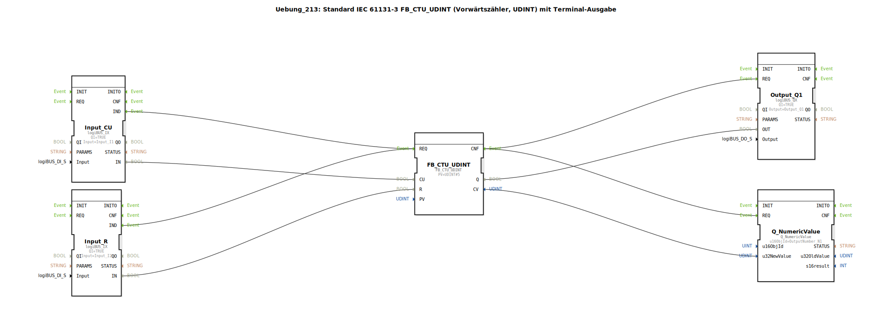

# Uebung_213: Standard IEC 61131-3 FB_CTU_UDINT (Vorwärtszähler, UDINT) mit Terminal-Ausgabe

* * * * * * * * * *
## Einleitung

Diese Übung implementiert einen Vorwärtszähler nach IEC 61131-3 (Typ FB_CTU_UDINT) als Subapplikation. Der Zähler verfügt über zwei digitale Eingänge (Count-Up und Reset), einen digitalen Ausgang (Q) und eine Terminalausgabe für den aktuellen Zählwert. Die Eingänge werden über logiBUS-IO-Bausteine bereitgestellt, während der Ausgang und der numerische Wert auf konfigurierte logiBUS-Kanäle ausgegeben werden.

## Verwendete Funktionsbausteine (FBs)

- **FB_CTU_UDINT** (Typ: `iec61131::counters::FB_CTU_UDINT`)
    - Parameter: `PV` = UDINT#5 (Vorgabewert für die Zählschwelle)
    - Ereignisse: REQ (Eingang), CNF (Ausgang)
    - Daten: CU (Count-Up), R (Reset), Q (Ausgang), CV (aktueller Zählwert)

- **Input_CU** (Typ: `logiBUS::io::DI::logiBUS_IX`)
    - Parameter: `QI` = TRUE, `Input` = Input_I1
    - Ereignis: IND (Ausgang)
    - Daten: IN (Ausgang)

- **Input_R** (Typ: `logiBUS::io::DI::logiBUS_IX`)
    - Parameter: `QI` = TRUE, `Input` = Input_I2
    - Ereignis: IND (Ausgang)
    - Daten: IN (Ausgang)

- **Output_Q1** (Typ: `logiBUS::io::DQ::logiBUS_QX`)
    - Parameter: `QI` = TRUE, `Output` = Output_Q1
    - Ereignis: REQ (Eingang)
    - Daten: OUT (Eingang)

- **Q_NumericValue** (Typ: `isobus::UT::Q::Q_NumericValue`)
    - Parameter: `u16ObjId` = OutputNumber_N1
    - Ereignis: REQ (Eingang)
    - Daten: u32NewValue (Eingang)

## Programmablauf und Verbindungen

Die Subapplikation besteht aus einer direkten Verschaltung der genannten Funktionsbausteine ohne zusätzliche Unterbausteine. Der Ablauf ist wie folgt:

1. **Eingangssignale**: Eine steigende Flanke am digitalen Eingang Input_I1 wird vom Baustein `Input_CU` erkannt und löst das Ereignis `IND` aus. Gleichzeitig wird der Wert des Eingangs (Bit) an den Datenausgang `IN` übergeben. Analog verhält es sich für den Reset-Eingang Input_I2 und den Baustein `Input_R`.

2. **Zählersteuerung**: Das Ereignis `IND` von `Input_CU` wird mit dem Ereigniseingang `REQ` des Zählers `FB_CTU_UDINT` verbunden. Über die Datenverbindung wird `Input_CU.IN` an den Zählereingang `CU` (Count-Up) gelegt. Dadurch wird der Zähler bei jeder positiven Flanke an diesem Eingang inkrementiert. Das Ereignis von `Input_R` wird ebenfalls auf den `REQ`-Eingang des Zählers geführt und der Datenwert an den `R`-Eingang (Reset) angelegt. Ein Reset setzt den Zähler auf Null.

3. **Zählerverhalten**: Der Zähler zählt ab dem Wert 0 aufwärts. Erreicht der interne Zählwert den Parameter `PV` (hier 5), wird der Ausgang `Q` auf TRUE gesetzt. Der aktuelle Zählwert ist am Ausgang `CV` (Datentyp UDINT) verfügbar.

4. **Ausgabe**: Nach jeder Zählerverarbeitung gibt der Zähler ein Bestätigungsereignis `CNF` aus. Dieses Ereignis wird parallel auf zwei Ausgabebausteine geschaltet:
   - **Output_Q1**: Das Ereignis `REQ` dieses Bausteins löst die Übernahme des Datenwertes von `FB_CTU_UDINT.Q` auf den physikalischen Ausgang `Output_Q1` aus.
   - **Q_NumericValue**: Das Ereignis `REQ` dieses Bausteins übernimmt den aktuellen Zählwert `CV` (als 32-Bit-Wert) und gibt ihn über die konfigurierte Objekt-ID `OutputNumber_N1` auf einem Terminal oder Display aus.

Ein Kommentar im Netzwerk weist darauf hin, dass eine zusätzliche Ereignisreduzierung (z.B. durch einen E_D_FF) zwischengeschaltet werden könnte, um die Ausgabe nur bei bestimmten Ereignissen zu aktualisieren.

**Lernziele**: 
- Verständnis der IEC 61131-3 Zählerfunktionsbausteine.
- Zusammenspiel von Ereignis- und Datenflüssen in 4diac.
- Einbindung von digitalen Ein-/Ausgängen über logiBUS-IO-Bausteine.
- Ausgabe numerischer Werte auf ein Terminal mittels Q_NumericValue.

**Benötigte Vorkenntnisse**: Grundlegende Bedienung der 4diac-IDE, Verständnis von Ereignis-/Datenverbindungen, Kenntnis der logiBUS-IO-Konfiguration.

**Übung starten**: Die Subapplikation muss in ein 4diac-Projekt importiert werden. Anschließend sind die Hardware-Kanäle (Input_I1, Input_I2, Output_Q1, OutputNumber_N1) den tatsächlichen Ein-/Ausgängen der SPS (z.B. logiBUS) zuzuordnen. Nach dem Laden und Starten der Applikation können die Eingänge über Taster oder Simulationssignale getestet werden; der Zählwert und der Ausgangsstatus werden auf dem Terminal bzw. an den konfigurierten Ausgang ausgegeben.

## Zusammenfassung

Die Übung demonstriert die Nachbildung eines standardisierten IEC 61131-3 Vorwärtszählers (FB_CTU_UDINT) in 4diac. Durch die Verknüpfung von logiBUS-IO-Bausteinen mit einem Zähler und einer numerischen Ausgabe wird ein praxisnahes Beispiel für ereignisgesteuerte Automatisierungslogik gezeigt. Die Schaltung verdeutlicht, wie sowohl digitale als auch numerische Ausgaben parallel zu einer Zähleraktion erfolgen können. Dieser Aufbau eignet sich gut, um das Zusammenspiel von Ereignis- und Datenverbindungen in der 4diac-IDE zu erlernen und zu vertiefen.