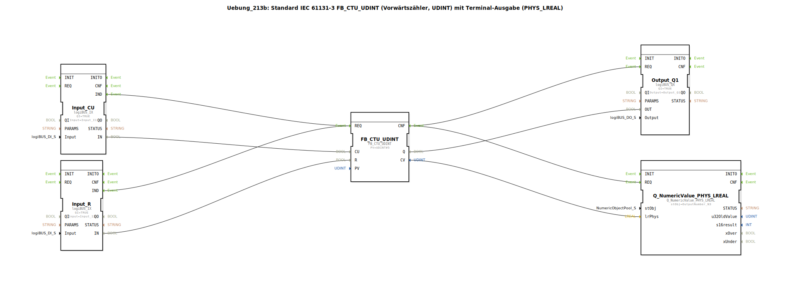

# Uebung_213b: Standard IEC 61131-3 FB_CTU_UDINT (Vorwärtszähler, UDINT) mit Terminal-Ausgabe (PHYS_LREAL)

* * * * * * * * * *
## Einleitung

Diese Übung implementiert einen Vorwärtszähler nach IEC 61131‑3 (FB_CTU_UDINT) mit einem Presetwert von 5. Die Zählimpulse werden über zwei digitale Eingänge bereitgestellt:  
- **I1** dient als Zähleingang (CU – Count Up)  
- **I2** dient als Rücksetzeingang (R – Reset)  

Der Zählerstand (CV) wird als physikalische Größe vom Typ LREAL auf einem Terminal ausgegeben. Ein digitaler Ausgang (Q1) wird aktiviert, sobald der Zählerstand den Presetwert erreicht oder überschreitet.  

Die Übung zeigt die direkte Verbindung eines UDINT‑Werts auf einen LREAL‑Ausgang – eine Typumwandlung ist nicht erforderlich, da UDINT implizit nach LREAL konvertiert werden kann.

## Verwendete Funktionsbausteine (FBs)

Die Übung enthält fünf Funktionsbausteine, die alle auf der obersten Netzwerkebene angeordnet sind. Sub‑Bausteine sind nicht vorhanden.

### FB_CTU_UDINT
- **Typ**: `iec61131::counters::FB_CTU_UDINT`
- **Parameter**: `PV` = `UDINT#5` (Presetwert)
- **Funktionsweise**: Vorwärtszähler (IEC 61131-3) für ganzzahlige Werte vom Typ UDINT. Bei jedem steigenden Signal am Eingang CU wird der Zählerstand CV um 1 erhöht. Wird der Eingang R gesetzt, wird CV auf 0 zurückgesetzt. Der Ausgang Q wird TRUE, sobald CV ≥ PV.

### Input_CU
- **Typ**: `logiBUS::io::DI::logiBUS_IX`
- **Parameter**: `QI` = `TRUE`, `Input` = `Input_I1`
- **Funktionsweise**: Digitaler Eingangsbaustein, der den physischen Eingang I1 (z. B. Taster) ausliest. Der Ereignisausgang IND signalisiert eine Zustandsänderung.

### Input_R
- **Typ**: `logiBUS::io::DI::logiBUS_IX`
- **Parameter**: `QI` = `TRUE`, `Input` = `Input_I2`
- **Funktionsweise**: Digitaler Eingangsbaustein für den physischen Eingang I2 (Rücksetztaster). Entspricht im Aufbau dem Baustein Input_CU.

### Output_Q1
- **Typ**: `logiBUS::io::DQ::logiBUS_QX`
- **Parameter**: `QI` = `TRUE`, `Output` = `Output_Q1`
- **Funktionsweise**: Digitaler Ausgangsbaustein, der den physischen Ausgang Q1 (z. B. Lampe) schaltet. Der Wert des Datenports OUT wird direkt an die Hardware übergeben.

### Q_NumericValue_PHYS_LREAL
- **Typ**: `isobus::UT::Q::Q_NumericValue_PHYS_LREAL`
- **Parameter**: `stObj` = `OutputNumber_N3`
- **Funktionsweise**: Terminalausgabe für einen physikalischen LREAL‑Wert. Der übergebene Wert (lrPhys) wird auf dem konfigurierten Ausgabekanal (hier `OutputNumber_N3`) dargestellt.

## Programmablauf und Verbindungen

Der Ablauf wird durch **Ereignisverbindungen** gesteuert:

1. Eine Änderung an **Input_CU** (Taster I1) erzeugt das Ereignis **IND**, das den Zählerbaustein über seinen **REQ**‑Eingang triggert.
2. Ebenso erzeugt eine Änderung an **Input_R** (Taster I2) ein **IND**‑Ereignis, das ebenfalls den **REQ**‑Eingang des Zählers erreicht – ein und derselbe Zähler wird also von beiden Eingängen angesprochen.
3. Nach der Verarbeitung gibt der Zähler ein **CNF**‑Ereignis aus. Dieses wird parallel an zwei Bausteine weitergeleitet:
   - an **Output_Q1** (Ausgang Q1)
   - an **Q_NumericValue_PHYS_LREAL** (Terminalausgabe)

Die **Datenverbindungen** übertragen die Werte:

- `Input_CU.IN` → `FB_CTU_UDINT.CU` (Zählimpuls)
- `Input_R.IN` → `FB_CTU_UDINT.R` (Rücksetzsignal)
- `FB_CTU_UDINT.Q` → `Output_Q1.OUT` (Ausgangszustand)
- `FB_CTU_UDINT.CV` → `Q_NumericValue_PHYS_LREAL.lrPhys` (Zählerstand als LREAL)

**Hinweis:** Der Zählerstand CV ist vom Typ UDINT. Der Datenport lrPhys erwartet LREAL. Da in IEC 61131-3 UDINT ohne explizite Konvertierung auf LREAL geschlossen werden kann, ist diese direkte Verbindung zulässig.

## Zusammenfassung

Die Übung veranschaulicht den Einsatz eines standardisierten Vorwärtszählers (FB_CTU_UDINT) in der 4diac‑IDE. Sie zeigt:
- Anbindung zweier digitaler Eingänge als Zähl‑ und Rücksetzsignal
- Verwendung eines digitalen Ausgangs zur Anzeige des Erreichens des Presetwerts
- Ausgabe des Zählerstands auf einem Terminal mithilfe eines physikalischen LREAL‑Ausgabebausteins
- implizite Typkonvertierung von UDINT nach LREAL

Damit werden grundlegende Kenntnisse der IEC‑61131‑3‑Zählerfunktionen und der Ein‑/Ausgangsverknüpfung in 4diac vermittelt.