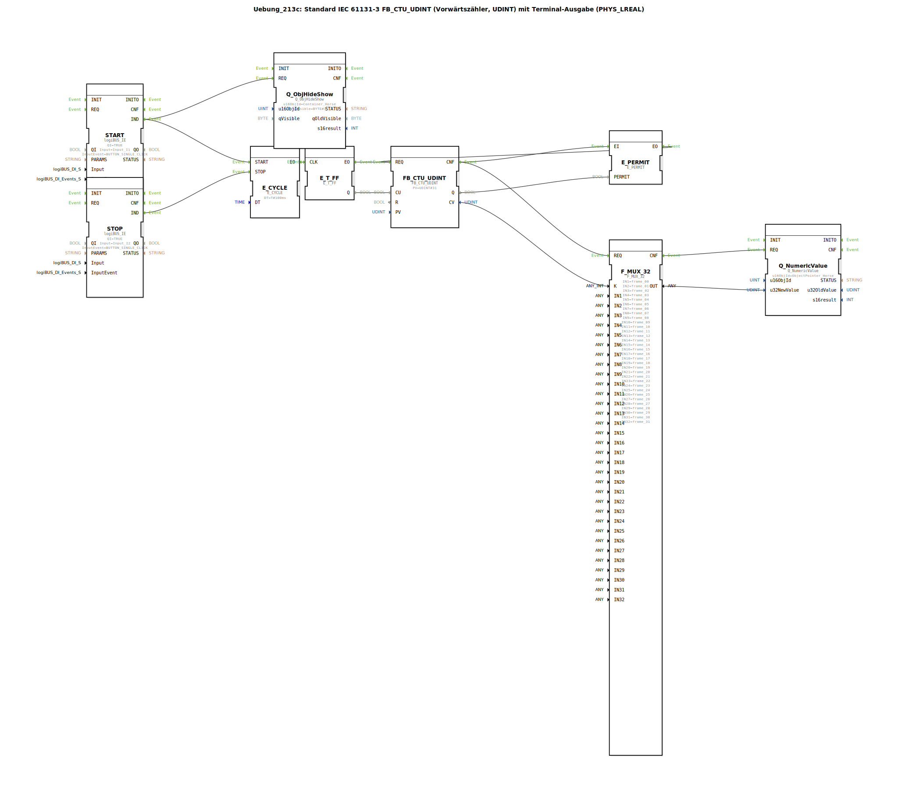

# Uebung_213c: Standard IEC 61131-3 FB_CTU_UDINT (Vorwärtszähler, UDINT) mit Terminal-Ausgabe (PHYS_LREAL)

* * * * * * * * * *

## Einleitung

Diese Übung realisiert einen Vorwärtszähler nach IEC 61131-3 (FB_CTU_UDINT) mit einer Zählgrenze von 31. Der Zählerstand wird zyklisch aktualisiert und über einen Multiplexer auf eine numerische Terminalausgabe (PHYS_LREAL) übertragen. Zusätzlich wird ein animiertes Objekt („Pferd“) über Ein-/Ausblenden gesteuert. Die Übung veranschaulicht die Kombination von IEC 61131-3 Funktionsbausteinen mit ereignisgesteuerter 4diac-Logik und Terminalausgabe.

## Verwendete Funktionsbausteine (FBs)

### Sub-Bausteine: `FB_CTU_UDINT`
- **Typ**: `iec61131::counters::FB_CTU_UDINT`
- **Verwendete interne FBs**: (Standard IEC 61131-3, keine weiteren Unterbausteine)
- **Parameter**:
    - `PV` = `UDINT#31` (Zählgrenze)
- **Funktionsweise**:  
  Der Baustein zählt bei jedem positiven Flanke am Eingang `CU` den aktuellen Zählerstand `CV` (UDINT) hoch. Erreicht `CV` den Wert `PV`, wird der Ausgang `Q` gesetzt. Der Zähler kann über den Eingang `R` zurückgesetzt werden.

### Sub-Bausteine: `START`
- **Typ**: `logiBUS::io::DI::logiBUS_IE`
- **Parameter**:
    - `QI` = `TRUE`
    - `Input` = `Input_I1` (physischer Eingang I1)
    - `InputEvent` = `BUTTON_SINGLE_CLICK`
- **Funktionsweise**:  
  Erzeugt bei Betätigung des Tasters I1 (Einfachklick) ein Ereignis `IND`, das den Zyklusstart und das Einblenden des Objekts auslöst.

### Sub-Bausteine: `STOP`
- **Typ**: `logiBUS::io::DI::logiBUS_IE`
- **Parameter**:
    - `QI` = `TRUE`
    - `Input` = `Input_I2`
    - `InputEvent` = `BUTTON_SINGLE_CLICK`
- **Funktionsweise**:  
  Erzeugt bei Betätigung des Tasters I2 ein Ereignis `IND`, das den zyklischen Timer anhält.

### Sub-Bausteine: `E_CYCLE`
- **Typ**: `iec61499::events::E_CYCLE`
- **Parameter**:
    - `DT` = `T#100ms` (Zykluszeit 100 ms)
- **Funktionsweise**:  
  Ein zyklischer Ereignisgenerator. Mit `START` wird der Zyklus gestartet, mit `STOP` angehalten. Das Ausgangsereignis `EO` tritt alle 100 ms auf.

### Sub-Bausteine: `E_T_FF`
- **Typ**: `iec61499::events::E_T_FF`
- **Funktionsweise**:  
  Ein T-Flipflop (Toggle-Flipflop). Jedes Ereignis am Takteingang `CLK` ändert den Zustand des Ausgangs `Q`. Hier wird aus dem 100‑ms-Takt ein 200‑ms‑Takt (wenn Q=1) erzeugt, um den Zählimpuls `CU` zu generieren.

### Sub-Bausteine: `E_PERMIT`
- **Typ**: `iec61499::events::E_PERMIT`
- **Funktionsweise**:  
  Ein Freigabebaustein. Er leitet ein Ereignis von `EI` nach `EO` nur dann weiter, wenn der Eingang `PERMIT` `TRUE` ist. Hier wird die Datenausgabe nur freigegeben, wenn der Zähler seinen Endwert erreicht hat (`Q=1`).

### Sub-Bausteine: `F_MUX_32`
- **Typ**: `iec61131::selection::F_MUX_32`
- **Parameter**:
    - `IN1` … `IN32` = `frame_00` … `frame_31` (32 vordefinierte Konstanten)
- **Funktionsweise**:  
  Ein 32‑Kanal-Multiplexer. Der Ausgang `OUT` entspricht dem Eingang `IN(K)`, wobei `K` der Auswahlwert (UDINT) ist. Hier wird der aktuelle Zählerstand `CV` als Auswahl verwendet, um das entsprechende Frame für die Animation auszuwählen.

### Sub-Bausteine: `Q_NumericValue`
- **Typ**: `isobus::UT::Q::Q_NumericValue`
- **Parameter**:
    - `u16ObjId` = `ObjectPointer_Horse`
- **Funktionsweise**:  
  Schreibt den am Eingang `u32NewValue` anliegenden Wert in ein Terminal-Display-Objekt. Der Wert wird als physikalische LREAL-Größe dargestellt.

### Sub-Bausteine: `Q_ObjHideShow`
- **Typ**: `isobus::UT::Q::Q_ObjHideShow`
- **Parameter**:
    - `u16ObjId` = `Container_Horse`
    - `qVisible` = `BYTE#1` (sichtbar)
- **Funktionsweise**:  
  Blendet ein Grafik-Container-Objekt ein (bei `REQ` wird es sichtbar). Dieses Objekt enthält vermutlich die animierte Pferdegrafik.

## Programmablauf und Verbindungen

1. **Start**: Ein Druck auf Taster **I1** erzeugt das Ereignis `START.IND`. Dieses startet den zyklischen Timer `E_CYCLE` und blendet gleichzeitig das Objekt `Container_Horse` über `Q_ObjHideShow` ein.
2. **Zyklischer Takt**: `E_CYCLE` erzeugt alle 100 ms ein Ereignis `EO`. Dieses taktet das T‑Flipflop `E_T_FF`, dessen Ausgang `Q` wechselt bei jedem zweiten Ereignis seinen Zustand. Dadurch entsteht ein 200‑ms‑Takt am Ausgang des Flipflops.
3. **Zählung**: Der Ausgang `E_T_FF.Q` ist mit dem Zähleingang `CU` von `FB_CTU_UDINT` verbunden. Bei jeder positiven Flanke (Wechsel von 0 auf 1) erhöht der Zähler `CV` um 1.
4. **Rücksetzen**: Sobald der Zähler seinen Endwert 31 erreicht hat, wird `Q` gesetzt. Dieser Zustand wird auf den Rücksetzeingang `R` zurückgeführt **und** an den Freigabeeingang `E_PERMIT.PERMIT` gelegt. Dadurch wird der Zähler automatisch zurückgesetzt und gleichzeitig die weitere Verarbeitung freigegeben.
5. **Datenauswahl**: Der aktuelle Zählerstand `CV` (vor dem Rücksetzen) wird als Auswahl `K` an den Multiplexer `F_MUX_32` gelegt. Der Multiplexer wählt das entsprechende `frame_xx` aus (0 … 31).
6. **Terminalausgabe**: Das vom Multiplexer gelieferte `frame_xx` wird an den Numeric-Wert-Ausgabebaustein `Q_NumericValue` übergeben und auf dem angeschlossenen Terminal dargestellt (z. B. als Zeichen oder Grafik).
7. **Stopp**: Ein Druck auf Taster **I2** erzeugt `STOP.IND`, das den Timer `E_CYCLE` anhält. Zählung und Ausgabe werden gestoppt.

**Lernziele**:  
- Anwendung des IEC 61131‑3 Zählers `FB_CTU_UDINT` in einer 4diac-Umgebung.  
- Kombination von ereignisgesteuerten Bausteinen (E_CYCLE, E_T_FF, E_PERMIT) mit datenflussorientierten Bausteinen (F_MUX_32, Q_NumericValue).  
- Steuerung eines animierten Objekts über Taster, zyklischen Timer und Zähler.

**Schwierigkeitsgrad**: Mittel  
**Vorkenntnisse**: Grundlagen der IEC 61499 Ereignissteuerung, IEC 61131‑3 Zählerfunktionen.

## Zusammenfassung

Die Übung `Uebung_213c` führt einen Vorwärtszähler mit automatischem Reset bei Erreichen der Grenze 31 aus. Ein zyklischer Timer (100 ms) erzeugt über ein T‑Flipflop einen 200‑ms‑Takt für die Zählimpulse. Der Zählerstand wird über einen Multiplexer in ein numerisches Terminalformat umgesetzt und angezeigt. Zusätzlich steuern zwei Taster den Start/Stopp der gesamten Animation. Die Übung zeigt anschaulich die Integration von IEC 61131‑3 Zählerlogik in ein ereignisgesteuertes 4diac‑System mit grafischer Ausgabe.