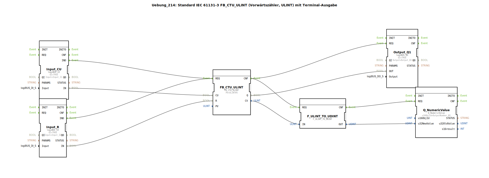

# Uebung_214: Standard IEC 61131-3 FB_CTU_ULINT (Vorwärtszähler, ULINT) mit Terminal-Ausgabe

* * * * * * * * * *

## Einleitung

Diese Übung demonstriert die Verwendung des IEC 61131-3 Standardvorwärtszählers **FB_CTU_ULINT** für den Datentyp **ULINT** (unsigned long integer). Der Zähler wird über zwei digitale Eingänge gesteuert: Der Eingang **CU** zählt bei jeder positiven Flanke um eins hoch, während der Eingang **R** den Zählerstand zurücksetzt. Der aktuelle Zählerstand wird auf ein Terminal ausgegeben, und der Ausgang **Q** wird aktiv, sobald der Zählerstand den voreingestellten Wert **PV** erreicht oder überschreitet. Ziel ist es, die Integration eines Standard-FBs mit Hardware-Ein-/Ausgängen und einer textuellen Ausgabe zu verstehen.

## Verwendete Funktionsbausteine (FBs)

Die Übung besteht aus einem Netzwerk von sechs internen Funktionsbausteinen, die über Ereignis- und Datenverbindungen verknüpft sind.

### Sub-Bausteine: FB_CTU_ULINT
- **Typ**: `iec61131::counters::FB_CTU_ULINT`
- **Verwendete interne FBs**: keiner (der Baustein selbst ist primitiv)
- **Parameter**:
  - `PV = ULINT#5` – Der Zähler wird aktiv, sobald der Stand den Wert 5 erreicht.
- **Ereignisseingänge/-ausgänge**:
  - **REQ** (Eingang) – löst die Zählerlogik aus.
  - **CNF** (Ausgang) – signalisiert die Verarbeitung und gibt das Ergebnis weiter.
- **Dateneingänge/-ausgänge**:
  - **CU** (Eingang, BOOL) – Zählimpuls (steigende Flanke zählt).
  - **R** (Eingang, BOOL) – Rücksetzen des Zählerstands.
  - **PV** (Eingang, ULINT) – Voreinstellwert, hier 5.
  - **Q** (Ausgang, BOOL) – TRUE, wenn CV >= PV.
  - **CV** (Ausgang, ULINT) – aktueller Zählerstand.
- **Funktionsweise**: Bei jedem REQ-Ereignis wird die Zählerlogik ausgeführt: Eine steigende Flanke auf **CU** erhöht **CV** um 1, ein TRUE auf **R** setzt **CV** auf 0. **Q** wird in derselben Verarbeitung aktualisiert.

### Sub-Bausteine: Input_CU und Input_R (logiBUS_IX)
- **Typ**: `logiBUS::io::DI::logiBUS_IX`
- **Verwendete interne FBs**: keiner
- **Parameter**:
  - `QI = TRUE` – Qualifier aktiviert den Kanal.
  - `Input = Input_I1` (für Input_CU) bzw. `Input = Input_I2` (für Input_R) – Hardware-Pin Zuordnung.
- **Ereignisse**:
  - **IND** (Ausgang) – wird bei Signaländerung am Eingang ausgelöst.
- **Daten**:
  - **IN** (Ausgang, BOOL) – aktueller Zustand des digitalen Eingangs.
- **Funktionsweise**: Diese Bausteine lesen die realen digitalen Eingänge (logiBUS-Hardware) und geben bei jeder Änderung ein Ereignis aus. Der Zustand wird über **IN** bereitgestellt.

### Sub-Bausteine: Output_Q1 (logiBUS_QX)
- **Typ**: `logiBUS::io::DQ::logiBUS_QX`
- **Verwendete interne FBs**: keiner
- **Parameter**:
  - `QI = TRUE` – Qualifier aktiviert den Ausgang.
  - `Output = Output_Q1` – Hardware-Pin Zuordnung.
- **Ereignisse**:
  - **REQ** (Eingang) – löst die Ausgabe des anliegenden Werts aus.
- **Daten**:
  - **OUT** (Eingang, BOOL) – der auszugebende Wert.
- **Funktionsweise**: Der Baustein setzt den Digitalausgang auf den Wert von **OUT**, sobald ein **REQ**-Ereignis eintrifft.

### Sub-Bausteine: F_ULINT_TO_UDINT
- **Typ**: `iec61131::conversion::F_ULINT_TO_UDINT`
- **Verwendete interne FBs**: keiner
- **Parameter**: keine
- **Ereignisse**:
  - **REQ** (Eingang) – startet die Konvertierung.
  - **CNF** (Ausgang) – signalisiert, dass das Ergebnis bereit ist.
- **Daten**:
  - **IN** (Eingang, ULINT) – der zu konvertierende Wert.
  - **OUT** (Ausgang, UDINT) – das konvertierte Ergebnis.
- **Funktionsweise**: Der Baustein wandelt einen 64‑Bit unsigned Integer (ULINT) in einen 32‑Bit unsigned Integer (UDINT) um. Ein Überlauf kann auftreten, wenn der ULINT-Wert größer als 2³²‑1 ist (Hinweis im Netzwerk).

### Sub-Bausteine: Q_NumericValue
- **Typ**: `isobus::UT::Q::Q_NumericValue`
- **Verwendete interne FBs**: keiner
- **Parameter**:
  - `u16ObjId = OutputNumber_N1` – Identifikation des Terminal-Objekts, an das der Wert gesendet wird.
- **Ereignisse**:
  - **REQ** (Eingang) – löst die Aktualisierung der Anzeige aus.
- **Daten**:
  - **u32NewValue** (Eingang, UDINT) – der anzuzeigende numerische Wert.
- **Funktionsweise**: Dieser Baustein sendet den übergebenen 32‑Bit Wert an ein Terminal (z. B. HMI oder Konsole), sodass der aktuelle Zählerstand visuell ausgegeben wird.

## Programmablauf und Verbindungen

1. **Eingangsereignisse**: Die digitalen Eingänge **Input_CU** und **Input_R** erzeugen bei Zustandsänderungen ein **IND**-Ereignis. Beide Ereignisse sind mit dem **REQ**-Eingang des Zählers **FB_CTU_ULINT** verbunden. Dadurch wird der Zähler jedes Mal neu berechnet, wenn einer der Eingänge seinen Zustand ändert.

2. **Zählerlogik**: Der Zähler wertet die anliegenden Daten aus:
   - **CU** erhält den aktuellen Zustand von **Input_CU.IN**.
   - **R** erhält den Zustand von **Input_R.IN**.
   - Eine steigende Flanke auf **CU** erhöht den internen Zählstand **CV** um 1.
   - Ein TRUE auf **R** setzt **CV** auf 0.
   - Überschreitet **CV** den Wert **PV** (hier 5), wird **Q** auf TRUE gesetzt.

3. **Ausgabe**: Nach der Berechnung sendet der Zähler das **CNF**-Ereignis. Dieses Ereignis wird parallel zu zwei Bausteinen geführt:
   - **Output_Q1** setzt den digitalen Ausgang auf den Wert von **FB_CTU_ULINT.Q**.
   - **F_ULINT_TO_UDINT** konvertiert den aktuellen Zählerstand **CV** von ULINT in UDINT.

4. **Terminal-Ausgabe**: Nach Abschluss der Konvertierung löst **F_ULINT_TO_UDINT.CNF** das **REQ**-Ereignis von **Q_NumericValue** aus. Der konvertierte Wert wird über die Datenleitung **OUT** an **u32NewValue** übergeben und auf dem Terminal ausgegeben.

5. **Hinweise aus der Übung**:
   - Ein Kommentar schlägt vor, ggf. einen **E_D_FF** (Einschaltverzögerer) einzubauen, um die Anzahl der Ereignisse zu reduzieren (z. B. bei schnellen Eingangssignalen).
   - Ein weiterer Kommentar warnt vor einem möglichen **Überlauf** bei der Konvertierung von ULINT nach UDINT, da ULINT einen größeren Wertebereich abdecken kann (bis 2⁶⁴‑1) als UDINT (bis 2³²‑1).

## Zusammenfassung

Die Übung 214 zeigt den praktischen Einsatz des IEC 61131-3 Standard-Zählers **FB_CTU_ULINT** in einer 4diac-IDE Umgebung. Durch die Verknüpfung mit Hardware-Eingängen (logiBUS) und einem Terminalausgabebaustein wird deutlich, wie ein industrieller Zähler konfiguriert und visualisiert werden kann. Die Schüler lernen, Ereignis- und Datenflüsse zu verstehen, sowie die Bedeutung von Datentypkonvertierung und die Gefahr von Überläufen bei nicht-passenden Typen. Die Übung eignet sich für Fortgeschrittene, die bereits Grundlagen der IEC 61131-3 und der 4diac-IDE beherrschen.