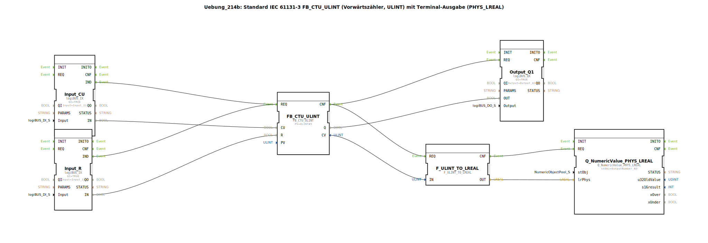

# Uebung_214b: Standard IEC 61131-3 FB_CTU_ULINT (Vorwärtszähler, ULINT) mit Terminal-Ausgabe (PHYS_LREAL)

* * * * * * * * * *

## Einleitung

Diese Übung implementiert einen Vorwärtszähler nach IEC 61131-3 (FB_CTU_ULINT). Der Zähler erhöht seinen Stand bei jeder steigenden Flanke am Eingang CU (Count Up) um eins, sofern der Rücksetzeingang R nicht aktiv ist. Wird der Presetwert (PV) erreicht oder überschritten, setzt der Ausgang Q auf TRUE. Der aktuelle Zählerstand wird als ULINT (vorzeichenloser 64‑Bit‑Integer) ausgegeben, über einen Konvertierungsbaustein in LREAL umgewandelt und an einen Terminal‑Ausgabebaustein übergeben, der den Wert auf einem angeschlossenen Terminal anzeigt.

Die physikalischen Ein‑ und Ausgänge sind mit den logiBUS‑Klemmen Input_I1, Input_I2 und Output_Q1 verbunden.

## Verwendete Funktionsbausteine (FBs)

### FB_CTU_ULINT
- **Typ**: `iec61131::counters::FB_CTU_ULINT`
- **Parameter**:
  - `PV` = `ULINT#5` (Presetwert)
- **Ereigniseingang/-ausgang**:
  - `REQ` (Eingang) – Trigger für Zähl‑ oder Rücksetzoperation
  - `CNF` (Ausgang) – Bestätigung der Bearbeitung
- **Dateneingang/-ausgang**:
  - `CU` (Eingang) – Zählimpuls (steigende Flanke)
  - `R` (Eingang) – Rücksetzen des Zählers
  - `Q` (Ausgang) – TRUE wenn Zählerstand >= PV
  - `CV` (Ausgang) – aktueller Zählerstand (ULINT)

### Input_CU (logiBUS_IX)
- **Typ**: `logiBUS::io::DI::logiBUS_IX`
- **Parameter**:
  - `QI` = `TRUE` (Aktivierung)
  - `Input` = `Input_I1` (physikalischer Digitaleingang)
- **Ereignisausgang**: `IND` – meldet ein Ereignis bei Änderung des Eingangs
- **Datenausgang**: `IN` – aktueller Zustand des Eingangs

### Input_R (logiBUS_IX)
- **Typ**: `logiBUS::io::DI::logiBUS_IX`
- **Parameter**:
  - `QI` = `TRUE`
  - `Input` = `Input_I2`
- **Ereignisausgang**: `IND`
- **Datenausgang**: `IN`

### Output_Q1 (logiBUS_QX)
- **Typ**: `logiBUS::io::DQ::logiBUS_QX`
- **Parameter**:
  - `QI` = `TRUE`
  - `Output` = `Output_Q1` (physikalischer Digitalausgang)
- **Ereigniseingang**: `REQ` – löst das Setzen des Ausgangs aus
- **Dateneingang**: `OUT` – Wert, der auf den Ausgang geschrieben wird

### F_ULINT_TO_LREAL
- **Typ**: `iec61131::conversion::F_ULINT_TO_LREAL`
- **Ereigniseingang/-ausgang**:
  - `REQ` (Eingang) – startet Konvertierung
  - `CNF` (Ausgang) – Bestätigung der Konvertierung
- **Dateneingang/-ausgang**:
  - `IN` (Eingang) – ULINT‑Wert
  - `OUT` (Ausgang) – konvertierter LREAL‑Wert

### Q_NumericValue_PHYS_LREAL
- **Typ**: `isobus::UT::Q::Q_NumericValue_PHYS_LREAL`
- **Parameter**:
  - `stObj` = `OutputNumber_N3` (Referenz auf das Terminal‑Ausgabeobjekt)
- **Ereigniseingang**: `REQ` – löst Ausgabe aus
- **Dateneingang**: `lrPhys` – physikalischer Wert als LREAL

## Programmablauf und Verbindungen

1. **Zählimpuls (CU)**: Eine steigende Flanke am Digitaleingang Input_I1 wird vom Baustein `Input_CU` erkannt und über den Ereignisausgang `IND` an den `REQ`-Eingang des Zählers `FB_CTU_ULINT` weitergeleitet. Gleichzeitig wird der Signalzustand über die Datenverbindung an den `CU`-Eingang übergeben.
2. **Rücksetzen (R)**: Ein Signal am Digitaleingang Input_I2 wird analog über `Input_R` an den `R`-Eingang des Zählers geführt. Bei aktivem Signal wird der Zähler auf 0 gesetzt.
3. **Zählerverarbeitung**: Der Zähler erhöht bei jeder positiven Flanke an `CU` den internen Stand, solange `R` = FALSE. Wird der Presetwert (PV = 5) erreicht, setzt der Ausgang `Q` auf TRUE.
4. **Ausgabe des Zählerstands (CV)**: Nach jedem Zähl‑ oder Rücksetzvorgang signalisiert `FB_CTU_ULINT` über `CNF` die Fertigstellung. Dieses Ereignis triggert gleichzeitig zwei Zweige:
   - **Digitalausgang**: Das Ereignis `CNF` startet den Baustein `Output_Q1`. Der Wert von `Q` (TRUE/FALSE) wird auf den physikalischen Ausgang Output_Q1 geschrieben.
   - **Terminalausgabe**: Ebenfalls über `CNF` wird der Konvertierungsbaustein `F_ULINT_TO_LREAL` getriggert. Dieser wandelt den aktuellen Zählerstand (`CV`, ULINT) in LREAL um. Nach Abschluss der Konvertierung wird das Terminal‑Ausgabemodul `Q_NumericValue_PHYS_LREAL` aktiviert und der konvertierte Wert angezeigt.

Alle Datenverbindungen sind so verdrahtet, dass die Werte synchron mit den Ereignissen weitergegeben werden.

**Lernziele**:
- Verständnis des IEC 61131-3 Zählers FB_CTU_ULINT (Vorwärtszähler)
- Umgang mit Datentypkonvertierung (ULINT → LREAL)
- Einbindung von physikalischen Ein‑/Ausgängen und Terminalausgabe in einer 4diac‑Subapplikation

**Schwierigkeitsgrad**: Einfach  
**Benötigte Vorkenntnisse**: Grundlagen der 4diac‑IDE, Umgang mit logiBUS‑Klemmen

**Ausführung**: In der 4diac‑IDE die Subapplikation `Uebung_214b` öffnen und im Simulation‑Modus testen. Die Eingänge `Input_I1` und `Input_I2` können über die Hardware‑Simulation oder reale Klemmen gesteuert werden.

## Zusammenfassung

Die Übung 214b demonstriert die Implementierung eines industriellen Vorwärtszählers mit Terminal‑Ausgabe. Der Zähler wird über zwei digitale Eingänge gesteuert, sein Ausgang schaltet einen Digitalausgang, und der aktuelle Zählerstand wird nach Konvertierung auf einem Terminal ausgegeben. Das Zusammenspiel von Ereignis‑ und Datenverbindungen sowie die Verwendung von Standard‑IEC‑ und logiBUS‑Bausteinen bilden die Grundlage für komplexere Automatisierungsanwendungen.