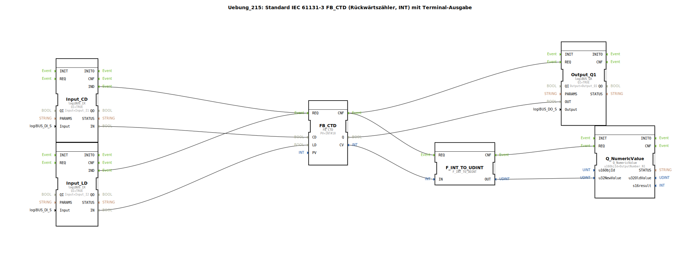

# Uebung_215: Standard IEC 61131-3 FB_CTD (Rückwärtszähler, INT) mit Terminal-Ausgabe

* * * * * * * * * *

## Einleitung

Diese Übung realisiert einen **Rückwärtszähler (FB_CTD)** gemäß IEC 61131-3. Der Zähler zählt bei jedem Ereignis an seinem **CD**-Eingang (Count Down) von einem vorgegebenen **PV**-Wert (Preset Value) herunter. Mit dem **LD**-Eingang (Load) kann der Zähler jederzeit auf den Preset-Wert zurückgesetzt werden. Der aktuelle Zählerstand wird auf einem numerischen Ausgabefeld (Terminal) dargestellt, und ein binärer Ausgang (Q1) wird gesetzt, sobald der Zählerstand **0** erreicht.

Die Übung bildet einen typischen Anwendungsfall eines IEC-Zählbausteins ab und zeigt dessen Anbindung an Hardwareeingänge sowie die Ausgabe des Zählerwertes über einen isobus‑Terminalbaustein.

---

## Verwendete Funktionsbausteine (FBs)

Die gesamte Schaltung besteht aus einem SubApp‑Typ (SubAppType) mit der Bezeichnung "Uebung_215". Im FBNetzwerk sind folgende Bausteine enthalten:

### Sub-Bausteine:

#### `FB_CTD` (Typ: `iec61131::counters::FB_CTD`)
- **Typ**: IEC 61131-3 Funktionbaustein – Abwärtszähler (Counter Down)
- **Parameter**:
  - `PV = INT#10` → Preset‑Wert = 10 (als Integer‑Konstante)
- **Ereigniseingänge**:
  - `REQ` → wird bei steigender Flanke an `CD` oder `LD` angesteuert
- **Ereignisausgänge**:
  - `CNF` → wird ausgelöst, sobald der Baustein eine neue Berechnung abgeschlossen hat
- **Dateneingänge**:
  - `CD` (BOOL) → Zählimpuls (Count Down)
  - `LD` (BOOL) → Laden des Preset‑Wertes
  - `PV` (INT) → Voreinstellwert (hier fest auf 10 gesetzt)
- **Datenausgänge**:
  - `Q` (BOOL) → wird `TRUE`, wenn der Zählerstand 0 erreicht hat
  - `CV` (INT) → aktueller Zählerstand

**Funktionsweise**:  
Der Baustein zählt bei jedem positiven Flankenwechsel an `CD` den internen Zähler um 1 herunter. Ein positiver Flanke an `LD` setzt den Zähler zurück auf den Wert von `PV`. Der Ausgang `Q` ist `TRUE`, solange der Zählerstand = 0 ist. Der aktuelle Zählerstand wird über `CV` ausgegeben.

#### `Input_CD` (Typ: `logiBUS::io::DI::logiBUS_IX`)
- **Typ**: Digitaleingang – physikalischer Eingang `Input_I1`
- **Parameter**:
  - `QI = TRUE` → Eingang aktiviert
  - `Input = Input_I1` → realer Eingang (z.B. Taster oder Sensor)
- **Ausgänge**:
  - `IND` (Ereignis) → wird bei Änderung des Eingangssignals ausgelöst
  - `IN` (BOOL) → aktueller Zustand des Eingangs

#### `Input_LD` (Typ: `logiBUS::io::DI::logiBUS_IX`)
- **Typ**: Digitaleingang – physikalischer Eingang `Input_I2`
- **Parameter**:
  - `QI = TRUE`
  - `Input = Input_I2`
- **Ausgänge**: wie `Input_CD`

#### `Output_Q1` (Typ: `logiBUS::io::DQ::logiBUS_QX`)
- **Typ**: Digitalausgang – physikalischer Ausgang `Output_Q1`
- **Parameter**:
  - `QI = TRUE`
  - `Output = Output_Q1` → realer Ausgang (z.B. Lampe oder Relais)
- **Eingänge**:
  - `REQ` (Ereignis) → wird bei neuem Zählergebnis ausgelöst
  - `OUT` (BOOL) → Wert für den Ausgang

#### `F_INT_TO_UDINT` (Typ: `iec61131::conversion::F_INT_TO_UDINT`)
- **Typ**: IEC‑Konvertierungsfunktion von `INT` nach `UDINT`
- **Dateneingänge**:
  - `IN` (INT) → Eingangswert (hier der aktuelle Zählerstand)
- **Datenausgänge**:
  - `OUT` (UDINT) → konvertierter Wert (vorzeichenloser 32‑Bit‑Integer)

> **Hinweis**: Die Verwendung dieses Bausteins ist aus technischer Sicht nicht optimal, da der Zählerstand `CV` eines **Rückwärtszählers** nicht negativ werden kann (er stoppt bei 0). Eine direkte Kopplung ohne Typkonvertierung wäre möglich, der Baustein dient hier aber als didaktisches Beispiel für die Umwandlung von Datentypen.

#### `Q_NumericValue` (Typ: `isobus::UT::Q::Q_NumericValue`)
- **Typ**: Terminal‑Ausgabebaustein zur Darstellung eines numerischen Wertes
- **Parameter**:
  - `u16ObjId = OutputNumber_N1` → Objekt‑ID des numerischen Anzeigefeldes auf dem Terminal
- **Eingänge**:
  - `REQ` (Ereignis) → löst die Aktualisierung der Anzeige aus
  - `u32NewValue` (UDINT) → neuer darzustellender Wert
- **Funktionsweise**: Der Baustein sendet den übergebenen Wert an das konfigurierte Terminal‑Feld, sodass der Benutzer den aktuellen Zählerstand auf einem Display ablesen kann.

---

## Programmablauf und Verbindungen

Der Ablauf der Übung wird durch die Ereignis‑ und Datenverbindungen im FBNetzwerk bestimmt:

1. **Ereignisauslösung**  
   - Die beiden Digitaleingänge `Input_CD` und `Input_LD` erzeugen bei einem Signalwechsel das Ereignis `IND`.  
   - Beide Ereignisse werden auf den **gleichen** Ereigniseingang `REQ` des Zählers `FB_CTD` geschaltet. Das bedeutet: Jeder Tastendruck (egal ob CD oder LD) triggert eine Neuberechnung des Zählers.

2. **Datenkopplung**  
   - Der **Zählimpuls** (`CD`) wird direkt vom Ausgang `IN` des Eingangsbausteins `Input_CD` an den Dateneingang `FB_CTD.CD` geführt.  
   - Der **Ladeimpuls** (`LD`) wird vom Ausgang `IN` des `Input_LD` an `FB_CTD.LD` angeschlossen.  
   - Der **Zählerausgang Q** wird an den Ausgabebaustein `Output_Q1.OUT` weitergegeben.  
   - Der **aktuelle Zählerstand `CV`** wird über den Konvertierungsbaustein `F_INT_TO_UDINT` an das Terminal `Q_NumericValue.u32NewValue` gesendet.

3. **Terminal‑Aktualisierung**  
   - Sobald die Berechnung des Zählers abgeschlossen ist, wird das Ereignis `CNF` von `FB_CTD` ausgelöst.  
   - Dieses Ereignis triggert sowohl den Ausgabebaustein `Output_Q1` als auch den Konvertierungsbaustein `F_INT_TO_UDINT`.  
   - Nach der Konvertierung feuert `F_INT_TO_UDINT.CNF` und aktualisiert die numerische Anzeige auf dem Terminal.

**Lernziele dieser Übung**:
- Einsatz des IEC‑Rückwärtszählers `FB_CTD` (Abwärtszähler) in 4diac.
- Kopplung von Hardwareeingängen und -ausgängen über logiBUS‑Bausteine.
- Ausgabe eines Zählerwerts auf einem Terminal mithilfe eines isobus‑Bausteins.
- Verständnis der Ereignis‑ und Datenflusssteuerung in einer SubApplikation.

**Schwierigkeitsgrad**: Einfach  
**Benötigte Vorkenntnisse**: Grundlegende Bedienung der 4diac‑IDE, Verständnis von IEC 61131‑3 Funktionbausteinen.

**Starten der Übung**:  
Laden Sie die Übung `Uebung_215` aus dem Paket `Uebungen` in ein leeres Projekt. Verbinden Sie die Hardwareeingänge `Input_I1` (CD) und `Input_I2` (LD) mit Tastern und den Ausgang `Output_Q1` mit einer Anzeige (z.B. Lampe). Das Terminal‑Objekt `OutputNumber_N1` muss im Pool konfiguriert sein.

---

## Zusammenfassung

In dieser Übung wurde ein vollständiger Rückwärtszähler gemäß IEC 61131‑3 aufgebaut. Der Zähler zählt bei Tastendruck an `I1` von 10 abwärts, setzt sich bei Tastendruck an `I2` zurück und aktiviert den Ausgang `Q1`, sobald der Wert 0 erreicht ist. Der aktuelle Zählerstand wird auf einem Terminal ausgegeben. Die Übung demonstriert die Integration von IEC‑Bausteinen mit logiBUS‑Hardware und isobus‑Visualisierung und vermittelt ein grundlegendes Verständnis für ereignisgesteuerte Automatisierungssysteme.