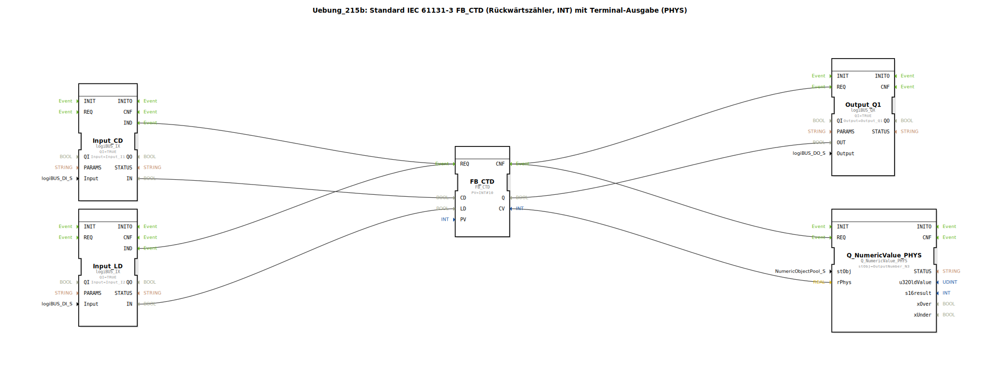

# Uebung_215b: Standard IEC 61131-3 FB_CTD (Rückwärtszähler, INT) mit Terminal-Ausgabe (PHYS)

* * * * * * * * * *
## Einleitung
Diese Übung implementiert einen **Rückwärtszähler** gemäß IEC 61131-3 (Funktionsbaustein `FB_CTD`) mit einem Preset-Wert von **10**. Der Zähler wird über zwei digitale Eingänge (CD – Count Down, LD – Load) gesteuert. Der aktuelle Zählerstand wird auf einem Terminal (PHYS) ausgegeben, und der Ausgang Q zeigt an, ob der Zählerstand Null erreicht hat.

## Verwendete Funktionsbausteine (FBs)

- **FB_CTD** (Typ: `iec61131::counters::FB_CTD`)
    - Parameter: `PV` = `INT#10` (Preset-Wert)
    - Ereignis-Eingang: `REQ` (Anforderung zur Ausführung)
    - Ereignis-Ausgang: `CNF` (Bestätigung der Verarbeitung)
    - Daten-Eingänge: `CD` (Count Down – Zählimpuls), `LD` (Load – Laden des Preset-Werts)
    - Daten-Ausgänge: `Q` (Ausgang, TRUE wenn CV = 0), `CV` (aktueller Zählerstand)
- **Input_CD** (Typ: `logiBUS::io::DI::logiBUS_IX`)
    - Parameter: `QI` = `TRUE`, `Input` = `Input_I1` (physischer Eingang I1)
    - Funktion: Digitaler Eingang, der bei einem Flankensignal ein Ereignis `IND` auslöst.
- **Input_LD** (Typ: `logiBUS::io::DI::logiBUS_IX`)
    - Parameter: `QI` = `TRUE`, `Input` = `Input_I2` (physischer Eingang I2)
    - Funktion: Digitaler Eingang für den Ladebefehl.
- **Output_Q1** (Typ: `logiBUS::io::DQ::logiBUS_QX`)
    - Parameter: `QI` = `TRUE`, `Output` = `Output_Q1` (physischer Ausgang Q1)
    - Funktion: Digitaler Ausgang, der den `Q`-Wert des Zählers auf eine physische Leitung ausgibt.
- **Q_NumericValue_PHYS** (Typ: `isobus::UT::Q::Q_NumericValue_PHYS`)
    - Parameter: `stObj` = `OutputNumber_N3` (Terminal-Ausgabestelle)
    - Funktion: Gibt den übergebenen numerischen Wert (`rPhys`) auf dem Terminal aus.

## Programmablauf und Verbindungen
Die folgenden Ereignis- und Datenverbindungen definieren den Ablauf:

### Ereignisverbindungen
- `Input_CD.IND` → `FB_CTD.REQ`: Bei einem Signal von Eingang I1 wird der Zählerbaustein getriggert (Count Down oder Load, abhängig vom LD-Signal).
- `Input_LD.IND` → `FB_CTD.REQ`: Ein Signal von Eingang I2 löst ebenfalls den Zählerbaustein aus (setzt CV auf PV).
- `FB_CTD.CNF` → `Output_Q1.REQ`: Nach der Verarbeitung wird der Ausgang Q aktualisiert.
- `FB_CTD.CNF` → `Q_NumericValue_PHYS.REQ`: Gleichzeitig wird der Zählerstand CV an das Terminal gesendet.

### Datenverbindungen
- `Input_CD.IN` → `FB_CTD.CD`: Der Wert des Eingangs (TRUE/FALSE) wird als Count-Down-Signal übergeben.
- `Input_LD.IN` → `FB_CTD.LD`: Der Wert des Eingangs dient als Load-Signal.
- `FB_CTD.Q` → `Output_Q1.OUT`: Der Ausgangswert Q (TRUE bei CV=0) wird auf den physischen Ausgang Q1 gelegt.
- `FB_CTD.CV` → `Q_NumericValue_PHYS.rPhys`: Der aktuelle Zählerstand (INT) wird direkt an den Terminalbaustein übergeben. Ein Kommentar im Netzwerk weist darauf hin, dass **INT ohne Konvertierung auf REAL** geschlossen werden kann.

### Ablaufbeschreibung
- **Load**: Wenn Eingang I2 aktiv wird, setzt der Zähler seinen internen Wert `CV` auf den Preset-Wert (10). Der Ausgang `Q` wird zurückgesetzt (FALSE).
- **Count Down**: Bei jedem positiven Flanke an Eingang I1 wird `CV` um 1 dekrementiert. Sobald `CV = 0` erreicht, wird `Q` auf TRUE gesetzt und bleibt TRUE bis zum nächsten Load.
- Die Ausgabe `Q` steuert den physischen Ausgang Q1, der dann z. B. eine Lampe oder ein Signal schalten kann.
- Der aktuelle Zählerstand wird stets nach jeder Verarbeitung auf dem Terminal (PHYS) angezeigt.

## Zusammenfassung
Die Übung 215b demonstriert den Einsatz des IEC 61131-3 Rückwärtszählers `FB_CTD` in einer 4diac-IDE-Umgebung. Durch die Kombination von digitalen Eingängen (I1, I2), einem digitalen Ausgang (Q1) und einer Terminalausgabe lernen Sie die typische Nutzung eines Zählers in der Automatisierungstechnik kennen. Die direkte Verbindung des Integer-Zählerstands an eine Terminalausgabestelle zeigt die flexible Datenkonvertierung des Systems.