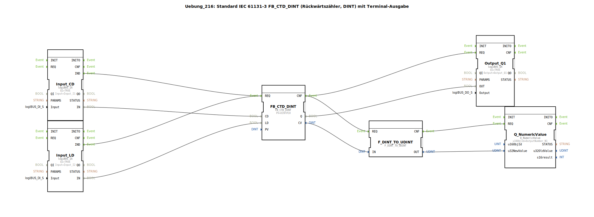

# Uebung_216: Standard IEC 61131-3 FB_CTD_DINT (Rückwärtszähler, DINT) mit Terminal-Ausgabe

* * * * * * * * * *

## Einleitung

Diese Übung demonstriert die Implementierung eines **Rückwärtszählers (CTD)** nach IEC 61131-3 mit ganzzahligem Datentyp `DINT` (Double Integer) und einer **Terminal-Ausgabe** des aktuellen Zählerstandes.  
Der Zähler wird durch zwei digitale Eingänge gesteuert:  
- **Eingang I1** – dekrementiert den Zähler bei positiver Flanke.  
- **Eingang I2** – lädt den vorgegebenen Startwert (PV = 10) in den Zähler.  

Ein digitaler Ausgang **Q1** wird aktiviert, sobald der Zählerstand den Wert 0 erreicht hat. Gleichzeitig wird der aktuelle Zählerstand über einen Terminal-Baustein ausgegeben.

## Verwendete Funktionsbausteine (FBs)

- **FB_CTD_DINT** – `iec61131::counters::FB_CTD_DINT`
  - Parameter: `PV` = `DINT#10` (Startwert)
  - Ereigniseingang: `REQ` (Zählimpuls von CD oder LD)
  - Ereignisausgang: `CNF` (Bestätigung nach Zählvorgang)
  - Dateneingänge: `CD` (Dekrement-Eingang), `LD` (Lade-Eingang)
  - Datenausgänge: `Q` (Signal bei Erreichen von 0), `CV` (aktueller Zählerstand)

- **Input_CD** – `logiBUS::io::DI::logiBUS_IX`
  - Parameter: `QI` = `TRUE`, `Input` = `Input_I1`
  - Liefert den Zustand des digitalen Eingangs I1.

- **Input_LD** – `logiBUS::io::DI::logiBUS_IX`
  - Parameter: `QI` = `TRUE`, `Input` = `Input_I2`
  - Liefert den Zustand des digitalen Eingangs I2.

- **Output_Q1** – `logiBUS::io::DQ::logiBUS_QX`
  - Parameter: `QI` = `TRUE`, `Output` = `Output_Q1`
  - Setzt den digitalen Ausgang Q1, wenn der Zähler Q‑Ausgang aktiv ist.

- **F_DINT_TO_UDINT** – `iec61131::conversion::F_DINT_TO_UDINT`
  - Wandelt den Zählerstand von `DINT` (vorzeichenbehaftet) in `UDINT` (vorzeichenlos) um.
  - **Hinweis:** Negative Zählerstände sind nach dieser Konvertierung nicht mehr darstellbar – die Übung macht dies als didaktische Einschränkung bewusst.

- **Q_NumericValue** – `isobus::UT::Q::Q_NumericValue`
  - Parameter: `u16ObjId` = `OutputNumber_N1`
  - Gibt einen numerischen Wert auf dem Terminal aus.

## Programmablauf und Verbindungen

1. **Ereignisverkettung**  
   - Eingang I1 oder I2 löst über den `IND`-Ereignisausgang den `REQ`-Eingang des Zählers aus.  
   - Nach erfolgreicher Verarbeitung (CNF) werden gleichzeitig der Ausgangsbaustein `Output_Q1` und die Konvertierung `F_DINT_TO_UDINT` angestoßen.  
   - Nach der Konvertierung wird der Wert an den Terminal-Baustein `Q_NumericValue` übergeben.

2. **Datenverkettung**  
   - `Input_CD.IN` → `FB_CTD_DINT.CD` (Dekrement)  
   - `Input_LD.IN` → `FB_CTD_DINT.LD` (Laden)  
   - `FB_CTD_DINT.Q` → `Output_Q1.OUT` (Setzen des Ausgangs bei Zählerstand 0)  
   - `FB_CTD_DINT.CV` → `F_DINT_TO_UDINT.IN` (Aktueller Zählerstand)  
   - `F_DINT_TO_UDINT.OUT` → `Q_NumericValue.u32NewValue` (Terminalausgabe)

3. **Funktionsweise**  
   - Bei jeder positiven Flanke an I1 wird der Zählerstand um 1 verringert.  
   - Bei einer positiven Flanke an I2 wird der Zähler mit dem Wert 10 (PV) geladen.  
   - Sobald der Zählerstand 0 erreicht, wird der Ausgang Q1 gesetzt.  
   - Der aktuelle Zählerstand wird fortlaufend auf dem Terminal ausgegeben.

   **Didaktischer Hinweis:**  
   Die Konvertierung `DINT_TO_UDINT` ist für negative Zählerstände nicht geeignet (UDINT kann nur positive Werte darstellen). Dies ist als **bewusste Einschränkung** in die Übung eingebaut, um auf die Problematik der Datentypumwandlung hinzuweisen.

## Zusammenfassung

Die Übung „Uebung_216“ vermittelt den Einsatz eines IEC 61131-3 Rückwärtszählers (`FB_CTD_DINT`) in Verbindung mit einer Terminalausgabe. Sie zeigt:
- Die Steuerung eines Zählers über zwei digitale Eingänge (Dekrement/Laden).  
- Die Verwendung eines Ausgangsbausteins zur Signalisierung des Erreichens des Zählendes.  
- Die Umwandlung von Datentypen (`DINT` → `UDINT`) und deren Grenzen (keine negativen Werte).  
- Die Visualisierung von Zählerwerten auf einem Terminal.

Die Übung ist für Einsteiger in die 4diac-IDE geeignet, die bereits grundlegende Kenntnisse über IEC 61131-3-Bausteine und digitale Ein-/Ausgänge besitzen. Sie kann direkt geladen und mit simulierten oder realen Eingängen getestet werden.