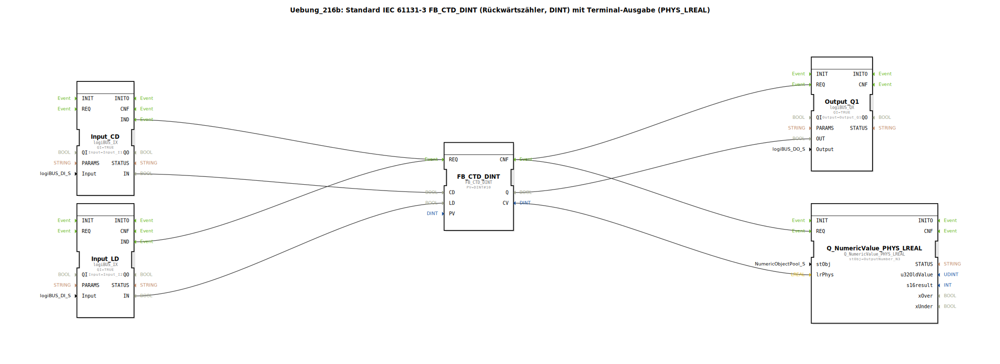

# Uebung_216b: Standard IEC 61131-3 FB_CTD_DINT (Rückwärtszähler, DINT) mit Terminal-Ausgabe (PHYS_LREAL)

* * * * * * * * * *
## Einleitung

Diese Übung implementiert einen **Rückwärtszähler (CTD)** gemäß IEC 61131-3 mit dem Datentyp `DINT` und einer Terminalausgabe des aktuellen Zählwerts als physikalische Größe (`PHYS_LREAL`). Der Zähler wird über zwei digitale Eingänge gesteuert (**CD** = Count Down, **LD** = Load) und gibt das Zählersignal (`Q`) auf einen digitalen Ausgang aus. Parallel dazu wird der aktuelle Zählerstand über einen numerischen Ausgangsbaustein auf einem Terminal visualisiert.

## Verwendete Funktionsbausteine (FBs)

- **FB_CTD_DINT** – Typ: `iec61131::counters::FB_CTD_DINT`
    - Parameter: `PV` = `DINT#10` (Vorwahlwert 10)
    - Zählt bei jedem steigenden Flanke an `CD` von `PV` abwärts; wird bei Aktivierung von `LD` auf den Wert `PV` zurückgesetzt.
- **Input_CD** – Typ: `logiBUS::io::DI::logiBUS_IX`
    - Parameter: `QI` = `TRUE`, `Input` = `Input_I1` (Hardware-Eingang I1)
    - Stellt den Zähleingang (Count Down) bereit.
- **Input_LD** – Typ: `logiBUS::io::DI::logiBUS_IX`
    - Parameter: `QI` = `TRUE`, `Input` = `Input_I2` (Hardware-Eingang I2)
    - Stellt den Ladeeingang (Load) bereit.
- **Output_Q1** – Typ: `logiBUS::io::DQ::logiBUS_QX`
    - Parameter: `QI` = `TRUE`, `Output` = `Output_Q1` (Hardware-Ausgang Q1)
    - Gibt den logischen Zustand des Zählerausgangs `Q` aus.
- **Q_NumericValue_PHYS_LREAL** – Typ: `isobus::UT::Q::Q_NumericValue_PHYS_LREAL`
    - Parameter: `stObj` = `OutputNumber_N3` (Terminal-Objekt für die Anzeige)
    - Wandelt den aktuellen Zählwert (`CV`) in eine physikalische `LREAL`-Größe um und zeigt ihn auf dem Terminal an.

## Programmablauf und Verbindungen

Die Steuerung erfolgt rein ereignisgesteuert über die **IND**-Ereignisse der Eingänge:

1. **Zähleingang (CD):**  
   Eine steigende Flanke an `Input_I1` wird über den Baustein `Input_CD` erfasst und löst das Ereignis `IND` aus. Dieses wird mit dem `REQ`-Ereignis des Zählers `FB_CTD_DINT` verbunden. Gleichzeitig wird der physikalische Eingangswert (`IN`) über die Datenverbindung `Input_CD.IN → FB_CTD_DINT.CD` an den Zähleingang übertragen.

2. **Ladeeingang (LD):**  
   Analog dazu wird eine steigende Flanke an `Input_I2` über `Input_LD` erfasst und ebenfalls mit dem `REQ` des Zählers verbunden. Der Eingangswert (`IN`) wird an den Ladeeingang `FB_CTD_DINT.LD` weitergeleitet.  
   *Hinweis*: Beide Ereignisse (CD und LD) nutzen dasselbe `REQ`-Ereignis des Zählers. Der Zähler wertet intern die jeweiligen Datenleitungen aus, um die Operation (zählen oder laden) zu unterscheiden.

3. **Ausgang Q1 und Terminalanzeige:**  
   Nach Abschluss der Zählerverarbeitung wird das `CNF`-Ereignis ausgelöst. Dieses wird parallel an die `REQ`-Eingänge von `Output_Q1` und `Q_NumericValue_PHYS_LREAL` gesendet.  
   - Der Ausgangswert `FB_CTD_DINT.Q` (logisch, wenn Zählerstand ≤ 0) wird über die Datenverbindung an `Output_Q1.OUT` gelegt und somit am Hardware-Ausgang Q1 ausgegeben.  
   - Der aktuelle Zählerstand `FB_CTD_DINT.CV` (Typ `DINT`) wird an `Q_NumericValue_PHYS_LREAL.lrPhys` übergeben und als physikalischer `LREAL`-Wert auf dem Terminal dargestellt.

**Zusammenfassung der Verbindungen:**

| Sender | Empfänger | Art |
|--------|-----------|-----|
| `Input_CD.IND` | `FB_CTD_DINT.REQ` | Ereignis |
| `Input_LD.IND` | `FB_CTD_DINT.REQ` | Ereignis |
| `FB_CTD_DINT.CNF` | `Output_Q1.REQ` | Ereignis |
| `FB_CTD_DINT.CNF` | `Q_NumericValue_PHYS_LREAL.REQ` | Ereignis |
| `Input_CD.IN` | `FB_CTD_DINT.CD` | Daten |
| `Input_LD.IN` | `FB_CTD_DINT.LD` | Daten |
| `FB_CTD_DINT.Q` | `Output_Q1.OUT` | Daten |
| `FB_CTD_DINT.CV` | `Q_NumericValue_PHYS_LREAL.lrPhys` | Daten |

## Zusammenfassung

Die Übung 216b demonstriert die Anwendung eines IEC 61131-3 Rückwärtszählers (`FB_CTD_DINT`) in der 4diac-IDE. Der Zähler wird über zwei digitale Eingänge gesteuert und gibt sowohl ein binäres Signal (Zähler erreicht Null) als auch eine numerische Anzeige des aktuellen Zählwerts auf einem Terminal aus. Die Ereignissteuerung stellt sicher, dass die Ausgangswerte nur nach einer vollständigen Zähleroperation aktualisiert werden. Dieses Beispiel zeigt grundlegende Konzepte der ereignisgesteuerten Applikationsentwicklung mit Standard-Funktionsbausteinen und Hardware-Schnittstellen.