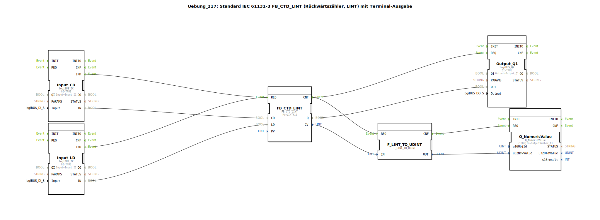

# Uebung_217: Standard IEC 61131-3 FB_CTD_LINT (Rückwärtszähler, LINT) mit Terminal-Ausgabe

* * * * * * * * * *
## Einleitung
Diese Übung implementiert einen Rückwärtszähler (Count Down, CTD) nach IEC 61131‑3 mit dem Datentyp LINT (64‑Bit Integer). Der Zähler wird durch zwei digitale Eingänge gesteuert: ein Count-Down-Impuls (CD) und ein Load-Impuls (LD). Der aktuelle Zählerstand (CV) wird über eine Konvertierung in den Typ UDINT (Unsigned 32‑Bit) an eine numerische Terminalausgabe gesendet. Der Ausgang Q signalisiert, wenn der Zählerstand ≤ 0 ist.

Ein Kommentar im Netzwerk weist darauf hin, dass die Konvertierung `F_LINT_TO_UDINT` für negative Zählerstände ungeeignet ist, da UDINT keine negativen Zahlen darstellen kann.

## Verwendete Funktionsbausteine (FBs)

**FB_CTD_LINT** (Rückwärtszähler LINT)
- **Typ**: `iec61131::counters::FB_CTD_LINT`
- **Parameter**: `PV = LINT#10` (Presetwert, Anfangswert für den Zähler)
- **Ereigniseingänge**: `REQ` (wird sowohl von `Input_CD` als auch von `Input_LD` getriggert)
- **Ereignisausgänge**: `CNF` (Bestätigung nach Verarbeitung)
- **Dateneingänge**: `CD` (Count-Down-Signal), `LD` (Load-Signal)
- **Datenausgänge**: `CV` (aktueller Zählerstand, LINT), `Q` (Ausgang, wenn CV ≤ 0)

**Input_CD** (Digitaler Eingang für Count-Down)
- **Typ**: `logiBUS::io::DI::logiBUS_IX`
- **Parameter**: `QI = TRUE`, `Input = Input_I1` (Hardware-Adresse)
- **Ereignisausgänge**: `IND` (Ereignis bei Signalwechsel)
- **Datenausgänge**: `IN` (aktueller Eingangswert, BOOL)

**Input_LD** (Digitaler Eingang für Load)
- **Typ**: `logiBUS::io::DI::logiBUS_IX`
- **Parameter**: `QI = TRUE`, `Input = Input_I2`
- **Ereignisausgänge**: `IND`
- **Datenausgänge**: `IN`

**Output_Q1** (Digitaler Ausgang)
- **Typ**: `logiBUS::io::DQ::logiBUS_QX`
- **Parameter**: `QI = TRUE`, `Output = Output_Q1`
- **Ereigniseingänge**: `REQ`
- **Dateneingänge**: `OUT` (setzt den Ausgang)

**F_LINT_TO_UDINT** (Konvertierung LINT → UDINT)
- **Typ**: `iec61131::conversion::F_LINT_TO_UDINT`
- **Ereigniseingänge**: `REQ`
- **Ereignisausgänge**: `CNF`
- **Dateneingänge**: `IN` (LINT)
- **Datenausgänge**: `OUT` (UDINT) – Achtung: Negative Eingangswerte werden nicht korrekt abgebildet.

**Q_NumericValue** (Terminal-Ausgabe numerischer Wert)
- **Typ**: `isobus::UT::Q::Q_NumericValue`
- **Parameter**: `u16ObjId = OutputNumber_N1` (Objektkennung im Terminal)
- **Ereigniseingänge**: `REQ`
- **Dateneingänge**: `u32NewValue` (UDINT, neuer anzuzeigender Wert)

## Programmablauf und Verbindungen

1. **Ereignisverkettung**:
   - Ein Eingangsereignis von `Input_CD.IND` oder `Input_LD.IND` triggert den `REQ` des Zählers `FB_CTD_LINT`.
   - Nach der Verarbeitung des Zählers (Ausgang `CNF`) werden gleichzeitig der Ausgang `Output_Q1` (über `REQ`) und die Konvertierung `F_LINT_TO_UDINT` (über `REQ`) aufgerufen.
   - Nach Abschluss der Konvertierung (`CNF`) wird die Terminalausgabe `Q_NumericValue` (über `REQ`) aktualisiert.

2. **Datenverbindungen**:
   - `Input_CD.IN` → `FB_CTD_LINT.CD`: Der Wert des digitalen Eingangs I1 steuert, ob der Zähler herunterzählt.
   - `Input_LD.IN` → `FB_CTD_LINT.LD`: Der Wert des digitalen Eingangs I2 lädt den Presetwert (PV) in den Zähler.
   - `FB_CTD_LINT.Q` → `Output_Q1.OUT`: Das Ausgangssignal des Zählers wird direkt auf den digitalen Ausgang Q1 gelegt.
   - `FB_CTD_LINT.CV` → `F_LINT_TO_UDINT.IN`: Der aktuelle Zählerstand (LINT) wird zur Konvertierung weitergeleitet.
   - `F_LINT_TO_UDINT.OUT` → `Q_NumericValue.u32NewValue`: Der konvertierte Wert (UDINT) wird zur Anzeige im Terminal gesendet.

3. **Hinweis zur Konvertierung**:
   Die Verwendung von `F_LINT_TO_UDINT` ist für negative Zählerstände nicht geeignet, da der Wertebereich von UDINT nur nicht-negative Zahlen umfasst. Bei negativem Zählerstand wird ein unerwartetes Ergebnis angezeigt oder die Konvertierung kann fehlschlagen. In der Praxis sollte eine andere Darstellung (z. B. Vorzeichenbehaftet) verwendet werden.

## Zusammenfassung
In dieser Übung wird ein IEC 61131‑3 Rückwärtszähler (`FB_CTD_LINT`) mit zwei digitalen Eingängen angesteuert. Der Zählerstand wird auf einem Terminal ausgegeben, wobei die Konvertierung von LINT nach UDINT bewusst eine Einschränkung für negative Werte darstellt. Die Aufgabe veranschaulicht die ereignisgesteuerte Verarbeitung in 4diac, die Kopplung von Hardwareeingängen und die Grenzen von Datentypkonvertierungen.