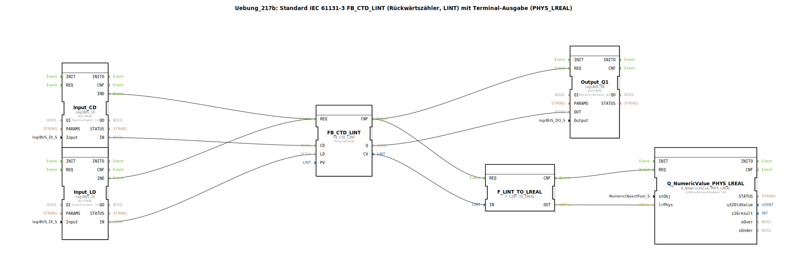

# Uebung_217b: Standard IEC 61131-3 FB_CTD_LINT (Rückwärtszähler, LINT) mit Terminal-Ausgabe (PHYS_LREAL)

* * * * * * * * * *

## Einleitung

Diese Übung implementiert einen Rückwärtszähler nach IEC 61131-3 (Typ `FB_CTD_LINT`), der mit einem LINT-Datentyp arbeitet. Der aktuelle Zählerstand wird über einen physikalischen LREAL-Ausgang auf einem Terminal dargestellt. Die Übung demonstriert die Verwendung eines IEC-Standardzählers, die Ankopplung an reale Ein-/Ausgänge (logiBUS) und die Datentypkonvertierung von LINT nach LREAL für die Terminalausgabe.

## Verwendete Funktionsbausteine (FBs)

Folgende Funktionsbausteine werden im Netzwerk der SubApp verwendet:

- **FB_CTD_LINT** (Typ: `iec61131::counters::FB_CTD_LINT`)
    - Parameter: `PV` = `LINT#10` (Presetwert = 10)
    - Eingänge: Ereignis `REQ`, Daten `CD` (Zählimpuls), `LD` (Laden des Presetwerts)
    - Ausgänge: Ereignis `CNF`, Daten `Q` (Zählerstand > 0), `CV` (aktueller Zählerstand)

- **Input_CD** (Typ: `logiBUS::io::DI::logiBUS_IX`)
    - Parameter: `QI` = `TRUE`, `Input` = `Input_I1` (physischer Digitaleingang 1)
    - Ausgang: Daten `IN` (Bool)

- **Input_LD** (Typ: `logiBUS::io::DI::logiBUS_IX`)
    - Parameter: `QI` = `TRUE`, `Input` = `Input_I2` (physischer Digitaleingang 2)
    - Ausgang: Daten `IN` (Bool)

- **Output_Q1** (Typ: `logiBUS::io::DQ::logiBUS_QX`)
    - Parameter: `QI` = `TRUE`, `Output` = `Output_Q1` (physischer Digitalausgang 1)
    - Eingang: Daten `OUT` (Bool)

- **F_LINT_TO_LREAL** (Typ: `iec61131::conversion::F_LINT_TO_LREAL`)
    - Eingang: Daten `IN` (LINT)
    - Ausgang: Daten `OUT` (LREAL)

- **Q_NumericValue_PHYS_LREAL** (Typ: `isobus::UT::Q::Q_NumericValue_PHYS_LREAL`)
    - Parameter: `stObj` = `OutputNumber_N3` (Terminalausgabe-Objekt)
    - Eingang: Daten `lrPhys` (LREAL)

## Programmablauf und Verbindungen

Die Übung arbeitet ereignisgesteuert:

1. **Ereignispfad**:  
   - Ein steigender Impuls am Digitaleingang `Input_I1` (verbunden mit `Input_CD`) erzeugt ein Ereignis `IND`.  
   - Ebenso erzeugt ein Impuls an `Input_I2` (verbunden mit `Input_LD`) ein `IND`-Ereignis.  
   - Beide Ereignisse werden auf den Ereigniseingang `REQ` des Zählers `FB_CTD_LINT` geführt.  
   - Nach Verarbeitung des Zählers (Ausgang `CNF`) wird einerseits der Ausgang `Output_Q1` (über `REQ`) und andererseits die Konvertierung `F_LINT_TO_LREAL` (über `REQ`) getriggert.  
   - Nach der Konvertierung wird das Ereignis an die Terminalausgabe `Q_NumericValue_PHYS_LREAL` weitergeleitet.

2. **Datenpfad**:  
   - Der digitale Wert von `Input_CD.IN` (Bool) wird auf den Dateneingang `CD` des Zählers gelegt.  
   - Der digitale Wert von `Input_LD.IN` wird auf den Dateneingang `LD` des Zählers gelegt.  
   - Der Zählerausgang `Q` (Bool) wird auf den Dateneingang `OUT` des Ausgangsbausteins `Output_Q1` geführt.  
   - Der aktuelle Zählerstand `CV` (LINT) wird an den Konverter `F_LINT_TO_LREAL.IN` übergeben.  
   - Der konvertierte Wert (LREAL) wird an den Terminalbaustein `Q_NumericValue_PHYS_LREAL.lrPhys` gesendet.

**Funktionsweise des Zählers**:
- Solange kein Ladesignal (`LD` = FALSE) anliegt, zählt der Baustein bei jedem steigenden Impuls an `CD` von 10 rückwärts (Presetwert = `PV` = 10).
- Ein Ladesignal setzt den aktuellen Zählerstand auf den Wert von `PV` zurück.
- Der Ausgang `Q` ist `TRUE`, solange der Zählerstand größer als 0 ist; bei Erreichen von 0 wird `Q` = `FALSE` (Überlauf ist nicht definiert, bleibt bei 0).
- Der aktuelle Zählerstand wird auf dem Terminal als physikalischer LREAL-Wert ausgegeben.

## Zusammenfassung

Die Übung **Uebung_217b** realisiert einen standardkonformen Rückwärtszähler (`FB_CTD_LINT`) mit Terminalausgabe. Sie verknüpft digitale Eingänge (logiBUS) als Zähl- und Ladeimpulse, einen Digitalausgang als Meldeausgang und eine LINT-zu-LREAL-Konvertierung für die Anzeige des aktuellen Zählerstands auf einem Terminal. Der Ablauf ist vollständig ereignisgesteuert und zeigt die Integration von IEC 61131-3-Bausteinen mit logiBUS-I/O und Terminalausgaben in der 4diac-IDE.