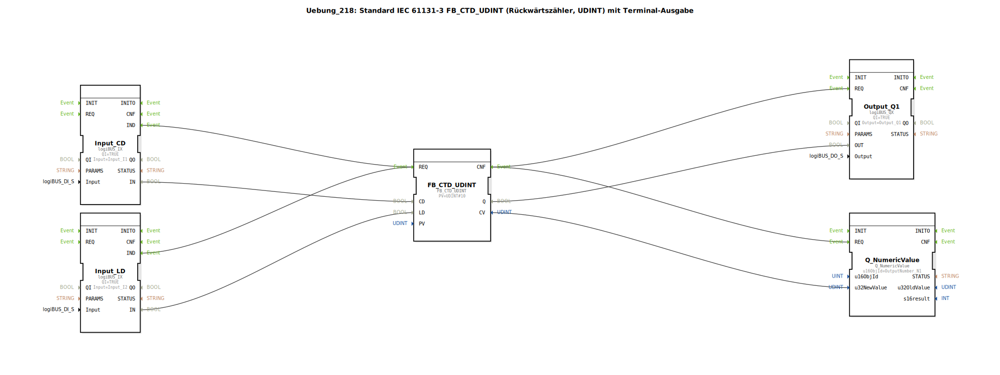

# Uebung_218: Standard IEC 61131-3 FB_CTD_UDINT (Rückwärtszähler, UDINT) mit Terminal-Ausgabe

* * * * * * * * * *

## Einleitung

In dieser Übung wird ein Rückwärtszähler nach IEC 61131‑3 (Typ `FB_CTD_UDINT`) implementiert. Der Funktionsbaustein zählt bei jedem negativen Flanke am Eingang `CD` (Count Down) rückwärts, beginnend vom voreingestellten Wert `PV` (Preset Value). Über einen Ladeeingang (`LD`) kann der Zähler auf den Startwert zurückgesetzt werden. Der aktuelle Zählerstand (`CV`) wird auf ein Terminal ausgegeben, und der Ausgang `Q` wird gesetzt, sobald der Zählerstand Null erreicht.

Die Hardware-Anbindung erfolgt über zwei digitale Eingänge (I1, I2) und einen digitalen Ausgang (Q1) sowie eine Ausgabe für numerische Werte auf dem Terminal. Die gesamte Konfiguration ist als SubApplikation in 4diac IDE umgesetzt.

## Verwendete Funktionsbausteine (FBs)

| FB-Name | Typ | Beschreibung |
|---------|-----|--------------|
| `FB_CTD_UDINT` | `iec61131::counters::FB_CTD_UDINT` | IEC 61131‑3 Rückwärtszähler mit Eingängen `CD`, `LD`, `PV` und Ausgängen `Q` und `CV`. Parameter: `PV = UDINT#10` (Startwert 10). |
| `Input_CD` | `logiBUS::io::DI::logiBUS_IX` | Digitaler Eingang für das Zählsignal (Taster I1). Parameter: `QI=TRUE`, `Input=Input_I1`. |
| `Input_LD` | `logiBUS::io::DI::logiBUS_IX` | Digitaler Eingang für das Laden des Zählers (Taster I2). Parameter: `QI=TRUE`, `Input=Input_I2`. |
| `Output_Q1` | `logiBUS::io::DQ::logiBUS_QX` | Digitaler Ausgang für die Anzeige „Zählerstand = 0” (Lampe Q1). Parameter: `QI=TRUE`, `Output=Output_Q1`. |
| `Q_NumericValue` | `isobus::UT::Q::Q_NumericValue` | Terminal‑Ausgabe für den aktuellen Zählerstand (`CV`). Parameter: `u16ObjId=OutputNumber_N1`. |

**Hinweis:** Im Netzwerk befindet sich ein Kommentar, der darauf hinweist, dass eine explizite Typkonvertierung (`F_UDINT_TO_UDINT`) nicht notwendig ist, da der Datenfluss direkt erfolgt.

## Programmablauf und Verbindungen

### Ereignissteuerung

1. **Ereignisquelle:**  
   - `Input_CD.IND` (Signal von Taster I1) wird mit `FB_CTD_UDINT.REQ` verbunden.  
   - `Input_LD.IND` (Signal von Taster I2) wird ebenfalls mit `FB_CTD_UDINT.REQ` verbunden.

2. **Ereignissenke:**  
   - `FB_CTD_UDINT.CNF` (Bestätigung des Zählers) löst zwei Aktionen aus:  
     - `Output_Q1.REQ` (Aktualisierung des digitalen Ausgangs Q1).  
     - `Q_NumericValue.REQ` (Aktualisierung der Terminal‑Anzeige).

### Datenflüsse

| Quelle | Ziel | Bedeutung |
|--------|------|-----------|
| `Input_CD.IN` | `FB_CTD_UDINT.CD` | Taster I1 als Zählimpuls (Rückwärtszählen). |
| `Input_LD.IN` | `FB_CTD_UDINT.LD` | Taster I2 als Ladesignal (Setzen auf PV). |
| `FB_CTD_UDINT.Q` | `Output_Q1.OUT` | Ausgang Q1 wird aktiv, sobald Zählerstand = 0 ist. |
| `FB_CTD_UDINT.CV` | `Q_NumericValue.u32NewValue` | Aktueller Zählerstand (als 32‑Bit‑Wert) an das Terminal. |

### Funktionsweise

- Nach dem Start wird der Zähler durch das Ladesignal (`LD`) auf den voreingestellten Wert `PV = 10` gesetzt.
- Jedes negativ werdende Signal am `CD`‑Eingang (Taster I1) verringert den Zähler um 1.
- Sobald der Zählerstand null erreicht, wird der Ausgang `Q` auf `TRUE` gesetzt und der digitale Ausgang Q1 (Lampe) leuchtet.
- Der aktuelle Zählerstand (`CV`) wird fortlaufend auf dem Terminal (Objekt `OutputNumber_N1`) ausgegeben.

### Lernziele & Vorkenntnisse

- **Schwierigkeitsgrad:** Einfach
- **Vorkenntnisse:** Grundkenntnisse in IEC 61131‑3 und Umgang mit der 4diac IDE.
- **Lernziele:**  
  - Verwendung des Standard‑Rückwärtszählers `FB_CTD_UDINT`.  
  - Anbindung digitaler Ein‑/Ausgänge und einer Terminal‑Ausgabe.  
  - Verständnis von Ereignis‑ und Datenverbindungen in 4diac.

## Zusammenfassung

Die Übung 218 realisiert einen vollständigen Rückwärtszähler mit IEC 61131‑3 Standardbaustein. Durch die Kombination von zwei Tastern (Zählen und Laden) sowie einer Ausgabe auf das Terminal und eine Lampe wird das Verhalten des Zählers anschaulich demonstriert. Die Integration in 4diac erfolgt durch einfache Ereignis‑ und Datenverknüpfungen, die eine robuste und erweiterbare Steuerung ermöglichen.