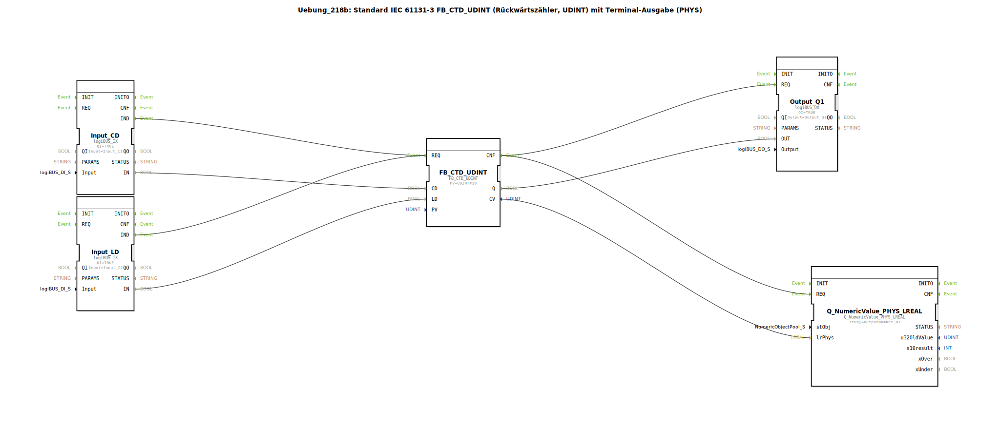

# Uebung_218b: Standard IEC 61131-3 FB_CTD_UDINT (Rückwärtszähler, UDINT) mit Terminal-Ausgabe (PHYS)

* * * * * * * * * *

## Einleitung

Diese Übung implementiert einen Rückwärtszähler (Down Counter) nach IEC 61131-3 vom Typ **FB_CTD_UDINT** (Zählwert als UDINT).  
Der Zähler wird über zwei digitale Eingänge gesteuert: Ein Impuls an **Eingang I1** (CD) zählt den aktuellen Wert um 1 herunter, ein Impuls an **Eingang I2** (LD) lädt den voreingestellten Wert (PV) in den Zähler.  
Der aktuelle Zählerstand wird sowohl als **physikalischer Wert (LREAL)** über ein Terminal ausgegeben (FB `Q_NumericValue_PHYS_LREAL`) als auch als **digitales Signal (Q1)** bereitgestellt – Q1 ist TRUE, sobald der Zählerstand Null erreicht hat.  
Die Übung zeigt die direkte Verbindung von UDINT auf LREAL ohne manuelle Konvertierung und demonstriert die Kombination von Zählerlogik mit physischer Ausgabe.

## Verwendete Funktionsbausteine (FBs)

Die Übung besteht aus einer SubApplikation (SubAppType), die fünf Funktionsbausteine enthält.  
Nachfolgend werden alle verwendeten FBs beschrieben.

### Sub-Bausteine:

1. **FB_CTD_UDINT** (IEC 61131‑3 Rückwärtszähler)  
   - **Typ**: `iec61131::counters::FB_CTD_UDINT`  
   - **Parameter**:  
     - `PV` = `UDINT#10` (Voreinstellwert)  
   - **Ereigniseingänge**:  
     - `REQ` – wird durch einen steigenden Impuls der Eingänge CD oder LD getriggert  
   - **Ereignisausgänge**:  
     - `CNF` – quittiert die Ausführung nach einem REQ  
   - **Dateneingänge**:  
     - `CD` – Zählimpuls (herunterzählen)  
     - `LD` – Ladeimpuls (setzt Zähler auf PV)  
   - **Datenausgänge**:  
     - `Q` (BOOL) – TRUE wenn Zählerstand = 0  
     - `CV` (UDINT) – aktueller Zählerstand  
   - **Funktionsweise**:  
     Der Baustein realisiert einen flankengetriggerten Abwärtszähler. Bei einem positiven Impuls auf CD wird CV um 1 dekrementiert; bei LD wird CV auf den Wert in PV gesetzt. Der Ausgang Q wird TRUE, sobald CV den Wert 0 erreicht.

2. **Input_CD** (Digitaler Eingang I1)  
   - **Typ**: `logiBUS::io::DI::logiBUS_IX`  
   - **Parameter**:  
     - `QI` = `TRUE` (Aktivierung)  
     - `Input` = `Input_I1` (physischer Anschluss)  
   - **Ereignisausgang**:  
     - `IND` – wird bei einer steigenden Flanke am Eingang gesendet  
   - **Datenausgang**:  
     - `IN` (BOOL) – aktueller Zustand des Eingangs  
   - **Funktionsweise**:  
     Stellt den physischen digitalen Eingang I1 (z. B. Taster oder Sensor) im System bereit. Bei Änderung des Zustands wird das Ereignis IND ausgelöst.

3. **Input_LD** (Digitaler Eingang I2)  
   - **Typ**: `logiBUS::io::DI::logiBUS_IX`  
   - **Parameter**:  
     - `QI` = `TRUE`  
     - `Input` = `Input_I2`  
   - **Ereignisausgang**:  
     - `IND`  
   - **Datenausgang**:  
     - `IN` (BOOL)  
   - **Funktionsweise**:  
     Identisch zu Input_CD, jedoch an physischem Eingang I2 angeschlossen – dient als Ladeimpuls für den Zähler.

4. **Output_Q1** (Digitaler Ausgang Q1)  
   - **Typ**: `logiBUS::io::DQ::logiBUS_QX`  
   - **Parameter**:  
     - `QI` = `TRUE` (Aktivierung)  
     - `Output` = `Output_Q1` (physischer Ausgang)  
   - **Ereigniseingang**:  
     - `REQ` – triggert die Ausgabe des aktuellen Werts am Ausgang  
   - **Dateneingang**:  
     - `OUT` (BOOL) – Wert, der am Ausgang ausgegeben werden soll  
   - **Funktionsweise**:  
     Setzt den physischen digitalen Ausgang Q1 auf den Wert, der am Dateneingang OUT anliegt. Sobald der Zähler Q = TRUE liefert, wird Q1 aktiv.

5. **Q_NumericValue_PHYS_LREAL** (Terminal-Ausgabe)  
   - **Typ**: `isobus::UT::Q::Q_NumericValue_PHYS_LREAL`  
   - **Parameter**:  
     - `stObj` = `OutputNumber_N3` (Referenz auf das Terminal‑Ausgabeobjekt)  
   - **Ereigniseingang**:  
     - `REQ` – triggert die Ausgabe des aktuellen physikalischen Werts  
   - **Dateneingang**:  
     - `lrPhys` (LREAL) – der auszugebende physikalische Wert  
   - **Funktionsweise**:  
     Der Baustein übernimmt einen LREAL-Wert und gibt ihn über ein Terminal aus (z. B. auf einem Bedienpanel oder in einer Konsole). Der Zählerstand CV vom Typ UDINT wird ohne Konvertierung direkt an diesen Eingang angeschlossen.

## Programmablauf und Verbindungen

Der Ablauf wird durch die Ereignis- und Datenverbindungen im SubAppNetwork gesteuert:

- **Ereignisverkettung**:
  - Eine steigende Flanke an `Input_CD` oder `Input_LD` (jeweils `IND`) löst den Ereigniseingang `REQ` des Zählers `FB_CTD_UDINT` aus.
  - Nach Verarbeitung quittiert der Zähler mit `CNF`. Dieses Ereignis wird an zwei Stellen weitergeleitet:
    - Zum einen an `Output_Q1.REQ` – damit der aktuelle boolesche Zustand (Q) am physischen Ausgang ausgegeben wird.
    - Zum anderen an `Q_NumericValue_PHYS_LREAL.REQ` – damit der aktuelle Zählerstand auf dem Terminal erscheint.

- **Datenverkettung**:
  - Der Datenausgang `Input_CD.IN` ist mit dem Zählereingang `FB_CTD_UDINT.CD` verbunden – das Signal des Tasters I1 wird als Zählimpuls verwendet.
  - `Input_LD.IN` ist mit `FB_CTD_UDINT.LD` verbunden – der Taster I2 lädt den Voreinstellwert.
  - Der Zählerausgang `Q` (BOOL) geht an den Dateneingang `OUT` von `Output_Q1`.
  - Der Zählerausgang `CV` (UDINT) geht an den Dateneingang `lrPhys` von `Q_NumericValue_PHYS_LREAL`.

Die beiden Kommentare im Netzwerk weisen darauf hin, dass alternativ auch der normale Ausgang (Q) verwendet werden könnte, und dass UDINT ohne explizite Konvertierung auf LREAL geschlossen werden darf (intern erfolgt eine implizite Typumwandlung).

## Zusammenfassung

- **Lernziele**: Kennenlernen und Anwenden des IEC 61131‑3 Rückwärtszählers (CTD) mit UDINT-Zählwerten, sowie die Integration von digitalen Ein‑/Ausgängen und einer physischen Terminalausgabe.
- **Schwierigkeitsgrad**: Einfach bis mittel – geeignet zum Einstieg in die Zählerlogik und die Verwendung von physikalischen Ausgabeblöcken.
- **Vorkenntnisse**: Grundlegende Kenntnisse der 4diac‑IDE und einfacher IEC‑61131‑3 Bausteine.
- **Bedienung**:  
  1. Ordnen Sie die physischen Eingänge I1 (Taster für Herunterzählen) und I2 (Taster für Laden) an.  
  2. Der Ausgang Q1 schaltet, sobald der Zählerstand Null erreicht.  
  3. Das Terminal (OutputNumber_N3) zeigt den aktuellen Zählerstand als LREAL-Wert an.  
  4. Starten Sie die Übung durch Auslösen einer steigenden Flanke an einem der Eingänge.

Die Übung demonstriert eine vollständige, praxisnahe Zähleranwendung mit sowohl digitaler als auch visualisierter Rückmeldung.