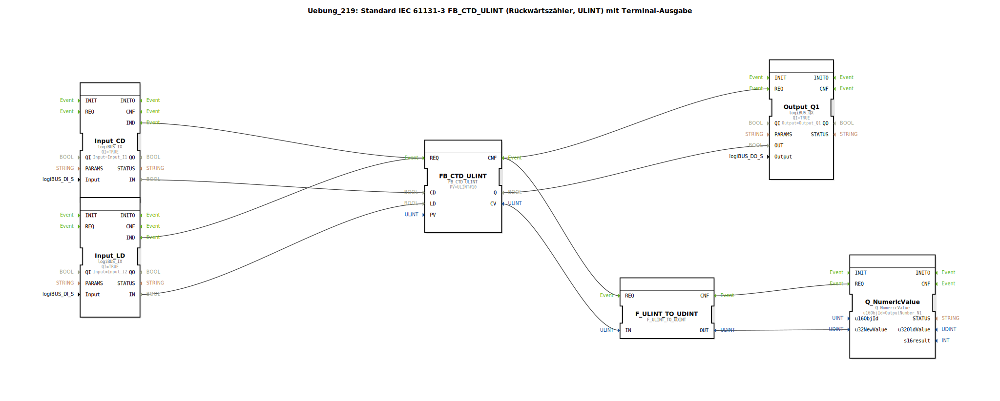

# Uebung_219: Standard IEC 61131-3 FB_CTD_ULINT (Rückwärtszähler, ULINT) mit Terminal-Ausgabe

* * * * * * * * * *
## Einleitung

Diese Übung implementiert einen Rückwärtszähler (Abwärtszähler) nach IEC 61131-3 mit dem Funktionsbaustein `FB_CTD_ULINT` (Datentyp ULINT). Der Zähler wird über zwei digitale Eingänge gesteuert: **CD** (Count Down) dekrementiert den Zählerstand, **LD** (Load) lädt den voreingestellten Wert (PV). Der aktuelle Zählerstand wird auf einem Terminal (NumericValue) ausgegeben. Zusätzlich wird ein digitaler Ausgang gesetzt, wenn der Zählerstand null erreicht.

## Verwendete Funktionsbausteine (FBs)

### FB_CTD_ULINT (IEC 61131-3 Rückwärtszähler)
- **Typ**: iec61131::counters::FB_CTD_ULINT
- **Parameter**:
  - `PV` = ULINT#10 (Voreingestellter Startwert)
- **Ereigniseingänge/-ausgänge**:
  - `REQ` (Event-Eingang) – löst Zähleroperation aus
  - `CNF` (Event-Ausgang) – Bestätigung nach Ausführung
- **Dateneingänge/-ausgänge**:
  - `CD` (BOOL) – Abwärtszählimpuls
  - `LD` (BOOL) – Laden des PV
  - `Q` (BOOL) – Ausgang wird TRUE, wenn Zählerstand = 0
  - `CV` (ULINT) – Aktueller Zählerwert

### Input_CD (Digitaler Eingang)
- **Typ**: logiBUS::io::DI::logiBUS_IX
- **Parameter**:
  - `QI` = TRUE (Qualifier)
  - `Input` = Input_I1 (Hardware-Eingang)
- **Ereignisausgang**: `IND` – wird bei Signaländerung ausgelöst
- **Datenausgang**: `IN` (BOOL) – aktueller Eingangswert

### Input_LD (Digitaler Eingang)
- **Typ**: logiBUS::io::DI::logiBUS_IX
- **Parameter**:
  - `QI` = TRUE
  - `Input` = Input_I2
- **Ereignisausgang**: `IND`
- **Datenausgang**: `IN` (BOOL)

### Output_Q1 (Digitaler Ausgang)
- **Typ**: logiBUS::io::DQ::logiBUS_QX
- **Parameter**:
  - `QI` = TRUE
  - `Output` = Output_Q1
- **Ereigniseingang**: `REQ` – übernimmt neuen Ausgangswert
- **Dateneingang**: `OUT` (BOOL) – zu setzender Ausgangswert

### F_ULINT_TO_UDINT (Typkonvertierung)
- **Typ**: iec61131::conversion::F_ULINT_TO_UDINT
- **Ereigniseingang**: `REQ`
- **Ereignisausgang**: `CNF`
- **Dateneingang**: `IN` (ULINT)
- **Datenausgang**: `OUT` (UDINT)

### Q_NumericValue (Terminal-Ausgabe)
- **Typ**: isobus::UT::Q::Q_NumericValue
- **Parameter**:
  - `u16ObjId` = OutputNumber_N1 (Kennung des Ausgabefeldes)
- **Ereigniseingang**: `REQ`
- **Dateneingang**: `u32NewValue` (UDINT)

## Programmablauf und Verbindungen

Der Ablauf wird über Ereignisverbindungen gesteuert:

1. **Eingangssignale verarbeiten**:  
   - Tritt eine Änderung an **Input_I1** (CD) oder **Input_I2** (LD) auf, so löst der entsprechende Eingangsbaustein (`Input_CD.IND` bzw. `Input_LD.IND`) ein Ereignis aus.  
   - Beide Ereignisse sind mit dem **REQ**-Eingang des Zählers `FB_CTD_ULINT` verbunden. Das führt dazu, dass bei jedem der beiden Eingänge ein Zählvorgang ausgelöst wird.

2. **Zähleroperation**:  
   - Der Zähler `FB_CTD_ULINT` führt abhängig vom Zustand der Datenleitungen aus:  
     - Ist `LD` = TRUE, wird der Wert aus `PV` (ULINT#10) geladen.  
     - Ist `CD` = TRUE (und `LD` = FALSE), wird der Zählerstand um 1 dekrementiert.  
   - Nach Ausführung wird der **CNF**-Ereignisausgang aktiviert.

3. **Ausgang und Terminalausgabe**:  
   - Das `CNF`-Ereignis wird an zwei Bausteine weitergeleitet:  
     - **Output_Q1**: Der Datenausgang `Q` des Zählers (TRUE bei Zählerstand = 0) wird auf den Hardware-Ausgang `Output_Q1` gelegt.  
     - **F_ULINT_TO_UDINT**: Der aktuelle Zählerwert `CV` (ULINT) wird in den Datentyp UDINT konvertiert, da die Terminalausgabe einen UDINT erwartet.  
   - Nach der Konvertierung löst `F_ULINT_TO_UDINT.CNF` die **Q_NumericValue**-Ausgabe aus, sodass der Zählerwert auf dem Terminal (Objekt `OutputNumber_N1`) erscheint.

**Hinweise aus den Kommentaren**:
- Es wird empfohlen, einen **E_D_FF** (Edge-Detection-Flipflop) zwischen den Eingängen und dem Zähler einzufügen, um die Anzahl der Ereignisaufrufe zu reduzieren (z. B. bei schnellen Signaländerungen).
- Bei der Konvertierung `F_ULINT_TO_UDINT` kann es zu einem **Überlauf** kommen, da ULINT (64 Bit) in UDINT (32 Bit) umgewandelt wird. Der Wertebereich von ULINT ist größer; es werden nur die unteren 32 Bit übernommen. Dies ist bei der Wahl der Zählerwerte zu beachten.

## Zusammenfassung

Die Übung **Uebung_219** demonstriert einen IEC 61131-3 konformen Rückwärtszähler mit Terminalausgabe. Sie verbindet digitale Eingabe, Abwärtszählfunktion, Ausgabe auf einen digitalen Ausgang und numerische Anzeige auf einem Display. Dabei werden Typkonvertierung, Ereignisverkettung und Hardware-Schnittstellen trainiert. Die bereitgestellte Implementierung ist eine SubApp, die als wiederverwendbarer Baustein in der 4diac-IDE genutzt werden kann.