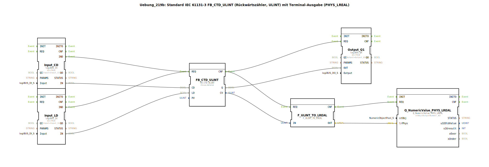

# Uebung_219b: Standard IEC 61131-3 FB_CTD_ULINT (Rückwärtszähler, ULINT) mit Terminal-Ausgabe (PHYS_LREAL)

* * * * * * * * * *
## Einleitung

Diese Übung demonstriert einen nach IEC 61131-3 standardisierten Rückwärtszähler (FB_CTD_ULINT) mit einem Zählbereich von ULINT (0 … 18.446.744.073.709.551.615). Der Zähler wird über zwei digitale Eingänge angesteuert: **CD** (Count Down) dekrementiert den aktuellen Zählwert bei jeder steigenden Flanke, **LD** (Load) setzt den Zählwert auf den vorgegebenen Preset-Wert (PV = 10) zurück. Der aktuelle Zählwert wird über eine Typkonvertierung in eine physikalische Gleitkommazahl (PHYS_LREAL) gewandelt und auf einem Terminal ausgegeben. Gleichzeitig wird ein digitaler Ausgang gesetzt, wenn der Zählwert den Wert 0 erreicht.

## Verwendete Funktionsbausteine (FBs)

| Bausteinname | Typ | Parameter / Einstellungen |
|---|---|---|
| **FB_CTD_ULINT** | `iec61131::counters::FB_CTD_ULINT` | `PV = ULINT#10` |
| **Input_CD** | `logiBUS::io::DI::logiBUS_IX` | `QI = TRUE`, `Input = Input_I1` |
| **Input_LD** | `logiBUS::io::DI::logiBUS_IX` | `QI = TRUE`, `Input = Input_I2` |
| **Output_Q1** | `logiBUS::io::DQ::logiBUS_QX` | `QI = TRUE`, `Output = Output_Q1` |
| **F_ULINT_TO_LREAL** | `iec61131::conversion::F_ULINT_TO_LREAL` | – (keine Parameter) |
| **Q_NumericValue_PHYS_LREAL** | `isobus::UT::Q::Q_NumericValue_PHYS_LREAL` | `stObj = OutputNumber_N3` |

**Funktionsweise der einzelnen Bausteine:**

| Baustein | Beschreibung |
|---|---|
| **FB_CTD_ULINT** | Rückwärtszähler (CTD) für vorzeichenlose lange Ganzzahlen (ULINT). Beim Ereignis **REQ** wird abhängig vom aktuell aktiven Eingang (CD oder LD) entweder der Zählwert dekrementiert oder der Preset-Wert geladen. Der aktuelle Zählwert steht am Ausgang **CV**, der Nullstand am Ausgang **Q** zur Verfügung. |
| **Input_CD** | Digitaler Eingangsbaustein, der das physische Signal `Input_I1` (Taster/Schalter) einliest und bei einer positiven Flanke das Ereignis **IND** auslöst. |
| **Input_LD** | Digitaler Eingangsbaustein, der das physische Signal `Input_I2` einliest und bei einer positiven Flanke das Ereignis **IND** auslöst. |
| **Output_Q1** | Digitaler Ausgangsbaustein, der bei einem Ereignis **REQ** den Wert am Dateneingang **OUT** auf den physischen Ausgang `Output_Q1` übernimmt. |
| **F_ULINT_TO_LREAL** | Konvertierungsbaustein, der einen ULINT-Wert in den Typ LREAL (64‑Bit Gleitkommazahl) umwandelt. |
| **Q_NumericValue_PHYS_LREAL** | Terminal-Ausgabebaustein für physikalische Gleitkommazahlen. Er gibt den übergebenen Wert am konfigurierten Objekt `OutputNumber_N3` aus. |

## Programmablauf und Verbindungen

Der Ablauf wird durch Ereignis- und Datenverbindungen gesteuert:

1. **Eingangssignale erfassen**  
   - `Input_CD.IND` (steigende Flanke an `Input_I1`) wird mit `FB_CTD_ULINT.REQ` verbunden.  
   - `Input_LD.IND` (steigende Flanke an `Input_I2`) wird ebenfalls mit `FB_CTD_ULINT.REQ` verbunden.  

   → Der Zähler wird bei **jeder** positiven Flanke an einem der beiden Eingänge aktiviert. Die Unterscheidung, ob dekrementiert oder geladen wird, erfolgt über die Datenverbindungen.

2. **Datenwerte zuweisen**  
   - `Input_CD.IN` → `FB_CTD_ULINT.CD` (Count Down)  
   - `Input_LD.IN` → `FB_CTD_ULINT.LD` (Load)  

   → Die logischen Zustände der beiden Eingänge bestimmen die Aktion:  
     - Ist **CD = TRUE** und **LD = FALSE**, wird der Zählwert dekrementiert.  
     - Ist **LD = TRUE** (unabhängig von CD), wird der Preset-Wert (10) geladen.

3. **Ausgabe nach Verarbeitung**  
   Nach Abschluss der Zähleroperation wird das Ereignis **CNF** des Zählers ausgelöst. Dieses ist mit zwei nachfolgenden Bausteinen verbunden:  
   - `Output_Q1.REQ`: Der aktuelle Zustand von `FB_CTD_ULINT.Q` (Zählerstand = 0 → TRUE) wird auf den digitalen Ausgang `Output_Q1` geschrieben.  
   - `F_ULINT_TO_LREAL.REQ`: Der aktuelle Zählwert (`FB_CTD_ULINT.CV`) wird in eine LREAL-Zahl umgewandelt.

4. **Terminal-Ausgabe**  
   Nach der Konvertierung triggert `F_ULINT_TO_LREAL.CNF` den Baustein `Q_NumericValue_PHYS_LREAL.REQ`. Der konvertierte Wert (`F_ULINT_TO_LREAL.OUT`) wird als physikalische Gleitkommazahl am Terminal unter `OutputNumber_N3` angezeigt.

Die gesamte Logik arbeitet **ereignisgesteuert**: Jede Änderung an einem der Eingänge löst eine vollständige Verarbeitungskette aus – vom Einlesen über die Zählerlogik bis zur Ausgabe des aktuellen Zählwerts und des digitalen Signals.

## Zusammenfassung

Die Übung **Uebung_219b** setzt einen IEC 61131-3‑konformen Rückwärtszähler (FB_CTD_ULINT) in der 4diac‑IDE um. Sie zeigt:

- die Parametrierung eines standardisierten Zählbausteins (Preset = 10),
- die Anbindung digitaler Ein‑/Ausgänge über logiBUS-Bausteine,
- die Typkonvertierung von ULINT nach LREAL,
- die Ausgabe von Messwerten auf einem Terminal (PHYS_LREAL).

Der Schwerpunkt liegt auf dem Verständnis von Ereignis‑ und Datenflüssen sowie der strukturierten Verschaltung von Funktionsbausteinen in einer Automatisierungsanwendung.