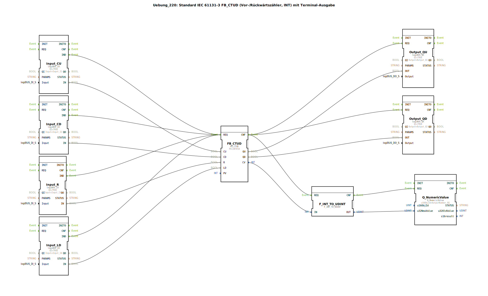

# Uebung_220: Standard IEC 61131-3 FB_CTUD (Vor-/Rückwärtszähler, INT) mit Terminal-Ausgabe

* * * * * * * * * *

## Einleitung

Diese Übung realisiert einen kombinierten Vor-/Rückwärtszähler (Up/Down Counter) nach IEC 61131-3 (FB CTUD) mit einer Preset-Schwelle von 10. Die Zählerstände werden sowohl über digitale Ausgänge als auch über einen numerischen Wert auf einem Terminal ausgegeben. Die Eingänge werden über logiBUS-Eingangsbausteine bereitgestellt.

## Verwendete Funktionsbausteine (FBs)

- **FB_CTUD** (Typ: `iec61131::counters::FB_CTUD`): Standard IEC 61131-3 Vor-/Rückwärtszähler.
  - Parameter: `PV` = `INT#10` (Presetwert)
  - Ereigniseingänge: `REQ` (Anforderung)
  - Ereignisausgänge: `CNF` (Bestätigung)
  - Dateneingänge: `CU` (Count Up), `CD` (Count Down), `R` (Reset), `LD` (Load)
  - Datenausgänge: `QU` (Ausgang bei Erreichen Preset), `QD` (Ausgang bei Erreichen 0), `CV` (aktueller Zählerwert)

- **Eingangsbausteine** (Typ: `logiBUS_IX`):
  - `Input_CU` (Eingang für Zählimpulse Aufwärts) – verbunden mit `Input_I1`
  - `Input_CD` (Eingang für Zählimpulse Abwärts) – verbunden mit `Input_I2`
  - `Input_R` (Reset-Eingang) – verbunden mit `Input_I3`
  - `Input_LD` (Load-Eingang) – verbunden mit `Input_I4`
  - Alle haben den Parameter `QI` = `TRUE`.

- **Ausgangsbausteine** (Typ: `logiBUS_QX`):
  - `Output_QU` (Ausgang QU) – verbunden mit `Output_Q1`
  - `Output_QD` (Ausgang QD) – verbunden mit `Output_Q2`
  - Alle haben den Parameter `QI` = `TRUE`.

- **F_INT_TO_UDINT** (Typ: `iec61131::conversion::F_INT_TO_UDINT`): Konvertiert den Integer-Zählerwert (CV) in einen vorzeichenlosen Doppel-Integer (UDINT) für die Terminalausgabe.

- **Q_NumericValue** (Typ: `isobus::UT::Q::Q_NumericValue`): Gibt einen numerischen Wert auf dem Terminal aus.
  - Parameter: `u16ObjId` = `OutputNumber_N1`

Hinweis: Die Verwendung von `F_INT_TO_UDINT` ist laut Kommentar *„großer Quatsch … keine Negativen Zahlen möglich“*, da der Zählerwert auch negativ werden kann (wenn mehr Rückwärts- als Vorwärtsimpulse erfolgen). In dieser Übung wird jedoch der Umgang mit dem FB CTUD demonstriert.

## Programmablauf und Verbindungen

Die Übung zeigt die typische Anwendung eines IEC 61131-3 Zählers mit Hardware-Ein- und Ausgängen über den logiBUS.

- **Ereignissteuerung**: Jeder Eingangsbaustein (`Input_CU`, `Input_CD`, `Input_R`, `Input_LD`) löst bei einer Flanke (`IND`) eine `REQ` an den `FB_CTUD` aus. Somit wird der Zähler bei jedem Impuls aktualisiert. Nach der Verarbeitung gibt der `FB_CTUD` eine `CNF`, die gleichzeitig die Ausgangsbausteine (`Output_QU`, `Output_QD`) sowie die Konvertierung und Terminalausgabe triggert.

- **Datenverbindungen**:
  - Die digitalen Eingangssignale (`IN` der `logiBUS_IX`) werden direkt an die entsprechenden Dateneingänge des Zählers (`CU`, `CD`, `R`, `LD`) geführt.
  - Die Zählerausgänge `QU` und `QD` werden an die logiBUS-Ausgänge (`OUT` von `logiBUS_QX`) angeschlossen.
  - Der aktuelle Zählerwert `CV` wird über `F_INT_TO_UDINT` in `UDINT` konvertiert und an `Q_NumericValue` übergeben, der diesen auf dem Terminal (Ausgabenummer `N1`) anzeigt.

- **Lernziele**:
  - Verständnis des IEC 61131-3 FB_CTUD (Vor-/Rückwärtszähler) mit allen Funktionen.
  - Einbindung von Hardware-Ein-/Ausgängen über logiBUS.
  - Ausgabe eines numerischen Wertes auf einem Terminal.
  - Erkennen von Einschränkungen bei der Datentypkonvertierung (Negativwerte).

- **Schwierigkeitsgrad**: Mittel. Vorkenntnisse in IEC 61131-3 und der 4diac-IDE sind hilfreich.

## Zusammenfassung

In dieser Übung wurde ein Vor-/Rückwärtszähler nach IEC 61131-3 implementiert. Der Zähler zählt bei jeder steigenden Flanke an den Eingängen `CU` (Aufwärts) und `CD` (Abwärts). Ein Reset (`R`) setzt den Zähler auf `0` zurück, Load (`LD`) lädt den Presetwert `PV`. Die Ausgänge `QU` und `QD` zeigen an, ob der Zählerstand den Presetwert erreicht (`QU`) bzw. `0` (`QD`). Zusätzlich wird der aktuelle Zählerwert auf einem Terminal ausgegeben, wobei die Konvertierung in `UDINT` für positive Werte funktioniert. Die Übung demonstriert die vollständige Integration von Standard-FBs mit logiBUS-Hardware und Terminalausgabe in der 4diac-IDE.