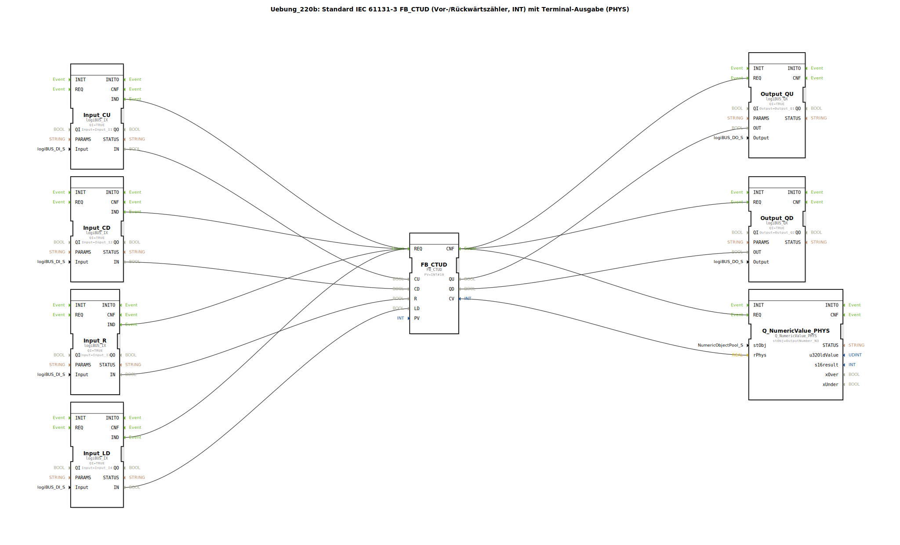

# Uebung_220b: Standard IEC 61131-3 FB_CTUD (Vor-/Rückwärtszähler, INT) mit Terminal-Ausgabe (PHYS)

* * * * * * * * * *

## Einleitung

In dieser Übung wird ein Vor-/Rückwärtszähler (Typ CTUD) nach IEC 61131-3 realisiert. Der Zähler besitzt einen Vorwärtszähleingang (CU), einen Rückwärtszähleingang (CD), einen Rücksetzeingang (R) und einen Ladeeingang (LD). Der aktuelle Zählwert (CV) wird auf einem physikalischen Terminal (PHYS) ausgegeben. Zusätzlich werden die beiden Zählerendstände QU (Überlauf bei Erreichen des Maximalwerts) und QD (Unterlauf bei Erreichen des Minimalwerts) auf digitale Ausgänge geführt. Die Steuerung erfolgt über vier digitale Eingänge (I1 … I4).

## Verwendete Funktionsbausteine (FBs)

Die Übung verwendet keine weiteren Sub-Bausteine, sondern setzt direkt aus dem Netzwerk folgende vordefinierte Funktionsbausteine ein:

- **FB_CTUD** (Typ: `iec61131::counters::FB_CTUD`)  
  *Parameter*: `PV = INT#10` (Zählschwellwert, entspricht einem Vorwahlwert von 10).  
  Der Baustein arbeitet als Vor-/Rückwärtszähler mit Ereignissteuerung und liefert die Ausgänge `QU`, `QD` und `CV`.

- **Input_CU**, **Input_CD**, **Input_R**, **Input_LD** (Typ: `logiBUS::io::DI::logiBUS_IX`)  
  *Parameter*: `QI = TRUE`, `Input = Input_I1` … `Input_I4`.  
  Vier digitale Eingänge, die die physikalischen Eingänge I1 bis I4 auf die internen Datenwerte abbilden.

- **Output_QU**, **Output_QD** (Typ: `logiBUS::io::DQ::logiBUS_QX`)  
  *Parameter*: `QI = TRUE`, `Output = Output_Q1` bzw. `Output_Q2`.  
  Zwei digitale Ausgänge, die die Überlauf- und Unterlaufbedingungen des Zählers an die physikalischen Ausgänge Q1 und Q2 weitergeben.

- **Q_NumericValue_PHYS** (Typ: `isobus::UT::Q::Q_NumericValue_PHYS`)  
  *Parameter*: `stObj = OutputNumber_N3` (Vorgabe aus dem Pool `DefaultPool_Numeric`).  
  Dieser Baustein dient der Ausgabe des aktuellen Zählwerts als Realwert auf einem Terminal. Er erhält den Zahlenwert über den Dateneingang `rPhys`.

## Programmablauf und Verbindungen

Der Ablauf wird über Ereignis- und Datenverbindungen gesteuert.

**Ereignisverbindungen**  
- Die `IND`-Ereignisse aller vier digitalen Eingänge (Input_CU, Input_CD, Input_R, Input_LD) sind auf den `REQ`-Eingang des Zählers FB_CTUD geschaltet. Jede steigende Flanke an einem der Eingänge löst somit eine Neuberechnung des Zählers aus.  
- Nach erfolgreicher Berechnung sendet der Zähler das `CNF`-Ereignis. Dieses wird auf die `REQ`-Eingänge der drei Ausgabebausteine (Output_QU, Output_QD, Q_NumericValue_PHYS) verteilt, sodass die Ausgangswerte parallel aktualisiert werden.

**Datenverbindungen**  
- Die digitalen Eingangswerte (`IN`) von Input_CU, Input_CD, Input_R und Input_LD werden auf die entsprechenden Dateneingänge des Zählers geführt (`CU`, `CD`, `R`, `LD`).  
- Vom Zähler werden die binären Ausgangssignale `QU` und `QD` auf die Dateneingänge `OUT` der Ausgangsbausteine Output_QU und Output_QD übertragen.  
- Der aktuelle Zählwert `CV` (Datentyp `INT`) wird auf den Eingang `rPhys` des Terminal-Ausgabebausteins gelegt. Ein Kommentar im Netzwerk erklärt, dass `INT` ohne explizite Konvertierung auf `REAL` geschlossen werden kann (implizite Typumwandlung ist erlaubt).

**Besonderheiten**  
- Der Zähler arbeitet nach der CTUD-Spezifikation: Ein positiver Impuls an `CU` erhöht den Zählwert, an `CD` verringert ihn. Ein Signal an `R` setzt den Zählwert auf Null, ein Signal an `LD` lädt den in `PV` hinterlegten Vorwahlwert.  
- Die Übung vermittelt das Verständnis eines kombinierten Vor-/Rückwärtszählers mit Hardware-Anbindung und visueller Terminalausgabe. Vorkenntnisse zu IEC 61131-3 Zählern und grundlegenden Ereignis-/Datenverbindungen sind hilfreich.

## Zusammenfassung

Die Übung „Uebung_220b“ realisiert einen vollständigen IEC-61131-3-konformen Vor-/Rückwärtszähler (CTUD) mit digitalen Ein- und Ausgängen sowie einer physikalischen Terminalausgabe des aktuellen Zählwerts. Die Steuerung erfolgt über vier Taster, die Zählerstände werden als Überlauf bzw. Unterlauf auf zwei Ausgänge gegeben. Der Ablauf demonstriert die typische Verschaltung eines Ereignis-gesteuerten Zählers mit dezentralen I/O-Modulen und einem numerischen Anzeigebaustein.