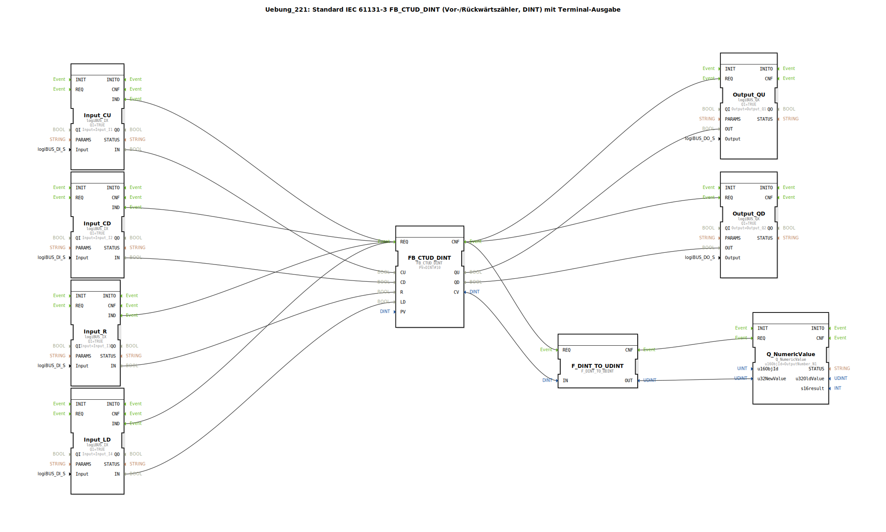

# Uebung_221: Standard IEC 61131-3 FB_CTUD_DINT (Vor-/Rückwärtszähler, DINT) mit Terminal-Ausgabe

* * * * * * * * * *

## Einleitung

Diese Übung implementiert einen kombinierten Vor-/Rückwärtszähler (engl. Up/Down Counter) basierend auf dem Standard IEC 61131-3 Funktionsbaustein `FB_CTUD_DINT`. Der gezählte Wert wird als Ganzzahl (DINT) geführt und über eine Konvertierung auf einer numerischen Anzeige (Terminal) ausgegeben. Zusätzlich werden zwei binäre Ausgänge gesetzt, die anzeigen, ob der Zähler den oberen (QU) oder unteren (QD) Grenzwert erreicht hat.

Die Steuerung erfolgt über vier digitale Eingänge (CU, CD, Reset, Laden des Anfangswerts), die über den logiBUS angeschlossen sind.

## Verwendete Funktionsbausteine (FBs)

### Kern-Funktionsbaustein

- **FB_CTUD_DINT** (Typ: `iec61131::counters::FB_CTUD_DINT`)
    - Parametrierung: `PV` = `DINT#10` (Vergleichswert für QU/QD)
    - Funktion: IEC 61131-3 konformer Vor-/Rückwärtszähler mit DINT-Werten. Zählt bei jedem positiven Flanke an CU (Count Up) oder CD (Count Down). Setzt QU auf TRUE, wenn `CV >= PV`, und QD auf TRUE, wenn `CV <= 0`. Über `R` wird der Zähler auf 0 zurückgesetzt; über `LD` wird der aktuelle Wert von `PV` geladen.

### Digitale Eingänge (logiBUS)

- **Input_CU**, **Input_CD**, **Input_R**, **Input_LD** (Typ: `logiBUS::io::DI::logiBUS_IX`)
    - Parametrierung: `QI` = `TRUE`
    - Funktion: Lesen der physikalischen Eingänge `Input_I1` bis `Input_I4` und Bereitstellung des Binärwerts am Datenausgang `IN`. Bei jeder Änderung wird ein Ereignis `IND` ausgelöst.

### Digitale Ausgänge (logiBUS)

- **Output_QU**, **Output_QD** (Typ: `logiBUS::io::DQ::logiBUS_QX`)
    - Parametrierung: `QI` = `TRUE`
    - Funktion: Setzen der physikalischen Ausgänge `Output_Q1` und `Output_Q2` entsprechend des anliegenden Werts am Dateneingang `OUT`.

### Ausgabe des Zählerwerts auf Terminal

- **Q_NumericValue** (Typ: `isobus::UT::Q::Q_NumericValue`)
    - Parametrierung: `u16ObjId` = `OutputNumber_N1`
    - Funktion: Zeigt einen numerischen Wert (UDINT) auf einem Terminal (z. B. HMI) an. Der Datenwert wird über `u32NewValue` übergeben.

- **F_DINT_TO_UDINT** (Typ: `iec61131::conversion::F_DINT_TO_UDINT`)
    - Funktion: Konvertiert einen DINT-Wert in einen UDINT-Wert. Dadurch wird der Zählerstand (der negativ werden könnte) als vorzeichenlose Ganzzahl dargestellt. (Hinweis: Diese Konvertierung ist nicht sinnvoll für negative Zählerstände, da negative DINT-Werte in UDINT umgedeutet werden.)

## Programmablauf und Verbindungen

1. **Ereignisverknüpfung**: Jeder der vier digitalen Eingänge (Input_CU, Input_CD, Input_R, Input_LD) löst bei einer Zustandsänderung (Ereignis `IND`) die Ausführung des Zählers `FB_CTUD_DINT` aus (Eingangsereignis `REQ`).  
   → Alle Eingänge sind direkt mit demselben `REQ`-Ereignis des Zählers verbunden. Dies bewirkt, dass bei jeder Änderung eines beliebigen Eingangs der Zähler neu verarbeitet wird.

2. **Datenverknüpfung**:
   - Die Eingangswerte `IN` der digitalen Eingänge werden auf die entsprechenden Dateneingänge des Zählers geführt: `CU`, `CD`, `R`, `LD`.
   - Nach der Zählerverarbeitung (`CNF`-Ereignis) werden:
     - Die Ausgänge `QU` und `QD` an die Ausgangsbausteine `Output_QU` und `Output_QD` weitergeleitet. Diese setzen die physikalischen Ausgänge.
     - Der aktuelle Zählerstand `CV` wird über `F_DINT_TO_UDINT` in einen vorzeichenlosen Wert umgewandelt und an `Q_NumericValue` übergeben, der den Wert auf dem Terminal anzeigt.

3. **Ablauf**:
   - Ein positiver Flanke an CU erhöht den Zähler um 1.
   - Ein positiver Flanke an CD verringert den Zähler um 1.
   - Ein positiver Flanke an R setzt den Zähler auf 0.
   - Ein positiver Flanke an LD lädt den Wert von `PV` (hier 10) in den Zähler.
   - Sobald der Zählerstand den Vergleichswert `PV` erreicht oder überschreitet, wird `QU` auf TRUE gesetzt; bei Unterschreiten von 0 wird `QD` auf TRUE gesetzt.

**Lernziele**:  
- Verständnis und Anwendung des IEC 61131-3 Standardzählers `CTUD`.  
- Einbindung von logiBUS-I/O-Modulen in eine 4diac-Applikation.  
- Ausgabe numerischer Werte auf einem Terminal.  
- Umgang mit Ereignis- und Datenverbindungen in 4diac.

**Schwierigkeitsgrad**: Einfach  
**Vorkenntnisse**: Grundlagen der 4diac-IDE, IEC 61131-3 Bausteine, logiBUS-Konfiguration.

## Zusammenfassung

Die Übung **Uebung_221** realisiert einen voll funktionsfähigen Vor-/Rückwärtszähler nach IEC 61131-3 mit vier digitalen Eingängen, zwei digitalen Ausgängen und einer numerischen Terminalanzeige. Der Aufbau demonstriert die saubere Trennung von Ereignis- und Datenflüssen sowie die Integration von Standardbibliotheken (IEC 61131-3, logiBUS, isobus) in einer 4diac-Subapplikation. Die Konvertierung von DINT nach UDINT ist ein bewusst gesetzter Hinweis auf mögliche Fallstricke bei der Darstellung negativer Zahlen.