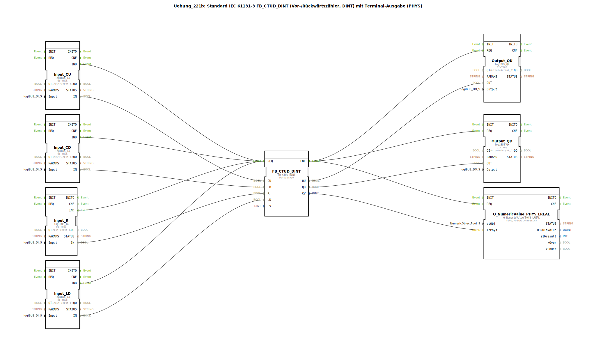

# Uebung_221b: Standard IEC 61131-3 FB_CTUD_DINT (Vor-/Rückwärtszähler, DINT) mit Terminal-Ausgabe (PHYS)

* * * * * * * * * *
## Einleitung

Diese Übung implementiert einen kombinierten Vor-/Rückwärtszähler nach IEC 61131-3 (Typ `FB_CTUD_DINT`) und gibt den aktuellen Zählerstand sowie die Zählerstatus (Überlauf/Unterlauf) über digitale Ausgänge und eine Terminalausgabe (PHYS) aus. Der Zähler kann über vier digitale Eingänge gesteuert werden: Vorwärtszählen (CU), Rückwärtszählen (CD), Rücksetzen (R) und Laden des Startwertes (LD).

## Verwendete Funktionsbausteine (FBs)

- **`FB_CTUD_DINT`** (Typ: `iec61131::counters::FB_CTUD_DINT`)
  - Parameter: `PV` = `DINT#10` (Startwert beim Laden)
  - Ereigniseingänge: `REQ` (Start der Verarbeitung)
  - Ereignisausgänge: `CNF` (Verarbeitung abgeschlossen)
  - Dateneingänge: `CU` (Count Up), `CD` (Count Down), `R` (Reset), `LD` (Load)
  - Datenausgänge: `QU` (Count Up erreicht), `QD` (Count Down erreicht), `CV` (aktueller Zählerwert)

- **Eingangs-FBs (logiBUS Digitaleingänge)**
  - `Input_CU` (Typ `logiBUS::io::DI::logiBUS_IX`): Eingangssignal für `CU`
  - `Input_CD` (Typ `logiBUS::io::DI::logiBUS_IX`): Eingangssignal für `CD`
  - `Input_R` (Typ `logiBUS::io::DI::logiBUS_IX`): Eingangssignal für `R`
  - `Input_LD` (Typ `logiBUS::io::DI::logiBUS_IX`): Eingangssignal für `LD`
  - Parameter aller: `QI` = `TRUE` (Aktivierung des Kanals), `Input` = zugeordneter logiBUS-Kanal (z.B. `Input_I1`..`Input_I4`)

- **Ausgangs-FBs (logiBUS Digitalausgänge)**
  - `Output_QU` (Typ `logiBUS::io::DQ::logiBUS_QX`): signalisiert `QU` (Zählerstand ≥ PV)
  - `Output_QD` (Typ `logiBUS::io::DQ::logiBUS_QX`): signalisiert `QD` (Zählerstand ≤ 0)
  - Parameter aller: `QI` = `TRUE`, `Output` = zugeordneter logiBUS-Kanal (z.B. `Output_Q1`, `Output_Q2`)

- **Terminalausgabe-FB**
  - `Q_NumericValue_PHYS_LREAL` (Typ `isobus::UT::Q::Q_NumericValue_PHYS_LREAL`): gibt den aktuellen Zählerstand (als LREAL) auf einem physikalischen Display aus
  - Parameter: `stObj` = `OutputNumber_N3` (Referenz auf das Terminal-Ausgabeelement)

## Programmablauf und Verbindungen

Das System arbeitet ereignisgesteuert:

1. **Eingangsverarbeitung**: Jeder der vier Eingangs-FBs (Input_CU, Input_CD, Input_R, Input_LD) erzeugt bei einer Signaländerung ein Ereignis (`IND`).
2. **Zählerberechnung**: Alle vier Ereignisse sind mit dem `REQ`-Eingang des Zählers `FB_CTUD_DINT` verbunden. Dadurch wird der Zähler bei jedem neuen Eingangssignal ausgewertet.
3. **Ausgangsaktualisierung**: Nach Abschluss der Zählerberechnung (`CNF`) werden die Ausgangs-FBs und der Terminal-FB zeitgleich getriggert:
   - `Output_QU` erhält den Wert von `QU`
   - `Output_QD` erhält den Wert von `QD`
   - `Q_NumericValue_PHYS_LREAL` erhält den aktuellen Zählerstand `CV`

**Datenverbindungen**:
- `Input_CU.IN` → `FB_CTUD_DINT.CU`
- `Input_CD.IN` → `FB_CTUD_DINT.CD`
- `Input_R.IN` → `FB_CTUD_DINT.R`
- `Input_LD.IN` → `FB_CTUD_DINT.LD`
- `FB_CTUD_DINT.QU` → `Output_QU.OUT`
- `FB_CTUD_DINT.QD` → `Output_QD.OUT`
- `FB_CTUD_DINT.CV` → `Q_NumericValue_PHYS_LREAL.lrPhys`

**Verhalten des Zählers**:
- Bei einer positiven Flanke an `CU` wird der Zähler um 1 erhöht.
- Bei einer positiven Flanke an `CD` wird der Zähler um 1 verringert.
- Bei einer positiven Flanke an `R` wird der Zähler auf 0 gesetzt.
- Bei einer positiven Flanke an `LD` wird der Zähler auf den Wert von `PV` (hier 10) gesetzt.
- Der Ausgang `QU` wird `TRUE`, sobald der Zählerstand ≥ PV ist; `QD` wird `TRUE`, sobald der Zählerstand ≤ 0 ist.

## Zusammenfassung

Die Übung zeigt den Einsatz eines universellen IEC 61131-3 Vor-/Rückwärtszählers (`FB_CTUD_DINT`) in Kombination mit digitalen Ein- und Ausgängen sowie einer physikalischen Terminalausgabe. Der Zähler wird über vier Taster gesteuert, die Statusausgänge werden auf LEDs ausgegeben, und der aktuelle Zählerstand erscheint auf einem Display. Dies ist eine grundlegende Aufgabe zur Einführung in Zählfunktionen und die Signalverarbeitung in der Automatisierungstechnik.