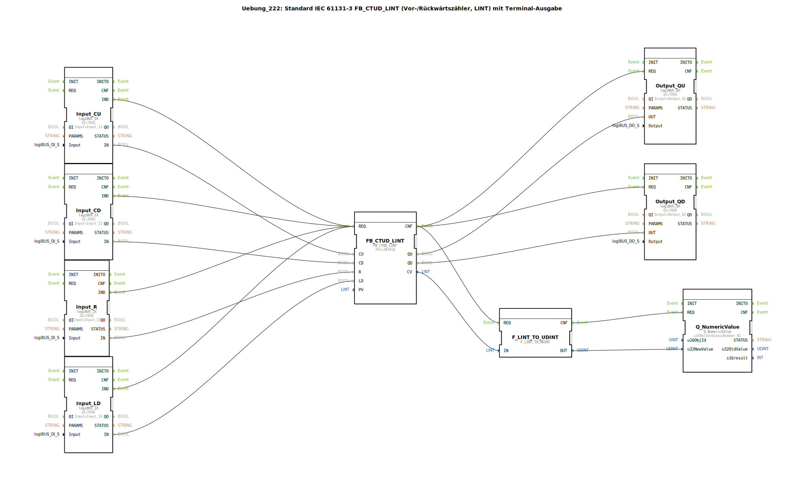

# Uebung_222: Standard IEC 61131-3 FB_CTUD_LINT (Vor-/Rückwärtszähler, LINT) mit Terminal-Ausgabe

* * * * * * * * * *

## Einleitung

Diese Übung implementiert einen Vor-/Rückwärtszähler gemäß IEC 61131-3 (Typ `FB_CTUD_LINT`) mit einem Wertebereich vom Typ `LINT`. Die Zählerstände werden über eine logiBUS-I/O-Kopplung an digitale Eingänge (Taster) gesteuert und an digitale Ausgänge (Signalleuchten) ausgegeben. Zusätzlich wird der aktuelle Zählerstand über einen numerischen Terminalausgang (`Q_NumericValue`) dargestellt. Die Übung demonstriert den Einsatz eines komplexen Zählers sowie die Umwandlung von `LINT` nach `UDINT` für die Ausgabe, wobei ein Kommentar auf die Einschränkung der Umwandlung hinweist (keine negativen Werte darstellbar).

## Verwendete Funktionsbausteine (FBs)

Die Übung enthält folgende Funktionsbausteine direkt auf der obersten Ebene (keine Sub-Bausteine):

- **FB_CTUD_LINT** (Typ: `iec61131::counters::FB_CTUD_LINT`)
    - Parameter: `PV` = `LINT#10` (Voreinstellwert 10)
    - Ereigniseingänge: `REQ` (Anforderung)
    - Ereignisausgänge: `CNF` (Bestätigung)
    - Dateneingänge: `CU` (Aufwärtszählimpuls), `CD` (Abwärtszählimpuls), `R` (Rücksetzen auf 0), `LD` (Laden von PV)
    - Datenausgänge: `QU` (Aufwärtszähler erreicht PV), `QD` (Abwärtszähler erreicht 0), `CV` (aktueller Zählerstand)
    - **Funktionsweise**: Der Baustein arbeitet als vorwärts/rückwärts zählender Timer mit 64‑Bit-Zähler (`LINT`). Bei jedem positiven Flanke an `CU` wird der Zähler erhöht, bei `CD` verringert. Über `R` wird auf 0 gesetzt, über `LD` auf den Wert von `PV` geladen. `QU` ist aktiv, wenn `CV >= PV`, `QD` aktiv, wenn `CV <= 0`.

- **Input_CU** (Typ: `logiBUS::io::DI::logiBUS_IX`)
    - Parameter: `QI` = `TRUE`, `Input` = `Input_I1`
    - Ausgang: `IN` (digitaler Wert), `IND` (Ereignis bei Flanke)

- **Input_CD** (Typ: `logiBUS::io::DI::logiBUS_IX`)
    - Parameter: `QI` = `TRUE`, `Input` = `Input_I2`

- **Input_R** (Typ: `logiBUS::io::DI::logiBUS_IX`)
    - Parameter: `QI` = `TRUE`, `Input` = `Input_I3`

- **Input_LD** (Typ: `logiBUS::io::DI::logiBUS_IX`)
    - Parameter: `QI` = `TRUE`, `Input` = `Input_I4`

- **Output_QU** (Typ: `logiBUS::io::DQ::logiBUS_QX`)
    - Parameter: `QI` = `TRUE`, `Output` = `Output_Q1`
    - Eingang: `OUT` (Wert), `REQ` (Ereignis)

- **Output_QD** (Typ: `logiBUS::io::DQ::logiBUS_QX`)
    - Parameter: `QI` = `TRUE`, `Output` = `Output_Q2`

- **Q_NumericValue** (Typ: `isobus::UT::Q::Q_NumericValue`)
    - Parameter: `u16ObjId` = `OutputNumber_N1`
    - Eingang: `REQ` (Ereignis), `u32NewValue` (numerischer Wert)
    - **Funktionsweise**: Dieser Baustein gibt einen 32‑Bit‑Wert (unsigned) auf eine numerische Anzeige im Terminal aus. Die Objekt-ID verweist auf einen vordefinierten Ausgabekanal.

- **F_LINT_TO_UDINT** (Typ: `iec61131::conversion::F_LINT_TO_UDINT`)
    - Eingang: `REQ` (Ereignis), `IN` (Wert vom Typ `LINT`)
    - Ausgang: `CNF` (Ereignis), `OUT` (Wert vom Typ `UDINT`)
    - **Funktionsweise**: Wandelt einen 64‑Bit‑Ganzzahlwert (LINT) in einen 32‑Bit‑vorzeichenlosen Wert (UDINT) um. **Hinweis**: Negative Eingangswerte können nicht korrekt dargestellt werden, da der Zielbereich nur positive Zahlen zulässt. Die Übung enthält einen Kommentar, der auf diese Einschränkung hinweist.

## Programmablauf und Verbindungen

Die Steuerung erfolgt über vier digitale Eingänge (logiBUS), die als Taster dienen:

- **Input_I1** (CU): Aufwärtszählen  
- **Input_I2** (CD): Abwärtszählen  
- **Input_I3** (R): Zähler zurücksetzen auf 0  
- **Input_I4** (LD): Zähler auf Voreinstellwert PV (=10) laden  

Jeder Eingangsbaustein erzeugt bei einer positiven Flanke ein Ereignis (`IND`). Diese Ereignisse werden auf den Ereigniseingang `REQ` des Zählerbausteins `FB_CTUD_LINT` geschaltet. Der Zähler reagiert dann auf den entsprechenden Dateneingang (`CU`, `CD`, `R`, `LD`).

Die Datenverbindungen übertragen die logischen Zustände der Taster:

- `Input_CU.IN` → `FB_CTUD_LINT.CU`
- `Input_CD.IN` → `FB_CTUD_LINT.CD`
- `Input_R.IN` → `FB_CTUD_LINT.R`
- `Input_LD.IN` → `FB_CTUD_LINT.LD`

Nach einer Verarbeitung des Zählers wird das Bestätigungsereignis (`CNF`) an mehrere Ausgänge weitergeleitet:

- `Output_QU.REQ` und `Output_QD.REQ` → aktualisiert die digitalen Ausgänge  
- `F_LINT_TO_UDINT.REQ` → startet die Typumwandlung

Die Datenausgänge `QU` und `QD` steuern die digitalen Ausgänge:

- `FB_CTUD_LINT.QU` → `Output_QU.OUT` (Ausgangsklemme `Output_Q1`)
- `FB_CTUD_LINT.QD` → `Output_QD.OUT` (Ausgangsklemme `Output_Q2`)

Der aktuelle Zählerstand (`CV`) wird über die Umwandlung `F_LINT_TO_UDINT` geleitet:

- `FB_CTUD_LINT.CV` → `F_LINT_TO_UDINT.IN`
- `F_LINT_TO_UDINT.OUT` → `Q_NumericValue.u32NewValue`

Nach erfolgreicher Umwandlung löst `F_LINT_TO_UDINT.CNF` das Ereignis `Q_NumericValue.REQ` aus, wodurch der Wert auf dem Terminal angezeigt wird.

**Lernziele**: 
- Einführung in IEC 61131-3 Zählerbausteine (CTUD) mit großer Datenbreite
- Verwendung von logiBUS-Ein-/Ausgabebaugruppen
- Typkonvertierung und deren Fallstricke (keine negativen Zahlen bei UDINT)
- Ereignisgesteuerte Ablaufsteuerung in 4diac

**Hinweis**: Die Übung setzt Grundkenntnisse der 4diac-IDE und der logiBUS-Konfiguration voraus. Die Eingänge müssen mit realen oder simulierten Tastern verbunden werden; die Ausgänge mit Leuchten oder Statusanzeigen.

## Zusammenfassung

Die Übung 222 realisiert einen universellen Vor-/Rückwärtszähler (FB_CTUD_LINT) mit einem 64‑Bit-Zählbereich, gesteuert durch vier Tastereingänge. Zwei digitale Ausgänge zeigen die Zustände `QU` (Maximum erreicht) und `QD` (Minimum erreicht) an, während ein Terminal den aktuellen Zahlwert ausgibt. Die notwendige Typumwandlung von `LINT` nach `UDINT` ist bewusst als Problemfall dokumentiert, um auf die mögliche Fehlinterpretation negativer Werte hinzuweisen. Der Entwurf folgt dem IEC-61131-3-Standard und erlaubt eine einfache Erweiterung für andere Zählparameter.