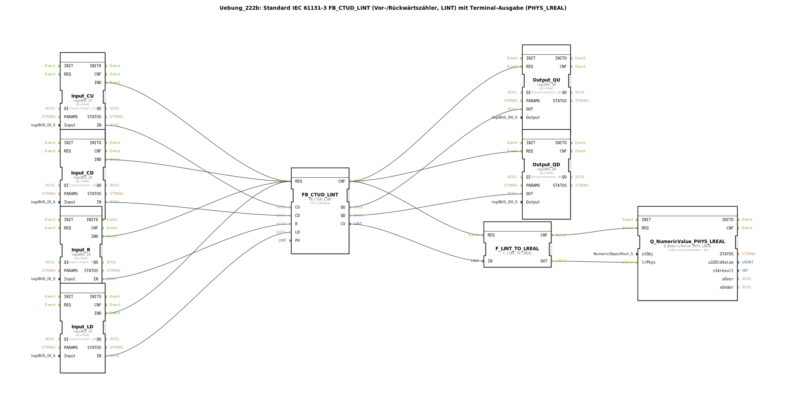

# Uebung_222b: Standard IEC 61131-3 FB_CTUD_LINT (Vor-/Rückwärtszähler, LINT) mit Terminal-Ausgabe (PHYS_LREAL)

* * * * * * * * * *

## Einleitung

Diese Übung realisiert einen standardkonformen IEC 61131-3 Vor-/Rückwärtszähler mit dem Datentyp **LINT** (64‑Bit Ganzzahl). Der Zähler wird über vier digitale Eingänge gesteuert: Hochzählen (CU), Herunterzählen (CD), Rücksetzen (R) und Laden des Presetwerts (LD). Der aktuelle Zählerstand wird an zwei digitale Ausgänge (QU und QD) sowie über einen Datentypkonverter als physikalischer Gleitkommawert (LREAL) auf einem Terminal ausgegeben. Damit kann der Zählerstand im laufenden Betrieb direkt in der Entwicklungsumgebung beobachtet werden.

## Verwendete Funktionsbausteine (FBs)

| Bausteinname | Typ | Parameter | Beschreibung |
|--------------|-----|-----------|--------------|
| `FB_CTUD_LINT` | `iec61131::counters::FB_CTUD_LINT` | PV = `LINT#10` | Vor-/Rückwärtszähler (LINT). Zählt bei CU-Ereignissen hoch, bei CD-Ereignissen runter. Ein R-Ereignis setzt den Zähler auf 0, ein LD-Ereignis lädt den Presetwert PV. |
| `Input_CU` | `logiBUS::io::DI::logiBUS_IX` | QI = TRUE, Input = `Input_I1` | Digitaler Eingang (logiBUS) – Signal zum Hochzählen. |
| `Input_CD` | `logiBUS::io::DI::logiBUS_IX` | QI = TRUE, Input = `Input_I2` | Digitaler Eingang – Signal zum Herunterzählen. |
| `Input_R` | `logiBUS::io::DI::logiBUS_IX` | QI = TRUE, Input = `Input_I3` | Digitaler Eingang – Rücksetzsignal. |
| `Input_LD` | `logiBUS::io::DI::logiBUS_IX` | QI = TRUE, Input = `Input_I4` | Digitaler Eingang – Ladesignal für Presetwert. |
| `Output_QU` | `logiBUS::io::DQ::logiBUS_QX` | QI = TRUE, Output = `Output_Q1` | Digitaler Ausgang – wird aktiv, wenn der Zählerstand ≥ PV ist. |
| `Output_QD` | `logiBUS::io::DQ::logiBUS_QX` | QI = TRUE, Output = `Output_Q2` | Digitaler Ausgang – wird aktiv, wenn der Zählerstand ≤ 0 ist. |
| `F_LINT_TO_LREAL` | `iec61131::conversion::F_LINT_TO_LREAL` | – | Konvertiert den aktuellen Zählerstand (LINT) in den Gleitkommadatentyp LREAL. |
| `Q_NumericValue_PHYS_LREAL` | `isobus::UT::Q::Q_NumericValue_PHYS_LREAL` | stObj = `OutputNumber_N3` | Gibt den konvertierten Wert als physikalische LREAL-Größe auf dem Terminal (OutputNumber_N3) aus. |

## Programmablauf und Verbindungen

1. **Ereignisverkettung**  
   - Jeder Tastendruck an einem der vier Eingänge (Input_CU, Input_CD, Input_R, Input_LD) löst das Ereignis `IND` aus.  
   - Diese Ereignisse werden alle an den Ereigniseingang `REQ` des Zählers `FB_CTUD_LINT` geleitet.  
   - Nach der Abarbeitung (Ereignisausgang `CNF`) wird der Folgebaustein `Output_QU` und `Output_QD` sowie der Konverter `F_LINT_TO_LREAL` angestoßen.  
   - Nach der Konvertierung wird das Terminal-Objekt `Q_NumericValue_PHYS_LREAL` aktualisiert.

2. **Datenverkettung**  
   - Die digitalen Eingangssignale (IN) werden direkt an die entsprechenden Zählereingänge gelegt:  
     * Input_CU.IN → FB_CTUD_LINT.CU  
     * Input_CD.IN → FB_CTUD_LINT.CD  
     * Input_R.IN  → FB_CTUD_LINT.R  
     * Input_LD.IN → FB_CTUD_LINT.LD  
   - Die Zählerausgänge:  
     * FB_CTUD_LINT.QU → Output_QU.OUT (Schaltet Ausgang Q1)  
     * FB_CTUD_LINT.QD → Output_QD.OUT (Schaltet Ausgang Q2)  
   - Der aktuelle Zählerstand (CV, LINT) wird über den Konverter in LREAL umgewandelt:  
     * FB_CTUD_LINT.CV → F_LINT_TO_LREAL.IN  
     * F_LINT_TO_LREAL.OUT → Q_NumericValue_PHYS_LREAL.lrPhys  
   - Das Terminal zeigt somit den Zählerstand als Dezimalzahl mit Gleitkomma an.

3. **Lernziele**  
   - Verständnis des IEC 61131-3 CTUD-Funktionsbausteins (LINT).  
   - Umgang mit digitalen Ein-/Ausgängen im logiBUS-System.  
   - Datentypkonvertierung von LINT nach LREAL.  
   - Visualisierung von Prozesswerten über ein Terminal-Objekt.

4. **Schwierigkeitsgrad & Vorkenntnisse**  
   - **Schwierigkeit:** Mittel.  
   - **Vorkenntnisse:** Grundlagen der 4diac-IDE, Umgang mit SubApp-Typen, Ereignis- und Datenverbindungen, einfache IEC 61131-3 Kenntnisse.

5. **Ausführung**  
   - Laden Sie die Übung in die 4diac-IDE.  
   - Weisen Sie die entsprechenden logiBUS-Kanäle zu (Input_I1 … I4, Output_Q1, Q2).  
   - Starten Sie die Simulation oder übertragen Sie sie auf die Zielhardware.  
   - Beobachten Sie die Zählerstände auf dem Terminal (OutputNumber_N3) und die Ausgänge Q1, Q2.

## Zusammenfassung

Die Übung „Uebung_222b“ demonstriert einen vollständigen IEC 61131-3 konformen Vor-/Rückwärtszähler mit LINT-Datentyp. Durch die Kombination digitaler Ein-/Ausgänge, eines Standardzählers und einer Datentypkonvertierung wird ein einfacher, aber praxisnaher Zähleraufbau realisiert, dessen aktueller Wert über ein Terminal beobachtet werden kann. Dieses Beispiel eignet sich besonders zum Erlernen von Ereignisverknüpfungen und der Datenkonvertierung zwischen Ganzzahl- und Gleitkommatypen in 4diac.