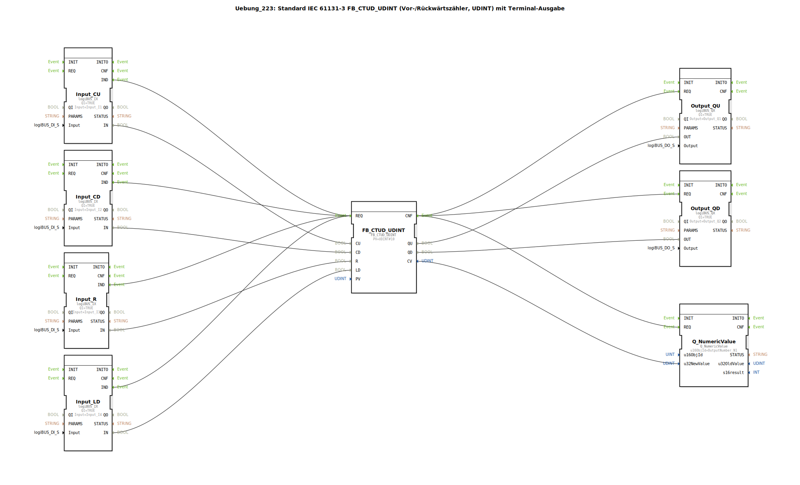

# Uebung_223: Standard IEC 61131-3 FB_CTUD_UDINT (Vor-/Rückwärtszähler, UDINT) mit Terminal-Ausgabe

* * * * * * * * * *

## Einleitung

Diese Übung implementiert einen Vor-/Rückwärtszähler (FB_CTUD_UDINT) gemäß IEC 61131-3 mit Datentyp UDINT. Der Zähler wird über digitale Eingänge gesteuert und gibt den aktuellen Zählerstand sowie zwei Ausgangssignale (QU, QD) an digitale Ausgänge aus. Zusätzlich wird der Zählerwert auf einem Terminal (Q_NumericValue) ausgegeben.

Die Übung demonstriert die Verwendung von logiBUS-Ein-/Ausgangsbausteinen in Verbindung mit einem standardisierten Zähler-FB. Ein Kommentar im Netzwerk weist darauf hin, dass ggf. E_D_FF-Bausteine eingefügt werden sollten, um die Ereignisanzahl zu reduzieren.

## Verwendete Funktionsbausteine (FBs)

In der SubApp werden folgende Funktionsbausteine verwendet:

- **FB_CTUD_UDINT** – IEC 61131-3 Vor-/Rückwärtszähler (UDINT)
  - Parameter: `PV` = `UDINT#10`
  - Ereigniseingang: `REQ`
  - Dateneingänge: `CU` (Vorwärts zählen), `CD` (Rückwärts zählen), `R` (Rücksetzen), `LD` (Laden des Wertes von PV)
  - Datenausgänge: `QU` (Zählerstand >= PV), `QD` (Zählerstand = 0), `CV` (aktueller Zählerwert, UDINT)

- **Input_CU** – Digitaler Eingang (logiBUS_IX)
  - Parameter: `QI` = TRUE, `Input` = `Input_I1`

- **Input_CD** – Digitaler Eingang (logiBUS_IX)
  - Parameter: `QI` = TRUE, `Input` = `Input_I2`

- **Input_R** – Digitaler Eingang (logiBUS_IX)
  - Parameter: `QI` = TRUE, `Input` = `Input_I3`

- **Input_LD** – Digitaler Eingang (logiBUS_IX)
  - Parameter: `QI` = TRUE, `Input` = `Input_I4`

- **Output_QU** – Digitaler Ausgang (logiBUS_QX)
  - Parameter: `QI` = TRUE, `Output` = `Output_Q1`

- **Output_QD** – Digitaler Ausgang (logiBUS_QX)
  - Parameter: `QI` = TRUE, `Output` = `Output_Q2`

- **Q_NumericValue** – Terminalausgabe (isobus::UT::Q::Q_NumericValue)
  - Parameter: `u16ObjId` = `OutputNumber_N1`
  - Daten: `u32NewValue` (erhält den Zählerwert CV)

## Programmablauf und Verbindungen

Die Übung ist als eine SubApp realisiert, die keine eigenen Ein-/Ausgangsschnittstellen besitzt, sondern direkt auf die globalen logiBUS- und ISOBUS-Ressourcen zugreift.

**Ereignisverbindungen:**

1. Alle vier digitalen Eingabebausteine (Input_CU, Input_CD, Input_R, Input_LD) lösen bei einer steigenden Flanke (IND-Ereignis) das Ereignis `REQ` des Zählers FB_CTUD_UDINT aus.
2. Nach Bearbeitung des Zählers wird dessen Bestätigungsereignis `CNF` an die Ausgabebausteine Output_QU, Output_QD und Q_NumericValue weitergeleitet, sodass diese ihre Werte aktualisieren.

**Datenverbindungen:**

- `Input_CU.IN` → `FB_CTUD_UDINT.CU`
- `Input_CD.IN` → `FB_CTUD_UDINT.CD`
- `Input_R.IN` → `FB_CTUD_UDINT.R`
- `Input_LD.IN` → `FB_CTUD_UDINT.LD`
- `FB_CTUD_UDINT.QU` → `Output_QU.OUT`
- `FB_CTUD_UDINT.QD` → `Output_QD.OUT`
- `FB_CTUD_UDINT.CV` → `Q_NumericValue.u32NewValue`

**Ablauf:**

- Sobald ein digitaler Eingang (z.B. Taster) betätigt wird, wird das entsprechende Signal an den Zähler weitergegeben.
- Der Zähler zählt bei jedem positiven Flanke an CU hoch, bei CD runter. Mit R wird der Zähler auf 0 zurückgesetzt. Mit LD wird der aktuelle Zählerwert auf den Wert von PV (10) gesetzt.
- Die Ausgänge QU und QD zeigen an, ob der Zählerstand den PV-Wert erreicht hat (QU) bzw. ob der Zählerstand 0 ist (QD).
- Der aktuelle Zählerstand (CV) wird zusätzlich auf einem Terminal ausgegeben (Q_NumericValue).

**Hinweis:** Ein Kommentar im Netzwerk schlägt vor, ggf. einen oder zwei E_D_FF-Bausteine einzufügen, um die Ereignisse zu reduzieren, wenn mehrere Eingänge gleichzeitig ausgelöst werden.

## Zusammenfassung

Die Übung 223 zeigt die praktische Anwendung eines IEC 61131-3 Vor-/Rückwärtszählers (FB_CTUD_UDINT) in einer 4diac-IDE-Umgebung. Durch die Kombination von logiBUS-Eingängen und -Ausgängen sowie einer Terminalausgabe wird ein vollständiger Zähler mit Anzeige realisiert. Die Übung verdeutlicht die Verbindung von Ereignis- und Datenflüssen zwischen Funktionsbausteinen unterschiedlicher Bibliotheken.