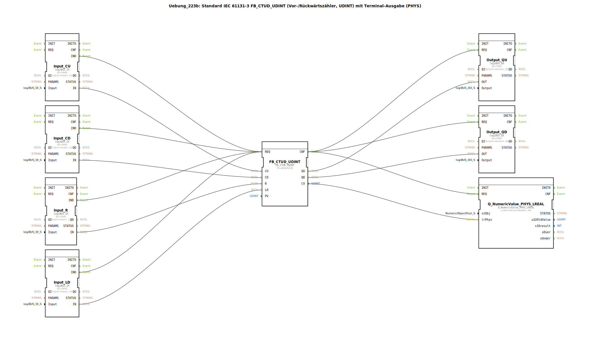

# Uebung_223b: Standard IEC 61131-3 FB_CTUD_UDINT (Vor-/Rückwärtszähler, UDINT) mit Terminal-Ausgabe (PHYS)

* * * * * * * * * *

## Einleitung

Diese Übung implementiert einen vorwärts/rückwärts zählenden Funktionsbaustein nach IEC 61131-3 (Typ `FB_CTUD_UDINT`) mit einem Wertebereich vom Typ `UDINT`. Der aktuelle Zählerstand wird zusätzlich auf einem Terminal (PHYS) ausgegeben. Die Steuerung der Zählerfunktionen erfolgt über vier digitale Eingänge, und zwei digitale Ausgänge signalisieren die Zähler-Richtungsanzeigen.

## Verwendete Funktionsbausteine (FBs)

- **FB_CTUD_UDINT**  
  - Typ: `iec61131::counters::FB_CTUD_UDINT`  
  - Parameter: `PV` = `UDINT#10`  
  - Funktion: Standard IEC 61131-3 Vor-/Rückwärtszähler (UDINT). Zählt bei jedem positiven Flanke an `CU` hoch, an `CD` runter. Über `R` wird der Zähler auf 0 zurückgesetzt, über `LD` wird der Wert aus `PV` geladen.  

- **Input_CU, Input_CD, Input_R, Input_LD**  
  - Typ: `logiBUS::io::DI::logiBUS_IX`  
  - Parameter:  
    - `QI` = `TRUE`  
    - `Input` = `Input_I1` (für CU), `Input_I2` (für CD), `Input_I3` (für R), `Input_I4` (für LD)  
  - Funktion: Digitaleingangsklemmen zur Erfassung der Taster- oder Sensorsignale.  

- **Output_QU, Output_QD**  
  - Typ: `logiBUS::io::DQ::logiBUS_QX`  
  - Parameter:  
    - `QI` = `TRUE`  
    - `Output` = `Output_Q1` (für QU), `Output_Q2` (für QD)  
  - Funktion: Digitalausgangsklemmen zur Anzeige, ob der Zähler den Wert `PV` erreicht hat (QU) bzw. ob der Wert 0 erreicht hat (QD).  

- **Q_NumericValue_PHYS_LREAL**  
  - Typ: `isobus::UT::Q::Q_NumericValue_PHYS_LREAL`  
  - Parameter: `stObj` = `OutputNumber_N3`  
  - Funktion: Gibt den aktuellen Zählerwert als `LREAL` auf dem Terminal (PHYS) aus. Der Wert wird direkt von `CV` (UDINT) übernommen – eine Typkonvertierung ist aufgrund der automatischen Umwandlung von UDINT nach LREAL nicht erforderlich.

## Programmablauf und Verbindungen

Die Ereignissteuerung erfolgt über die `IND`-Ereignisse der digitalen Eingänge. Jeder Tastendruck an einem Eingang löst eine `REQ`-Verarbeitung des Zählers aus:

1. **Ereignisverbindungen**  
   - `Input_CU.IND` → `FB_CTUD_UDINT.REQ`  
   - `Input_CD.IND` → `FB_CTUD_UDINT.REQ`  
   - `Input_R.IND` → `FB_CTUD_UDINT.REQ`  
   - `Input_LD.IND` → `FB_CTUD_UDINT.REQ`  
   - `FB_CTUD_UDINT.CNF` → `Output_QU.REQ`, `Output_QD.REQ`, `Q_NumericValue_PHYS_LREAL.REQ`

2. **Datenverbindungen**  
   - `Input_CU.IN` → `FB_CTUD_UDINT.CU`  
   - `Input_CD.IN` → `FB_CTUD_UDINT.CD`  
   - `Input_R.IN` → `FB_CTUD_UDINT.R`  
   - `Input_LD.IN` → `FB_CTUD_UDINT.LD`  
   - `FB_CTUD_UDINT.QU` → `Output_QU.OUT`  
   - `FB_CTUD_UDINT.QD` → `Output_QD.OUT`  
   - `FB_CTUD_UDINT.CV` → `Q_NumericValue_PHYS_LREAL.lrPhys`

Somit wird bei jeder Zustandsänderung eines Eingangs der Zähler neu berechnet, die Ausgänge aktualisiert und der aktuelle numerische Wert auf dem Terminal ausgegeben. Der Kommentar im Netzwerk weist darauf hin, dass `UDINT` ohne explizite Konvertierung an den `LREAL`-Eingang angeschlossen werden kann.

## Zusammenfassung

Die Übung 223b demonstriert den Einsatz eines standardisierten IEC 61131-3 Vor-/Rückwärtszählers (`FB_CTUD_UDINT`) in einer Steuerungsumgebung. Vier digitale Eingänge ermöglichen das Hochzählen, Herunterzählen, Rücksetzen und Laden des Zählerwerts. Zwei digitale Ausgänge zeigen das Erreichen des Grenzwerts (`QU`) bzw. des Nullwerts (`QD`) an. Zusätzlich wird der aktuelle Zählerstand als physikalischer Wert auf einem Terminal (PHYS) ausgegeben. Die einfache Verkabelung und die direkte Typumwandlung von `UDINT` auf `LREAL` machen die Schaltung besonders übersichtlich.