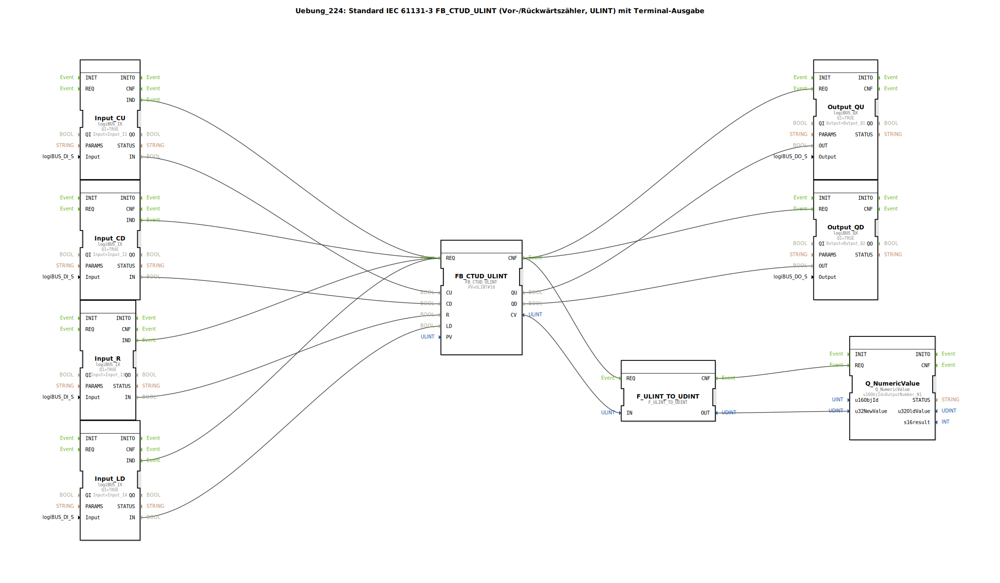

# Uebung_224: Standard IEC 61131-3 FB_CTUD_ULINT (Vor-/Rückwärtszähler, ULINT) mit Terminal-Ausgabe

* * * * * * * * * *

## Einleitung

Diese Übung implementiert einen kombinierten Vor-/Rückwärtszähler nach IEC 61131-3 (Typ `FB_CTUD_ULINT`) mit 64‑Bit‑Vorwahl (ULINT). Der Zählerstand wird über den Terminal‑Baustein `Q_NumericValue` auf einer numerischen Anzeige ausgegeben. Die Eingänge werden über logiBUS‑Digitaleingänge bereitgestellt, die Ausgänge über logiBUS‑Digitalausgänge.

## Verwendete Funktionsbausteine (FBs)

- **FB_CTUD_ULINT** – Typ: `iec61131::counters::FB_CTUD_ULINT`
    - Parameter: `PV` = `ULINT#10` (Vorwahlwert)
    - Eingänge: `CU` (Vorwärts zählen), `CD` (Rückwärts zählen), `R` (Reset), `LD` (Laden von PV)
    - Ausgänge: `QU` (Vorwahl erreicht, vorwärts), `QD` (Vorwahl erreicht, rückwärts), `CV` (aktueller Zählerwert)
    - Ereignisse: `REQ` (Aufruf), `CNF` (Bestätigung)
    - Funktionsweise: Der Baustein zählt bei jedem positiven Flanke an `CU` (vorwärts) bzw. `CD` (rückwärts). Bei `R=TRUE` wird der Zähler auf 0 gesetzt, bei `LD=TRUE` wird der Wert von `PV` geladen. Bei Erreichen des Vorwahlwerts werden die Ausgänge `QU`/`QD` gesetzt.

- **Input_CU** – Typ: `logiBUS::io::DI::logiBUS_IX`
    - Parameter: `QI = TRUE`, `Input = Input_I1`
    - Eingänge: `IND` (Ereignis bei Änderung), `IN` (Datenwert)
    - Funktionsweise: digitaler Eingang, der den physischen Eingang `Input_I1` auf den Zähleingang `CU` legt.

- **Input_CD** – Typ: `logiBUS::io::DI::logiBUS_IX`
    - Parameter: `QI = TRUE`, `Input = Input_I2`
    - Funktionsweise: digitaler Eingang für den Rückwärtszähleingang `CD`.

- **Input_R** – Typ: `logiBUS::io::DI::logiBUS_IX`
    - Parameter: `QI = TRUE`, `Input = Input_I3`
    - Funktionsweise: digitaler Eingang für den Reseteingang `R`.

- **Input_LD** – Typ: `logiBUS::io::DI::logiBUS_IX`
    - Parameter: `QI = TRUE`, `Input = Input_I4`
    - Funktionsweise: digitaler Eingang für den Ladeeingang `LD`.

- **Output_QU** – Typ: `logiBUS::io::DQ::logiBUS_QX`
    - Parameter: `QI = TRUE`, `Output = Output_Q1`
    - Funktionsweise: digitaler Ausgang, der den Zustand von `QU` an den physischen Ausgang `Output_Q1` weitergibt.

- **Output_QD** – Typ: `logiBUS::io::DQ::logiBUS_QX`
    - Parameter: `QI = TRUE`, `Output = Output_Q2`
    - Funktionsweise: digitaler Ausgang, der den Zustand von `QD` an den physischen Ausgang `Output_Q2` weitergibt.

- **F_ULINT_TO_UDINT** – Typ: `iec61131::conversion::F_ULINT_TO_UDINT`
    - Eingänge: `IN` (ULINT), Ausgänge: `OUT` (UDINT)
    - Ereignisse: `REQ`, `CNF`
    - Funktionsweise: konvertiert den 64‑Bit‑Zählerwert (`CV`) in einen 32‑Bit‑Wert. **Achtung:** bei Werten > 2³² kann es zum Überlauf kommen (siehe Kommentar).

- **Q_NumericValue** – Typ: `isobus::UT::Q::Q_NumericValue`
    - Parameter: `u16ObjId = OutputNumber_N1`
    - Eingänge: `REQ`, `u32NewValue`
    - Funktionsweise: gibt den übergebenen Zahlenwert auf dem Terminal (numerische Anzeige) aus.

## Programmablauf und Verbindungen

1. **Ereignissteuerung**  
   Jeder digitale Eingang (Input_CU…Input_LD) erzeugt bei Zustandsänderung ein Ereignis (`IND`). Alle diese Ereignisse sind auf den `REQ`‑Eingang des Zählers `FB_CTUD_ULINT` geschaltet. Dadurch wird der Zähler bei jedem Tastendruck an einem der vier Eingänge aufgerufen.  
   *Hinweis:* Da gleichzeitige Ereignisse mehrerer Eingänge zu einem einzigen Aufruf zusammengefasst werden (oder auch nicht), kann es zu unerwünschtem Verhalten kommen. Im Kommentar wird daher empfohlen, ggf. einen oder zwei `E_D_FF` (Event‑DFlipFlop) einzubauen, um die Ereignisse zu reduzieren.

2. **Datenverbindungen**  
   - Die digitalen Eingangswerte (`IN`) werden direkt auf die entsprechenden Zählereingänge (`CU`, `CD`, `R`, `LD`) geführt.  
   - Die Ausgänge `QU` und `QD` des Zählers sind mit den Digitalausgängen (`Output_QU`, `Output_QD`) verbunden.  
   - Der aktuelle Zählerwert `CV` wird über den Konvertierungsbaustein `F_ULINT_TO_UDINT` auf 32 Bit reduziert und an den Terminal‑Baustein `Q_NumericValue` übergeben.  
   - Die Ereigniskette: `FB_CTUD_ULINT.CNF` löst gleichzeitig die Ausgangs‑FBs und die Konvertierung aus. Nach der Konvertierung wird `Q_NumericValue` aktualisiert.

3. **Parameter**  
   Der Vorwahlwert `PV` ist auf `ULINT#10` gesetzt – ein Vergleich mit diesem Wert setzt die Ausgänge `QU`/`QD`.

4. **Lernziele**  
   - Kennenlernen des IEC‑61131‑3‑Zählers `FB_CTUD_ULINT`.  
   - Umgang mit digitalen Ein‑/Ausgängen über logiBUS.  
   - Verwendung von Konvertierungsbausteinen und Terminalausgabe.  
   - Bewusstsein für Ereigniskollisionen und mögliche Abhilfe durch `E_D_FF`.

5. **Schwierigkeitsgrad:** Mittel  
   **Voraussetzungen:** Grundlegende Kenntnisse der 4diac‑IDE, Umgang mit logiBUS‑E/A‑Bausteinen und Ereignisverkabelung.

## Zusammenfassung

Die Übung 224 realisiert einen vollständigen Vor‑/Rückwärtszähler mit 64‑Bit‑Auflösung und Terminalanzeige. Vier digitale Eingänge steuern Zählen, Reset und Laden eines Vorwahlwerts. Die Ausgänge signalisieren das Erreichen der Vorwahl. Die optionalen `E_D_FF` dienen der Stabilisierung bei mehreren gleichzeitigen Ereignissen. Dieses Beispiel vermittelt den praktischen Einsatz von Zählern, E/A‑Anbindung und Datentypkonvertierung in 4diac.