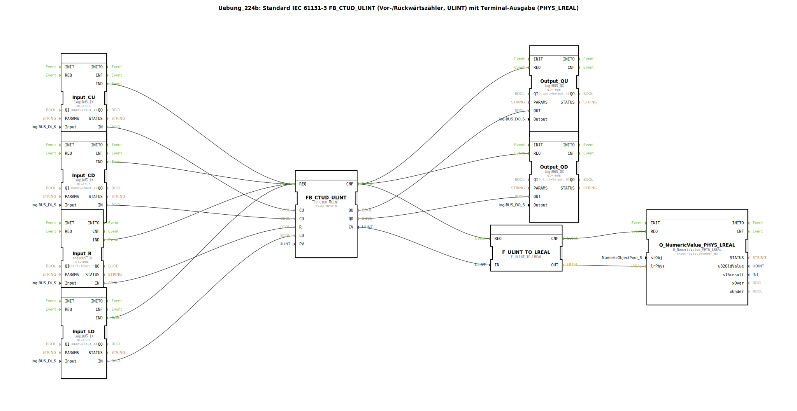

# Uebung_224b: Standard IEC 61131-3 FB_CTUD_ULINT (Vor-/Rückwärtszähler, ULINT) mit Terminal-Ausgabe (PHYS_LREAL)

* * * * * * * * * *
## Einleitung

Diese Übung implementiert einen Vor-/Rückwärtszähler nach IEC 61131-3 (Funktionsbaustein `FB_CTUD_ULINT`) mit dem Datentyp `ULINT`. Der aktuelle Zählerstand wird über einen Konverter in einen physikalischen Wert (`LREAL`) umgewandelt und auf einer Terminalausgabe (z. B. einem Bedienpanel) angezeigt. Die Steuerung erfolgt über vier digitale Eingänge (CU, CD, R, LD), zwei digitale Ausgänge zeigen die Grenzwertsignale (QU, QD) an.

## Verwendete Funktionsbausteine (FBs)

- **`FB_CTUD_ULINT`** (Typ: `iec61131::counters::FB_CTUD_ULINT`)
  - Parameter: `PV` = `ULINT#10`
  - Ereigniseingang: `REQ` (trigger)
  - Ereignisausgang: `CNF`
  - Dateneingänge: `CU` (count up), `CD` (count down), `R` (reset), `LD` (load)
  - Datenausgänge: `QU` (Grenzwert oben), `QD` (Grenzwert unten), `CV` (aktueller Zählerstand)
  - Funktionsweise: Realisiert einen Vor-/Rückwärtszähler. Bei jedem ansteigenden Ereignis auf `CU` wird der Zähler erhöht, bei `CD` verringert. Bei `R` wird der Zähler auf 0 gesetzt, bei `LD` wird der Wert von `PV` geladen. Die Ausgänge `QU` und `QD` werden gesetzt, wenn der Zählerstand den programmierten Grenzwert erreicht hat.

- **`Input_CU`** (Typ: `logiBUS::io::DI::logiBUS_IX`)
  - Parameter: `QI` = `TRUE`, `Input` = `Input_I1`
  - Funktionsweise: Digitaler Eingang, der den physischen Eingang `I1` des logiBUS-Moduls einliest.

- **`Input_CD`** (Typ: `logiBUS::io::DI::logiBUS_IX`)
  - Parameter: `QI` = `TRUE`, `Input` = `Input_I2`
  - Funktionsweise: Digitaler Eingang für `I2`.

- **`Input_R`** (Typ: `logiBUS::io::DI::logiBUS_IX`)
  - Parameter: `QI` = `TRUE`, `Input` = `Input_I3`
  - Funktionsweise: Digitaler Eingang für `I3`.

- **`Input_LD`** (Typ: `logiBUS::io::DI::logiBUS_IX`)
  - Parameter: `QI` = `TRUE`, `Input` = `Input_I4`
  - Funktionsweise: Digitaler Eingang für `I4`.

- **`Output_QU`** (Typ: `logiBUS::io::DQ::logiBUS_QX`)
  - Parameter: `QI` = `TRUE`, `Output` = `Output_Q1`
  - Funktionsweise: Digitaler Ausgang, der den physischen Ausgang `Q1` ansteuert.

- **`Output_QD`** (Typ: `logiBUS::io::DQ::logiBUS_QX`)
  - Parameter: `QI` = `TRUE`, `Output` = `Output_Q2`
  - Funktionsweise: Digitaler Ausgang für `Q2`.

- **`F_ULINT_TO_LREAL`** (Typ: `iec61131::conversion::F_ULINT_TO_LREAL`)
  - Funktionsweise: Konvertiert den `ULINT`-Wert des Zählerstands in einen `LREAL`-Wert für die Ausgabe.

- **`Q_NumericValue_PHYS_LREAL`** (Typ: `isobus::UT::Q::Q_NumericValue_PHYS_LREAL`)
  - Parameter: `stObj` = `OutputNumber_N3` (Verweis auf ein Terminalobjekt)
  - Funktionsweise: Stellt einen numerischen Wert als physikalische Größe (`LREAL`) auf dem Terminal dar.

## Programmablauf und Verbindungen

Der Ablauf wird ereignisgesteuert über die **Ereignisverbindungen** gesteuert:

- Jeder digitale Eingang (`Input_CU`, `Input_CD`, `Input_R`, `Input_LD`) erzeugt ein `IND`-Ereignis, wenn sich der Eingangszustand ändert.
- Diese vier Ereignisse werden gemeinsam auf den `REQ`-Ereigniseingang des Zählers `FB_CTUD_ULINT` geführt.
- Nach der Verarbeitung des Zählers (bei jedem Ereignis) erzeugt dieser ein `CNF`-Ereignis. Dieses Ereignis wird parallel an drei Bausteine weitergegeben:
  - `Output_QU.REQ` – aktualisiert den digitalen Ausgang `QU`
  - `Output_QD.REQ` – aktualisiert den digitalen Ausgang `QD`
  - `F_ULINT_TO_LREAL.REQ` – startet die Konvertierung des Zählerstands
- Nach Abschluss der Konvertierung erzeugt `F_ULINT_TO_LREAL` ein `CNF`-Ereignis, das an `Q_NumericValue_PHYS_LREAL.REQ` weitergeleitet wird, um die Anzeige zu aktualisieren.

Die **Datenverbindungen** übertragen die Werte:

- Die digitalen Eingangssignale (`Input_*.IN`) werden direkt auf die entsprechenden Dateneingänge des Zählers geführt: `CU`, `CD`, `R`, `LD`.
- Die Ausgangssignale des Zählers (`QU`, `QD`) werden an die digitalen Ausgänge `Output_QU.OUT` und `Output_QD.OUT` angeschlossen.
- Der aktuelle Zählerstand (`CV`) wird in den Konverter `F_ULINT_TO_LREAL.IN` eingespeist.
- Das konvertierte `LREAL`-Signal (`OUT`) gelangt zum Terminalbaustein `Q_NumericValue_PHYS_LREAL.lrPhys` und wird dort angezeigt.

**Hinweis:** Im Netzwerk befindet sich ein Kommentar, der darauf hinweist, dass bei Bedarf ein oder zwei `E_D_FF`-Bausteine eingefügt werden können, um die Ereignishäufigkeit zu reduzieren. Dies kann sinnvoll sein, wenn mehrere Eingänge gleichzeitig schalten.

## Zusammenfassung

Die Übung demonstriert die Verwendung eines IEC 61131-3 Vor-/Rückwärtszählers (`FB_CTUD_ULINT`) in 4diac. Die digitale Hardware (Eingänge I1–I4, Ausgänge Q1–Q2) wird über logiBUS-Bausteine angebunden. Der Zählerstand wird in einen physikalischen Messwert (`LREAL`) konvertiert und auf einem Terminal ausgegeben. Die Lernziele umfassen den Umgang mit Zählerbausteinen, Ereignisverkettung, Typkonvertierung und die Anbindung von Ein-/Ausgängen in einer ereignisgesteuerten Umgebung.