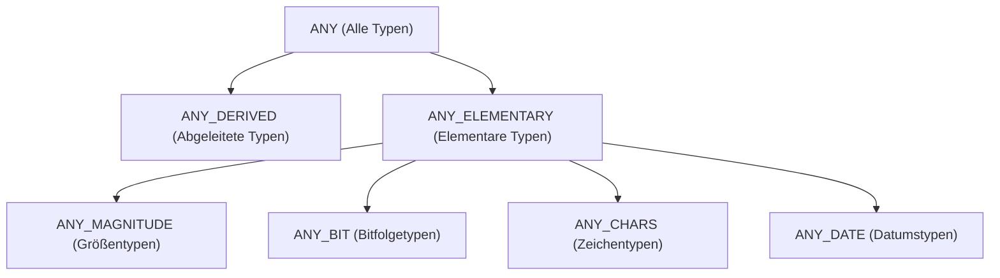
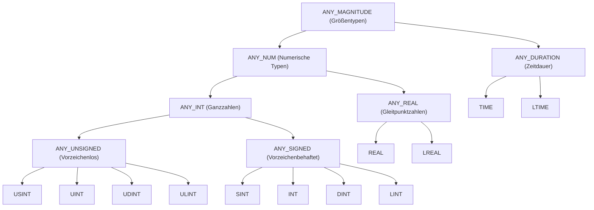
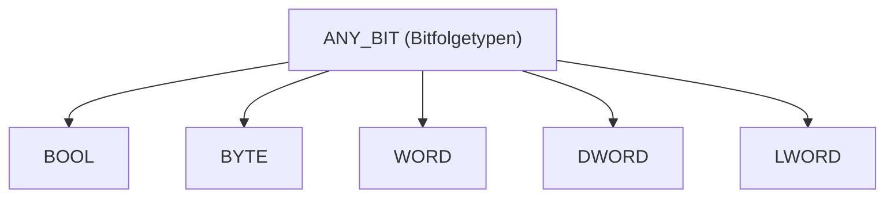
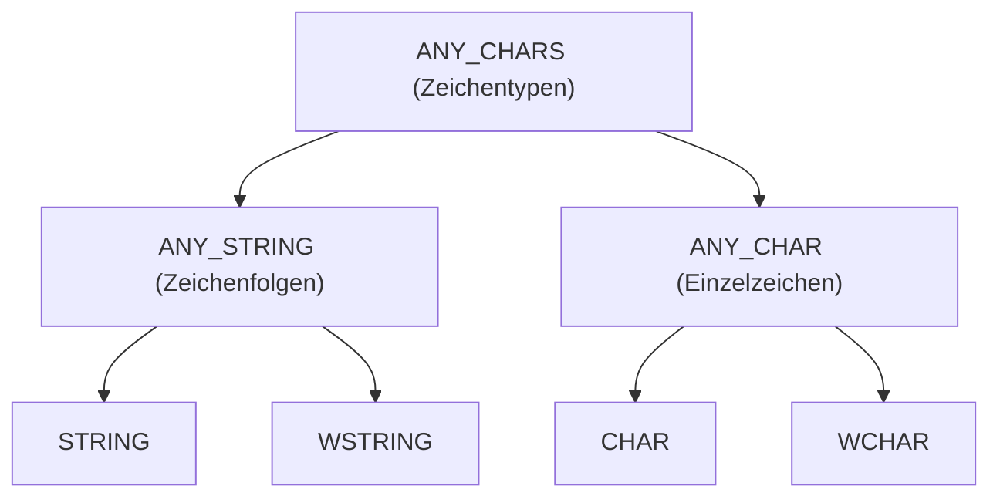
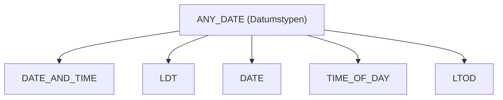

# Generische Datentypen (ANY-Typen)

In der Norm DIN EN 61131-3 werden generische Datentypen (auch als "allgemeine" Datentypen bezeichnet) verwendet, um Funktionen und Funktionsbausteine zu definieren, die mit verschiedenen, aber verwandten Datentypen arbeiten können (Überladen). Diese Typen werden durch das Präfix `ANY` gekennzeichnet.

## Hierarchie der ANY-Typen

Die folgende Grafik verdeutlicht die oberste Vererbungshierarchie der generischen Datentypen gemäß der Norm.

## Beschreibung der Gruppen

### ANY_ELEMENTARY

Diese Gruppe umfasst alle vordefinierten Standard-Datentypen der Norm.

#### ANY_MAGNITUDE (Größentypen)

Typen, die eine Größe darstellen und für arithmetische Operationen geeignet sind. Hier wird weiter zwischen numerischen Typen und Zeitdauern unterschieden.

-   **ANY_NUM**: Numerische Typen (Ganzzahlen und Gleitpunktzahlen).
-   **ANY_DURATION**: Zeitdauer-Typen (`TIME`, `LTIME`).

#### ANY_BIT (Bitfolgetypen)

Typen zur Darstellung von Bitfolgen.

#### ANY_CHARS (Zeichentypen)

Typen für Zeichen und Zeichenfolgen.

#### ANY_DATE (Datumstypen)

Typen für Datums- und Uhrzeitangaben.

### ANY_DERIVED

Diese Gruppe umfasst alle vom Anwender definierten Datentypen (z.B. `STRUCT`, `ENUM`, `ARRAY`), die nicht direkt auf einen elementaren Typ zurückzuführen sind.

## Verwendung

Generische Datentypen werden primär in Standard-Bibliotheken verwendet. Ein Beispiel ist die `ADD`-Funktion, die am Eingang den Typ `ANY_NUM` akzeptiert und somit sowohl zwei `INT` als auch zwei `REAL` Werte addieren kann.

In anwenderdefinierten Programm-Organisationseinheiten (POEs) ist die Verwendung von `ANY`-Typen laut Norm nicht vorgesehen und bleibt herstellerspezifischen Erweiterungen vorbehalten.
