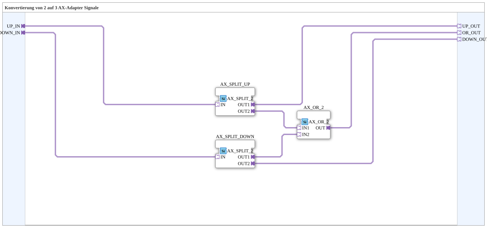

# AX_2_TO_3

* * * * * * * * * *

## Einleitung

`AX_2_TO_3` nimmt zwei unabhängige AX-Adapter-Signale (`UP_IN`, `DOWN_IN`) entgegen und stellt drei Ausgänge bereit: die beiden Eingänge unverändert durchgereicht (`UP_OUT`, `DOWN_OUT`) sowie zusätzlich deren ODER-Verknüpfung (`OR_OUT`) — typischerweise für "Hoch"/"Runter"-Taster, bei denen zusätzlich ein gemeinsames "irgendeine Richtung aktiv"-Signal gebraucht wird.

## Verwendete Funktionsbausteine (FBs)

### Sub-Bausteine: AX_2_TO_3

- **Typ**: SubAppType
- **Verwendete interne FBs**:
    - **AX_SPLIT_UP** / **AX_SPLIT_DOWN**: je `adapter::events::unidirectional::AX_SPLIT_2` — verzweigen `UP_IN` bzw. `DOWN_IN` je in einen direkten Durchgang und einen Zweig zur ODER-Verknüpfung.
    - **AX_OR_2**: `adapter::booleanOperators::AX_OR_2` — verknüpft die beiden Zweige zu `OR_OUT`.
- **Funktionsweise**: `UP_IN` → `UP_OUT` (direkt) und in `AX_OR_2`; `DOWN_IN` → `DOWN_OUT` (direkt) und in `AX_OR_2`; `AX_OR_2.OUT` → `OR_OUT`.

## Programmablauf und Verbindungen

1. `UP_IN` → `AX_SPLIT_UP.IN` → `AX_SPLIT_UP.OUT1` → `UP_OUT`, `AX_SPLIT_UP.OUT2` → `AX_OR_2.IN1`.
2. `DOWN_IN` → `AX_SPLIT_DOWN.IN` → `AX_SPLIT_DOWN.OUT2` → `DOWN_OUT`, `AX_SPLIT_DOWN.OUT1` → `AX_OR_2.IN2`.
3. `AX_OR_2.OUT` → `OR_OUT`.

## Anwendungsszenarien

- Rampen-/Ramp-Tasten-Verschaltungen (z. B. "Hoch"/"Runter"), bei denen neben den einzelnen Richtungssignalen auch ein gemeinsames "eine der beiden Tasten ist aktiv"-Signal benötigt wird (z. B. um eine Statusanzeige nur während aktiver Bedienung aufleuchten zu lassen).

## Zusammenfassung

`AX_2_TO_3` reicht zwei Adapter-Signale unverändert durch und ergänzt sie um ihre ODER-Verknüpfung als drittes Signal — reine Verdrahtungshilfe ohne eigene Zustandslogik.

---

### 🌐 Passende Themen-Unterseiten auf ms-muc-docs.de

- [🌐 Eclipse 4diac IDE & Farb-Referenz auf ms-muc-docs.de](https://www.ms-muc-docs.de/iec-61499/eclipse-4diac/)
