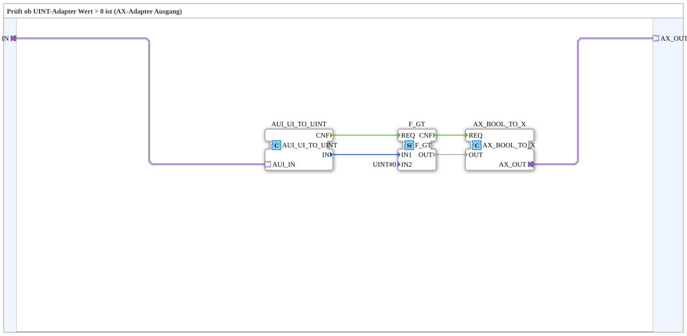

# AX_GT_0_UINT

* * * * * * * * * *

## Einleitung

`AX_GT_0_UINT` prüft, ob ein UINT-Adapter-Wert größer als 0 ist, und gibt das Ergebnis als boolesches AX-Adapter-Signal aus — nützlich, um z. B. einen Objekt-ID- oder Zählerwert direkt in ein Aktiv/Inaktiv-Signal für eine VT-Statusanzeige umzuwandeln.

## Verwendete Funktionsbausteine (FBs)

### Sub-Bausteine: AX_GT_0_UINT

- **Typ**: SubAppType
- **Verwendete interne FBs**:
    - **AUI_UI_TO_UINT**: `adapter::conversion::unidirectional::AUI_UI_TO_UINT` — entpackt den UINT-Adapter-Wert (`AUI`) in eine normale Datenverbindung.
    - **F_GT**: `iec61131::comparison::F_GT` — Vergleich `IN1 > IN2`, hier parametriert mit `IN2=UINT#0`.
    - **AX_BOOL_TO_X**: `adapter::conversion::unidirectional::AX_BOOL_TO_X` — verpackt das boolesche Vergleichsergebnis wieder als AX-Adapter.
- **Funktionsweise**: `IN` (AUI) → entpackt zu UINT → verglichen mit 0 → als AX-Adapter ausgegeben.

## Programmablauf und Verbindungen

1. `IN` (Adapter) → `AUI_UI_TO_UINT.AUI_IN`.
2. `AUI_UI_TO_UINT.IN` (Datenwert) → `F_GT.IN1`; `F_GT.IN2 = UINT#0` (Parameter).
3. `AUI_UI_TO_UINT.CNF` → `F_GT.REQ`; `F_GT.CNF` → `AX_BOOL_TO_X.REQ`.
4. `F_GT.OUT` → `AX_BOOL_TO_X.OUT`; `AX_BOOL_TO_X.AX_OUT` → `AX_OUT` (Adapter).

## Anwendungsszenarien

- Umwandlung eines UINT-Objekt-ID- oder Zählerwerts (z. B. "wie viele Kanäle sind aktiv") in ein einfaches boolesches Adapter-Signal für VT-Statusanzeigen oder Freigabelogik.

## Zusammenfassung

`AX_GT_0_UINT` ist ein kompakter Adapter-Wrapper um den Standardvergleich `F_GT` — wandelt "UINT > 0" direkt in ein AX-Adapter-Signal um.

---

### 🌐 Passende Themen-Unterseiten auf ms-muc-docs.de

- [🌐 Eclipse 4diac IDE & Farb-Referenz auf ms-muc-docs.de](https://www.ms-muc-docs.de/iec-61499/eclipse-4diac/)
