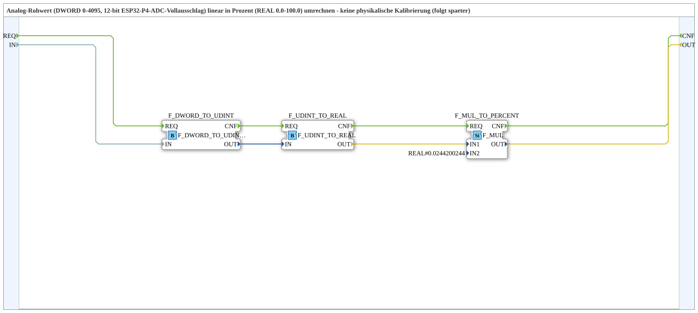

# F_AI_RAW_TO_PERCENT

* * * * * * * * * *

## Einleitung

`F_AI_RAW_TO_PERCENT` rechnet den Analog-Rohwert von `logiBUS_AI_ID`/`logiBUS_AI_IDA` (DWORD, 0-4095, 12-bit ESP32-P4-ADC-Vollausschlag) **linear** in Prozent (REAL 0.0-100.0) um — ohne physikalische Kalibrierung (die folgt als späterer Ausbauschritt). Datenbasierte Variante; die volladapterbasierte Alternative ist [`F_AI_RAW_TO_PERCENT_AD`](./F_AI_RAW_TO_PERCENT_AD.md).

## Verwendete Funktionsbausteine (FBs)

### Sub-Bausteine: F_AI_RAW_TO_PERCENT

- **Typ**: SubAppType
- **Verwendete interne FBs**:
    - **F_DWORD_TO_UDINT**: `iec61131::conversion::F_DWORD_TO_UDINT` — Bit-Reinterpretation DWORD→UDINT, hier gültig (gleiche 32-Bit-Darstellung eines vorzeichenlosen Integers).
    - **F_UDINT_TO_REAL**: `iec61131::conversion::F_UDINT_TO_REAL` — echter numerischer Cast UDINT→REAL.
    - **F_MUL_TO_PERCENT**: `iec61131::arithmetic::F_MUL` — Multiplikation mit `REAL#0.0244200244` (= 100/4095).
- **Funktionsweise**: `IN` (Rohwert 0-4095) → UDINT → REAL → ×(100/4095) = Prozent.

## Programmablauf und Verbindungen

1. `IN` → `F_DWORD_TO_UDINT.IN` → `F_UDINT_TO_REAL.IN` → `F_MUL_TO_PERCENT.IN1`.
2. `F_MUL_TO_PERCENT.IN2 = REAL#0.0244200244` (Parameter, = 100/4095).
3. `F_MUL_TO_PERCENT.OUT` → `OUT` (Prozent 0.0-100.0).

## Technische Besonderheiten

- **Numerisch korrekte Kette**: DWORD→UDINT ist eine gültige Bit-Reinterpretation (siehe [Numerisch vs. bitweise](../../../../Bibliotheken/ExternalLibraries/adapter/conversion/unidirectional/Numerisch_vs_Bitweise.md)), UDINT→REAL ist ein echter numerischer Cast — zusammen ergibt das eine korrekte DWORD→REAL-Umwandlung, ohne die Bit-Reinterpretations-Falle von `F_DWORD_TO_REAL`.
- **Keine physikalische Kalibrierung**: Der Faktor 100/4095 liefert nur den linearen Prozentanteil des ADC-Vollausschlags, keine physikalische Einheit (Volt, Bar, etc.) — das ist laut Kommentar ein späterer Ausbauschritt.

## Anwendungsszenarien

- Anzeige/Weiterverarbeitung eines rohen Analogeingangswerts als Prozentwert, z. B. für ein AI-Trainingsbeispiel.

## Zusammenfassung

`F_AI_RAW_TO_PERCENT` demonstriert die numerisch korrekte DWORD→REAL-Kette (über UDINT) am konkreten Beispiel eines Analog-Rohwerts — datenbasierte Variante, siehe [`F_AI_RAW_TO_PERCENT_AD`](./F_AI_RAW_TO_PERCENT_AD.md) für die adapterbasierte Alternative.

---

### 🌐 Passende Themen-Unterseiten auf ms-muc-docs.de

- [🌐 Eclipse 4diac IDE & Farb-Referenz auf ms-muc-docs.de](https://www.ms-muc-docs.de/iec-61499/eclipse-4diac/)
